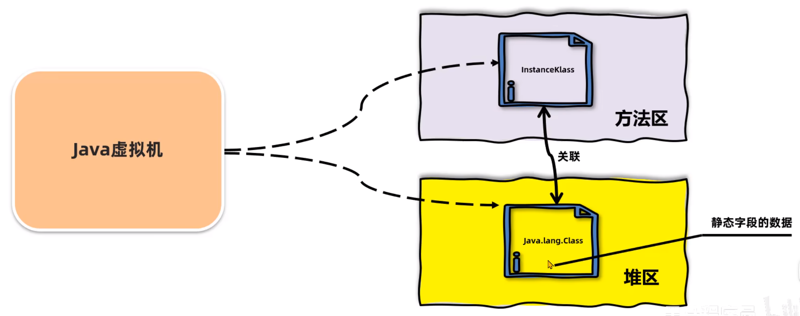
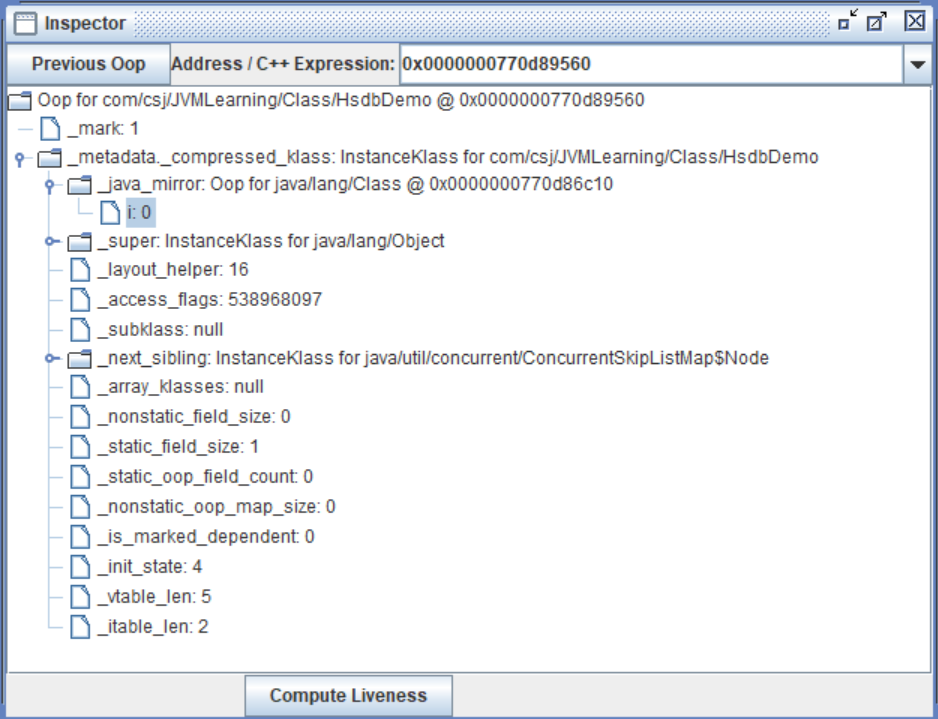
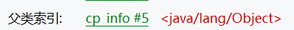
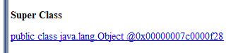
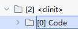
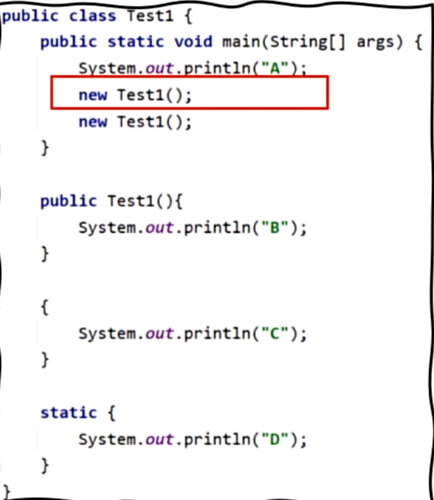

 ## 1.加载Loading
 JVM的几个重要内存区域：
- **方法区**：存放已加载的类的信息、常量、静态变量、方法
- **堆区**：存放对象实例
- **栈区**：每调用一个方法，会创建一个栈帧，里面存放着方法中的局部变量了、方法出口等信息，存放在栈区中

 加载，即将字节码文件加载到内存中，并解析以供运行
1. 类加载器根据全类名以二进制流的方式获取字节码信息
2. 加载完后将字节码信息保存到方法区
3. 生成一个InstanceKlass对象，用于保存方法区中类的所有信息
> 信息包括：**基本信息**、**常量池**、**字段**、**方法**、**虚方法表**(用于实现多态)
4. 在堆中生成一份与方法区中数据类似的Class对象，作为方法去中类的入口
> InstanceKlass为C++编写无法访问，Class为java包装，让java代码能够访问类中的信息和静态数据。 里面只包含 **字段**、**方法**和**静态数据** 供开发者访问，剔除掉了一些冗余信息。开发者只会使用一部分信息(字段和方法)，创建Class对象是防止开发者对其进行修改，保障了数据的安全性，但又能访问到所需要的信息

- 使用HSDB工具查看
    
    可以看到里面有一个InstanceKlass的类，而且聚合了Class对象，其中静态数据存放在Class对象中
- hotspot虚拟机是在这个类需要被用到的时候才会去加载（懒加载），而其他的jvm虚拟机会在一开始就加载
- 开发者可以控制的是步骤1，即控制jvm从什么地方加载字节码文件，可以通过自定义类加载器区控制字节码文件获取的方式

## 2.连接Linking
#### 2.1 验证
> 验证内容是否符合Java虚拟机的规范

1. 文件格式校验，验证文件是否以0xCAFEBABE开头，校验文件主副版本号不能高于环境主副版本号
2. 元信息校验，如所有类必须有父类(Objects)，即super不能为空、不能继承final修饰的类
3. 验证程序执行指令的语义，如方法内指令未执行完时跳转到其他方法去
4. 符号引用验证，如是否访问了其它类中被private修饰的方法

#### 2.2 准备
> 给静态变量分配内存并赋默认值

注意：区别**默认值**和**初始值**  
- 默认值不是初始值，数据类型一般为0，布尔类型为false，引用类型为null，在编译阶段无法确定值，所以用0占位  
- 若有final修饰，则默认值是就是程序中指定的值，在编译阶段就能确定值
- 准备阶段不会有执行任何Java方法，无法执行构造函数，估无法赋值引用类型和静态变量赋值
```java
// 准备阶段赋默认值0，类初始化阶段赋初始值1 -> 赋值代码存在于类构造器中
public static int value = 1;
// 基本数据类型准备阶段直接赋初始值1
public static final int value = 1;
// 引用类型不会在准备阶段赋值，而是在初始化阶段赋值
public static final String value = new String("hello");
```
- 赋默认值的作用：防止获取到内存空间上残存的数据

#### 2.3 解析
> 将常量池中的符号引用转换为直接引用  
- 符号引用是字节码文件中用编号来访问常量池中的内容  
  
- 直接引用是使用内存地址直接访问具体的数据 

## 3.初始化Initialization
- 执行静态代码块内的代码，并为静态的变量赋值，即执行字节码文件中**clinit**部分的指令
> jvm会通过锁来保证只有一个线程会去执行clinit方法，其他线程需要阻塞等待

```text
0 iconst_5
// 把操作数栈中的第一个数弹出，并赋值给常量池中#7的常量，即i
1 putstatic #7 <com/csj/JVMLearning/Test.i : I>
4 iconst_3
5 putstatic #7 <com/csj/JVMLearning/Test.i : I>
8 return
```
- 当既有静态变量又有静态代码块的时候，clinit中执行顺序和Java代码编写顺序一样
    ```java
    //后执行static代码块中的代码，所以结果i=3
    public static int i = 2;
    static {
        i = 3;
    }
    //先执行static代码块中的代码，所以结果i=2
    static {
        i = 3;
    }
    public static int i = 2;
    ```
    > 静态代码块是给类做初始化，代码块、构造函数是给对象做初始化
- 类的初始化只会执行一次，会有以下的情况会触发类的初始化
  1. 访问类的静态变量或静态方法，若访问的变量是被**final修饰**且等号**右边**是**基本数据类型或字符串**，则**不会**触发初始化
  ```java
  public class Test {
      public static void main(String[] args) {
          //结果会先打印"A初始化"，再打印A
          System.out.println(A.a);
      }
  }
  class A{
      //若等号右边是基本数据类型，则不会触发初始化（在连接阶段已经赋好值了） -> 若等号右边是是引用类型，如Integer.value(1)，则仍需要初始化
      public static final int a = 1;
      // new String("hello")，也需要初始化
      public static final String b = "hello";
      static {
          System.out.println("A初始化");
      }
  }
  ```
  3. 使用Class.forName()方法获取类时，若没有指定是否初始化，若类没有被加载，则会默认初始化
    ```java
    public static Class<?> forName(String className) {
        //第二个参数则表示默认对类进行初始化
        return forName0(name, true, ClassLoader.getSystemClassLoader());
    }
    //可以指定是否初始化
    public static Class<?> forName(String name, boolean initialize,ClassLoader loader) {
    } 
    ```
  3. 使用new创建对象的时候
  4. 执行main方法时，main方法所在的类会初始化
- clinit指令不存在的情况
  1. 无静态代码块且无静态变量赋值
  2. 有静态变量声明，但没有赋值
  3. 有基本数据类型的静态变量声明赋值，但是被final修饰(会在准备阶段被初始化)
- 继承下的初始化
  1. 直接访问父类的静态变量，不会初始化子类
  2. 需要初始化子类时，需要先初始化父类
- 数组的创建不会导致元素类的初始化
  ```java
  public class Test {
      public static void main(String[] args) {
          A[] arrayA = new A[10];
      }
  }
  class A{
      static {
          System.out.println("A初始化");
      }
  }
  ```
  
## 4. 使用Using

```java
public class Test1 {
    public static void main(String[] args) {
      System.out.println("A");
      new Test1();
      new Test1();
    }
    public Test1() {
      System.out.println("B");
    }

    {
      System.out.println("C");
    }
    
    static {
        System.out.println("D");
    }
}
```
1. 执行类初始化时，会执行静态代码，即输出D
2. 执行System.out.println("A")，即输出A
3. new Test1()时，会先执行代码快，即输出C -> 代码块代码最终会在会放在构造函数中执行，且比构造函数先执行
```java
class User {
    public User() {
        System.out.println("构造函数");
    }
    
    {
        System.out.println("代码块");
    }
}
/*
 0 aload_0
 // 调用父类构造函数
 1 invokespecial #1 <java/lang/Object.<init> : ()V>
 // 打印"代码块"
 4 getstatic #2 <java/lang/System.out : Ljava/io/PrintStream;>
 7 ldc #3 <代码块>
 9 invokevirtual #4 <java/io/PrintStream.println : (Ljava/lang/String;)V>
// 打印"构造函数"
12 getstatic #2 <java/lang/System.out : Ljava/io/PrintStream;>
15 ldc #5 <构造函数>
17 invokevirtual #4 <java/io/PrintStream.println : (Ljava/lang/String;)V>
20 return
 */
```
4. 执行完代码块后再执行构造函数，即输出B
5. 重复3、4
最后输出DACBCB

## 5. 卸载Unloading