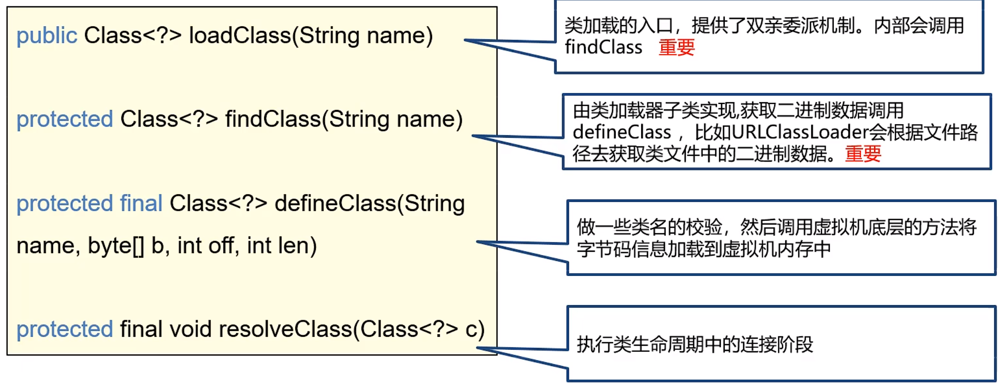

### 类加载器
- 作用：加载Java字节码.class文件到JVM中生成Class对象
    > 程序员可以控制虚拟机获取字节码文件的方式，与类的加载阶段有关
    > 只参与加载阶段中字节码的获取，并加载到内存中。 生成对象由jvm执行。
- 分类：  
    1. 虚拟机实现：  
       - 由虚拟机的底层语言来编写，如HotSpot虚拟机是用C++则类加载器也是C++，用于加载程序运行时的基础类，如java.lang.String
       - 启动类加载器BootStrap,用于加载Java中的核心类
    2. java实现：  
       - 所有的java类加载器都继承于ClassLoader类
       - 扩展类加载器Extension、应用程序类加载器Application
- 启动类加载器Bootstrap ClassLoader，默认加载/jre/lib下的类文件，如rt.jar（rt即RunTime），由于启动类加载器不是由Java编写，所以通常表示为Null
    > 使用启动类加载器加载自己的jar包：
    > 1. 放入jre/lib目录下(不建议)
    > 2. 使用参数-Xbootclasspath/a:jar包目录
- 扩展类加载器Extension ClassLoader，位于sun.misc.Launcher下的静态内部类并继承自URLClassLoader，默认加载/jre/lib/ext下的类文件，可以通过目录或指定jar包将字节码文件加载到内存中
  ```java
  public static void main(String[] args) throws IOException {
      ClassLoader classLoader = ScriptEnvironment.class.getClassLoader();
      System.out.println(classLoader);
  }
  //输出：sun.misc.Launcher$ExtClassLoader@677327b6
  ```
    > 使用扩展类加载器加载自己的jar包：
    > 1. 放入jre/lib/ext目录下(不建议)
    > 2. 使用参数-Djava.ext.dirs:jar包目录，由于会覆盖原来的目录，则需要使用 ; 来追加原始的目录，即java/jre/lib/ext;自己jar包的目录
- 应用程序加载器Application ClassLoader，加载classpath下的类文件，即项目中的类文件和第三方jar包中的类文件
  ```java
    public static void main(String[] args) throws ClassNotFoundException {
        Student student = new Student();
        ClassLoader classLoader = student.getClass().getClassLoader();
        System.out.println(classLoader);
    
        FileTypeUtil fileTypeUtil = new FileTypeUtil();
        ClassLoader classLoader1 = fileTypeUtil.getClass().getClassLoader();
        System.out.println(classLoader1);
    }
    //输出sun.misc.Launcher$AppClassLoader@18b4aac2   
    //    sun.misc.Launcher$AppClassLoader@18b4aac2
  ```
### 双亲委派机制
- 双亲委派机制的作用：
  1. 保证类加载的安全性，避免恶意替换JDK中的核心类，如加载一个错误的java.lang.String类，会导致JVM崩溃
  2. 避免类的重复加载，如在lib/ext/和classpath下有同一个类，则需要防止被ExtensionClassLoader和ApplicationClassLoader同时加载
- 双亲委派机制：**当一个类被加载时，会从下往上查找是否被加载过，再从上往下进行加载**
  
1. 向上查找：  
  流程：当前类加载器没有加载过，则查询父类加载起是否加载。如果已经加载过了，就直接返回对应的Class对象，加载过程结束。若没有加载，则继续向父类查询。  
  作用：能避免类的重复加载  
2. 向下加载：  
  流程：如果向上查找都没有加载过，则从父类加载器开始尝试加载，如果在父类的加载路径中，则由父类加载，如果所有父类都无法加载，则由当前加载起自己加载.如果都无法加载，则会抛出ClassNotFoundException异常  
  作用：保证加载的优先级，优先由Bootstrap加载。能防止恶意替换JDK中的核心类。  
  举个例子：Bootstrap会先把正确的java.lang.String类加载，当ApplicationClassLoader加载一个错误的java.lang.String类，会向上查找，发现Bootstrap已经加载了正确的java.lang.String类，则不会加载。
  ```java
      public static void main(String[] args) throws ClassNotFoundException {
          ClassLoader classLoader = Test.class.getClassLoader();
          System.out.println(classLoader);
          // 此处的java.lang.String是自定义的
          Class<?> aClass = classLoader.loadClass("java.lang.String");
          System.out.println(aClass.getClassLoader());
      }
      //输出sun.misc.Launcher$AppClassLoader@18b4aac2
      //    null    即代表Bootstrap，因为Bootstrap是由C++实现，在Java中没有对应的类，所以为null
  ```
- 打破双亲委派机制
#### 自定义类加载器
  - 问题：一个Tomcat程序可以运行多个web应用，当两个应用中类的限定名相同时，则只能加载其中一个类。因此Tomcat需要打破双亲委派机制，保证两个类都能被加载
  - 解决：Tomcat为每一个应用都创建了一个独立的类加载器
  - 双亲委派机制的实现：具体实现是体现在loadClass方法中
   
```java
      // Class.forName()会执行加载、连接、初始化   而loadClass()只会执行加载阶段
//类加载的入口，第二个参数表示是否需要执行生命周期中的连接以及后续的阶段  
public Class<?> loadClass(String name) throws ClassNotFoundException {
        return loadClass(name, false);
}
```
```java
protected Class<?> loadClass(String name, boolean resolve) throws ClassNotFoundException {
      //防止在多线程环境下被多次加载
      synchronized (getClassLoadingLock(name)) {
          //判断当前类加载器是否加载过该类 ，若加载过则直接返回 
          Class<?> c = findLoadedClass(name);
          if (c == null) {
              long t0 = System.nanoTime();
              try {
                  //判断是否有父类
                  if (parent != null) {
                      //有则向父类委派查找是否加载过该类！！！这里体现了双亲委派机制！！！
                      c = parent.loadClass(name, false);
                  } else {
                      //没有父类，则说明父类是启动类加载器，查找启动类加载器是否加载过该类
                      c = findBootstrapClassOrNull(name);
                  }
              } catch (ClassNotFoundException e) {
              }
              // 说明都没有加载过
              if (c == null) {
                  long t1 = System.nanoTime();
                  // 去对应的加载路径下查找.class文件
                  // 若找到则调用defineClass()方法，校验包名是否合法(如报名不能以java.开头)，将字节码信息加载到虚拟机中，若不在自己的加载路径下，则抛出异常
                  c = findClass(name);
                  sun.misc.PerfCounter.getParentDelegationTime().addTime(t1 - t0);
                  sun.misc.PerfCounter.getFindClassTime().addElapsedTimeFrom(t1);
                  sun.misc.PerfCounter.getFindClasses().increment();
              }
          }
          if (resolve) {
              //执行类生命周期中的加载阶段
              resolveClass(c);
          }
          return c;
        }
}
```
```java
// URLClassLoader
protected Class<?> findClass(final String name) throws ClassNotFoundException {
    final Class<?> result;
    result = AccessController.doPrivileged(new PrivilegedExceptionAction<Class<?>>() {
        public Class<?> run() throws ClassNotFoundException {
            //获取到指定路径下字节码文件
            String path = name.replace('.', '/').concat(".class");
            Resource res = ucp.getResource(path, false);
            return defineClass(name, res);
        }
    }, acc);
    return result;
}

private Class<?> defineClass(String name, Resource res) throws IOException {
    // 根据资源对象获取到二进制数据，将字节码信息加载到内存中
    java.nio.ByteBuffer bb = res.getByteBuffer();
    return defineClass(name, bb, cs);
```
- 自定义类加载器：**重写findClass()方法**，即重新定义加载的路径，但仍保留双亲委派机制
- 打破双亲委派机制：即**重写loadClass()方法**，将里面的双亲委派机制的代码删除 -> 双亲委派机制是在loadClass()中实现的
```java
class MyClassLoader extends ClassLoader {

    @Override
    public Class<?> loadClass(String name) throws ClassNotFoundException {
        // 这里通过自定义的方法来获取到字节码文件
        byte[] bytes = new byte[];
        // 只将字节码文件加载到虚拟机，不去父类加载器里去查找是否已加载，即不实现双亲委派机制的代码
        return defineClass(name, bytes, 0, bytes.length);
    }
}
```
- 若没有指定父类加载器，则默认为ApplicationClassLoader
  ```java
  //ClassLoader中的构造方法，若想指定默认类加载器，则需要重写ClassLoader的构造方法
  protected ClassLoader() {
      this(checkCreateClassLoader(), getSystemClassLoader());
  }
  private ClassLoader(Void unused, ClassLoader parent) {
    this.parent = parent;
  } 
  ```    
- 不同类加载器加载相同的类限定名，会被认为不是同一个类
- 即使通过自定义类加载器打破了双亲委派机制，但defineClass()中仍然对包名做了限制，以防被替换掉核心类；若执意想替换掉，则需要直接调用defineClass1()
本地方法
```java
private ProtectionDomain preDefineClass(String name, ProtectionDomain pd) {
    if (!checkName(name))
        throw new NoClassDefFoundError("IllegalName: " + name);
    // 不能以java.*作为类名
    if ((name != null) && name.startsWith("java.")) {
        throw new SecurityException("Prohibited package name: " + name.substring(0, name.lastIndexOf('.')));
    }
    return pd;
}
```
#### 线程上下文类加载器（ContextClassLoader）
- 问题：JDBC中，DriverManager是由BootStrap加载的，而DriverManager中加载的驱动类(如mysql驱动)是由ApplicationClassLoader加载的
- 应用：当时用Class.forName()加载类时，就是使用的线程上下文加载器来加载类的
##### SPI机制
1. SPI(Service Provider Interface)，JDK内置的服务发现机制，可以根据接口发现实现类(类似于spring的依赖注入)  
2. 工作原理：mysql jar包需要在META-INF/services下创建一个文件，文件名是实现的接口的全限定名，文件内容是实现类的全限定名  
  
  
- 使用ServiceLoader加载实现类
   ```java
   public static void main(String[] args){
      // 加载Driver接口的实现类
      ServiceLoader<Driver> drivers = ServiceLoader.load(Driver.class);
      Iterator<Driver> driverIterator = drivers.iterator();
      while (driverIterator.hasNext()) {
          //此处的driver就是实现了Driver接口的实现类
          Driver driver = driverIterator.next();
          System.out.println(driver.getClass());
      }
   }
    //此处输出class com.mysql.cj.jdbc.Driver
   ```
- 作用：可以将实现类与接口解耦，实现解耦后，实现类可以随意更换，将具体的实现交给用户来决定
- 自定义实现SPI  

```java
public static void main(String[] args) {
    // 加载实现SpiInterface接口的实现类
    ServiceLoader<SpiInterface> loader = ServiceLoader.load(SpiInterface.class);
    Iterator<SpiInterface> iterator = loader.iterator();
}
```
- 原理
```java
public final class ServiceLoader<S> implements Iterable<S> {
    private final Class<S> service;
    // ClassLoader是通过线程上下文类加载器来获取到ApplicationClassLoader
    public static <S> ServiceLoader<S> load(Class<S> service, ClassLoader loader) {
        return new ServiceLoader<>(service, loader);
    }
    private ServiceLoader(Class<S> svc, ClassLoader cl) {
        // 将接口class对象保存到service中
        service = Objects.requireNonNull(svc, "Service interface cannot be null");
        reload();
    }
    // 这里是懒加载，只返回了ServiceLoader对象，里面还没有元素
    public void reload() {
        lookupIterator = new LazyIterator(service, loader);
    }

    public Iterator<S> iterator() {
        return new Iterator<S>() {
            public boolean hasNext() {
                // 这里的lookupIterator是LazyIterator
                return lookupIterator.hasNext();
            }
            public S next() {
                return lookupIterator.next();
            }
        };
    }

    private class LazyIterator implements Iterator<S> {
        // 核心方法
        private boolean hasNextService() {
            // META-INF/services/ + service.getName() -> META-INF/services/com.csj.SpiInterface
            String fullName = PREFIX + service.getName();
            // 使用类加载器来获取资源
            configs = loader.getResources(fullName);
            // 遍历获取到的URL资源
            while ((pending == null) || !pending.hasNext()) {
                if (!configs.hasMoreElements()) {
                    return false;
                }
                pending = parse(service, configs.nextElement());
            }
            // 这里面的内容就是com.csj.SpiInterface文件里的实现类的全限定名
            nextName = pending.next();
            return true;
        }

        private S nextService() {
            // 获取到刚才的实现类的全限定名
            String cn = nextName;
            nextName = null;
            Class<?> c = null;
            // 获取到Class类
            c = Class.forName(cn, false, loader);
            // 反射获取到实例
            S p = service.cast(c.newInstance());
            // 这个相当于一个缓存，避免每次都通过反射获取
            providers.put(cn, p);
            return p;
        }
    }
    
    private Iterator<String> parse(Class<?> service, URL u) {
        // 根据路径获取到流
        InputStream in = null;
        BufferedReader r = null;
        ArrayList<String> names = new ArrayList<>();
        in = u.openStream();
        r = new BufferedReader(new InputStreamReader(in, "utf-8"));
        int lc = 1;
        // 一行一行读取META-INFO文件中的内容，
        while ((lc = parseLine(service, u, r, lc, names)) >= 0);
        return names.iterator();
    }
}
```
- 具体是如何找到哪个jar包的META-INFO/services中有接口的文件的呢？ 
-> 遍历所有jar包（当然不是无脑遍历），直到找到某个jar包中与接口名相同的文件，并根据文件的地址读取文件，包装成Resource对象
```java
// 存放着所有jar包对象
public class URLClassPath {
    // JVM会将所有加载到内存中的jar包都封装成一个JarLoader类
    // ServiceLoader会遍历所有的JarLoader
    static class JarLoader extends Loader {
        Resource getResource(final String name, boolean check) {
            final JarEntry entry = jar.getJarEntry(name);
            if (entry != null) {
                return checkResource(name, check, entry);
            }
        }
    }
}

// 省略其他过程
class ZipFile implements ZipConstants, Closeable {
    public ZipEntry getEntry(String name) {
        long jzentry = 0;
        synchronized (this) {
            // native方法，去找jar包中和参数name相同的文件的条目，并返回条目的句柄 
            // -> 条目：压缩包中的文件     句柄：指针
            jzentry = getEntry(jzfile, zc.getBytes(name), true);
            if (jzentry != 0) {
                // 找到了同名的文件，根据句柄（压缩包中的文件的地址）把条目（压缩包中的文件）包装成对线
                ZipEntry ze = ensuretrailingslash ? getZipEntry(null, jzentry)
                        : getZipEntry(name, jzentry);
                freeEntry(jzfile, jzentry);
                return ze;
            }
        }
        return null;
    }
}
```
- 总的来说：
1. 根据ClassLoader获取到META-INFO/services/下的接口的全限定名的文件 -> com.csj.SpiInterface
2. 遍历所有文件，获取到里面的实现类全限定名 -> com.csj.SpiImplements1
3. 通过Class.forName()来获取到Class对象，再通过反射来获取到实例
##### JDBC源码中使用SPI机制  
- 在加载DriverManager的时候，初始化阶段需要加载对应的驱动(通过SPI机制获取到需要加载的实现类驱动)，而驱动需要使用ApplicationClassLoader加载的，所以需要使用线程上下文类加载器来获得ApplicationClassLoader来加载驱动
```java
// DriverManager是由BootStrap加载的
public class DriverManager {
    static  {
        loadInitialDrivers();
        println("JDBC DriverManager initialized");
    }
    private static void loadInitialDrivers() {
        ServiceLoader<Driver> loadedDrivers = ServiceLoader.load(Driver.class);
        Iterator<Driver> driversIterator = loadedDrivers.iterator();
        while(driversIterator.hasNext()) {
            // driversIterator里面的实现类是由ApplicationClassLoader加载的
            driversIterator.next();
        }
    }
}
```
- 此处DriverManager是由Bootstrap类加载器加载，而Driver的实现类是由ApplicationClassLoader加载得到的

如何拿到Application加载器的呢？  
```java
public final class ServiceLoader<S> {
    public static <S> ServiceLoader<S> load(Class<S> service) {
        //获取当前线程上下文类加载器，默认为ApplicationClassLoader
        ClassLoader cl = Thread.currentThread().getContextClassLoader();
        return ServiceLoader.load(service, cl);
    }
}
//可以使用Thread.currentThread().setContextClassLoader()来设置线程上下文类加载器
```
- 线程上下文类加载器是否打破双亲委派机制：  
 没有。BootStrap加载DriverManager时，发现自己无法加载实现类，所以使用Application来加载实现类。可以理解为是直接拿到应用类加载器来加载，并没有走向下委派的流程。
且不论是BootStrap还是Application他们都是使用的JDK自带的类加载器，并没有去重写loadClass方法，所以还是遵循双亲委派机制。
3. OSGi模块化