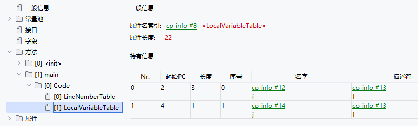

## Java内存区域
- 线程共享：方法区、堆
- 线程不共享：程序计数器、Java虚拟机栈、本地方法栈


### 程序计数器
> 记录下一条执行的字节码指令的地址
- 每个线程都有一个独立的程序计数器
- 加载阶段后，字节码中指令的偏移地址会转化为**内存地址**，程序计数器中存放的是内存地址
- 作用：
  - 分支if-else、循环while、跳转、异常处理、线程恢复等都需要使用程序计数器来记录下一行指令的地址
  - 线程上下文切换的时候，用于保存线程下一行的指令，恢复的时候以便继续执行

#### 内存溢出问题
程序计数器的需要存的内存地址长度固定；如果是Native方法，则为null。估是唯一一个不会出现OutOfMemoryError内存区域

### 栈
> Java虚拟机栈，保存每次调用Java方法时的信息；本地方法栈，保存本地方法（C++实现的native方法）的信息
- 由于Java方法和native方法信息类似，HotSpot虚拟机将二者合一

#### 栈帧
> 每次调用方法时，会创建一个栈帧来存局部变量表、操作数栈、动态信息、方法出口等信息
- 每一个方法的调用到完成，对应着栈中一个栈帧的入栈和出栈
- 栈的生命周期与线程相同

#### 局部变量表
> 存放编译时期可以确定的基本数据类型、对象引用等局部变量，包括this、方法参数、方法中的局部变量
```java
public static void main() {
    int i = 5;
    int j = 3;
}
/*
字节码
0 iconst_5 // 将常量5压入操作数栈
1 istore_0 // 将操作数栈顶的元素（5）存入局部变量表中的0号槽
2 iconst_3
3 istore_1
4 return
*/
```

- 信息说明
  - Nr. ： 编号
  - 起始PC：从字节码指令的第几行开始可以访问局部变量 -> 例子中是i从第2行可以访问，因为把常量5存入局部变量表示在第1行字节码指令执行的
  - 长度：变量可以被范围的范围 -> 例子中长度是3，则可以从第2行开始访问，到4行结束
  - 序号：变量在局部变量表中的slot的起始编号
- 局部变量表实际是数组，每个位置称为槽(slot)，其中long和double占用2个slot，其余数据类型占用1个slot
```java
public static void main() {
    long i = 5;
    int j = 3;
}
/*
0 ldc2_w #2 <5>
3 lstore_0 // long类型存入0号slot -> 序号为0
4 iconst_3
5 istore_2 // 用于long占用0号和1号两个slot，所以j变量占用2号 -> 序号为2
6 return
*/
```
- 实例方法中的0号slot存放的是this，运行时存放对象的指针
- 方法的参数也会保存在局部变量表中，顺序与定义的顺序一致
- 优先级为this -> 参数 -> 局部变量


- 局部变量表中的slot可以复用，当一个局部参数不再使用时，可以复用该slot，以节省空间
```java
public void main() {
    // 代码块执行完后，局部变量a已经不可达，估可以复用该slot
    {
        int a = 1;
    }
    int b = 2;
    String name = "pipixia";
    // 实际只占用三个slot -> this占据0号slot  b和name占据1号和2号slot
}
/*
0 iconst_1 
1 istore_1 // 将常量1放入1号slot
2 iconst_2 
3 istore_1 // 由于代码块已经执行完，局部变量a不可用，所以复用1号slot
4 ldc #2 <pipixia>
6 astore_2 // 将字符串对象存入2号slot
7 return
 */
```
- 局部变量表所需的内存空间在编译期间就能确定并完成分配，估进入方法时，局部变量表的大小不会改变

可见，编译后的字节码信息中存放有局部变量表最大槽数

#### 操作数栈
> 对变量进行操作时，需要从局部变量表中取出来压入操作数栈，临时保存在操作数栈中，使用时再弹出
```java
private int main(int a, int b) {
  int c = a + b;
  return c;
}
/*
局部变量表: 0号this    1号a    2号b
0 iload_1 // 将a 从局部变量表中取出来压入操作数栈
1 iload_2 // 将b 从局部变量表中取出来压入操作数栈
2 iadd // 弹出操作数栈中的两个元素，相加，并将结果压入操作数栈
3 istore_3 // 弹出操作数栈中一个元素（即相加的结果），存入局部变量表中的3号slot   3号c
4 iload_3 // 再将3号slot的数据压入操作数栈
5 ireturn // 弹出操作数栈中一个元素，并返回
 */
```
- 同样。操作数栈的大小在编译阶段就可以确定

#### 栈帧信息
##### 动态链接（指向运行时常量池中该栈帧所属方法的引用）
> 每个栈帧都包含了一个指向运行时常量池中该栈帧所属方法的引用，持有这个引用是为了支持方法调用过程中的动态链接
> Each frame contains a reference to the run-time constant pool for the type of the current method to support dynamic linking of the method code.
- 运行时常量池：即常量池中的数据被加载到内存中，包含类信息、常量、静态变量、编译后的代码等，用于存放符号引用和对应的直接引用（物理地址）
```java
public class Test {
    public void main(String[] args) {
        int c = add(StaticNumClass.a, StaticNumClass.b);
    }
    public int add(int a, int b) {
        return a + b;
    }
}
class StaticNumClass {
    static int a = 2;
    static int b = 3;
    static void change() {
        a++;
    }
}
```
使用javap反编译
```text
// 常量池：存有所有类信息、常量、方法的符号引用和对应的字符串字面量
// 待加载到内存后，会将符号引用转换为直接引用 -> 在连接阶段执行
Constant pool:
   #1 = Methodref          #6.#26         // java/lang/Object."<init>":()V
   #2 = Fieldref           #27.#28        // com/csj/JVMLearning/Class/StaticNumClass.a:I
   #3 = Fieldref           #27.#29        // com/csj/JVMLearning/Class/StaticNumClass.b:I
   #4 = Methodref          #5.#30         // com/csj/JVMLearning/Class/Test.add:(II)I
   #5 = Class              #31            // com/csj/JVMLearning/Class/Test
   #6 = Class              #32            // java/lang/Object
   #7 = Utf8               <init>
   #8 = Utf8               ()V
   #9 = Utf8               Code
  #10 = Utf8               LineNumberTable
  #11 = Utf8               LocalVariableTable
  #12 = Utf8               this
  #13 = Utf8               Lcom/csj/JVMLearning/Class/Test;
  #14 = Utf8               main
  #15 = Utf8               ([Ljava/lang/String;)V
  #16 = Utf8               args
  #17 = Utf8               [Ljava/lang/String;
  #18 = Utf8               c
  #19 = Utf8               I
  #20 = Utf8               add
  #21 = Utf8               (II)I
  #22 = Utf8               a
  #23 = Utf8               b
  #24 = Utf8               SourceFile
  #25 = Utf8               Test.java
  #26 = NameAndType        #7:#8          // "<init>":()V
  #27 = Class              #33            // com/csj/JVMLearning/Class/StaticNumClass
  #28 = NameAndType        #22:#19        // a:I
  #29 = NameAndType        #23:#19        // b:I
  #30 = NameAndType        #20:#21        // add:(II)I
  #31 = Utf8               com/csj/JVMLearning/Class/Test
  #32 = Utf8               java/lang/Object
  #33 = Utf8               com/csj/JVMLearning/Class/StaticNumClass
{
  // 方法名的符号是#14 描述符的符号是#15
  public void main(java.lang.String[]);
    descriptor: ([Ljava/lang/String;)V
    flags: (0x0001) ACC_PUBLIC
    Code:
         0: aload_0
         // 如果StaticNumClass中的change方法被调用，则a的值也在变化，估a的值是不确定的
         // 字节码中并不知道a的值是多少，只保存一个符号引用#2，调用getstatic时才能确定值
         1: getstatic     #2
         4: getstatic     #3
         // 根据#4可以找到方法是com/csj/JVMLearning/Class/Test.add:(II)I
         7: invokevirtual #4
        10: istore_2
        11: return
}
```
- 通过栈帧中存储的指向运行时常量池中该栈帧所属方法的引用，可以使用字节码中的符号引用去运行时常量池中获取到对应的直接引用，即物理地址（动态链接）
- 优点：避免每个栈帧中存放重复的，节省空间；支持多态
- 坑：栈帧中存的东西应该叫"指向运行时常量池中该栈帧所属方法的引用"，通过这个引用实现了动态链接的功能

##### 方法返回地址
> 方法调用结束后，需要将栈帧出栈。当前栈帧中存放有上一个栈帧的下一条指令的地址，弹出时将程序计数器设为该地址

##### 异常表
> 存放处理异常的信息，如异常捕获范围、异常跳转到的位置等
```java
public static void main(String[] args) {
    int i = 3;
    try {
        int j = 4;
    }
    catch (Exception e) {
        int k = 5;
    }
}
/*
 0 iconst_3
 1 istore_1
 // 起始PC
 2 iconst_4
 3 istore_2
 4 goto 10 (+6)
 //结束PC
 // catch块的开始
 // 跳转PC
 7 astore_2
 8 iconst_5
 9 istore_3
10 return        
 */
```

- 起始PC、结束PC：异常捕获的范围，即try{}代码块的范围
- 跳转PC：异常跳转的位置，即catch{}代码块的位置

##### 附加信息
> 虚拟机规范允许增加一些规范里没有描述的信息到栈帧中

#### 栈内存溢出
```java
public class Test {
    static int count = 0;
    public static void main(String[] args) {
        test();
    }
    static void test() {
        System.out.println(++count);
        test();
    }
}
//输出
/*
10528
10529
Exception in thread "main" java.lang.StackOverflowError        
 */
```
- 栈的默认大小取决于操作系统
- 可以通过-Xss可以指定Java虚拟机栈的大小，单位是字节、k、m、g；或-XX:ThreadStackSize=
- JDK8最小为180k，最大为1024m

### 堆
> 堆是Java虚拟机管理的内存中最大的一块区域，用于存放对象实例
- 通过栈上的局部变量表中存入堆上对象的引用，从而可以访问对象中的属性和方法；通过方法区到静态变量
- 堆是垃圾收集器的主要工作区域。垃圾收集器定期检查堆中的对象，回收不再被引用的对象，释放内存空间，防止内存泄漏
- Java堆可能处于物理上的不连续的空间，但逻辑上连续

#### 堆内存溢出
```java
public static void main(String[] args) {
    // 保证对象不会回收
    List<Object> list = new ArrayList<>();
    while (true) {
        list.add(new Object());
    }
}
/*
报错
Exception in thread "main" java.lang.OutOfMemoryError: Java heap space        
 */
```
- 使用-Xms 和 -Xmx 可以分别设置 堆的初始容量（total）和最大容量（max），单位同-Xss
- Xms最小为1m，Xmx最小2m

### 方法区
> 存放类信息、运行时常量池、字符串常量池
- Hotspot虚拟机的JDK7以前的版本，方法区位于永久代，JDK8以后，永久代被移出，方法区位于元空间
- 永久代：即内存的永久保存区域，位于虚拟机内部，大小由虚拟机控制，使用-XX:PermSize和-XX:MaxPermSize设置永久代大小
- 元空间：位于本地内存（直接内存）中，由操作系统控制，上限可以一直增大，直到操作系统的上限，使用-XX:MetaspaceSize和-XX:MaxMetaspaceSize设置元空间大小

移除永久代：
- 在JDK7开始就逐步移除永久代，如：字符串常量池、静态变量转移到堆中，其他信息（运行时常量池）仍存在永久代中 -> JDK7以后静态变量存放在堆中的Class文件中
- JDK8完全移除永久代
- 原因：永久代容易发生内存溢出问题，放在元空间中不受jvm的控制；且GC回收器在永久代回收效率低

#### 类信息
> 存放每个类的元数据
- 类的元数据，包括类的基本信息、常量池、静态变量、静态方法、虚方法表等
- 类在加载阶段被加载到内存中，生成一个Klass对象，并存在方法区中

#### 运行时常量池
> 字节码中的常量池被加载进内存后存放在运行时常量池中
- 常量池中的内容被加载到内存后，会存入运行时常量池中，并会在连接的解析阶段，将符号引用替换为直接引用（物理地址）

#### 字符串常量池
> 存放代码中定义的常量字符串，字符串在编译期间就已经确定
- String c = "1" + "2"，在编译阶段，会被优化为String c = "12"
- String c = a + b，在编译阶段，会被优化为StringBuilder sb = new StringBuilder(); sb.append(a).append(b); String c = sb.toString();

String.intern()
- 判断字符串常量池中是否有通过equals()方法相同的对象，如果有则直接返回字符串常量池中的对象，如果没有则将字符串放入字符串常量池，并返回常量池中的对象
- intern()允许程序将字符串放入字符串常量池
- JDK6以前是将堆中的对象复制一份放入永久的中的字符串常量池，并返回字符串常量池中的对象
- JDK7以后，由于字符串常量池被移到了堆中，字符串常量池中可以通过引用指向堆中的对象，估字符串常量池中存的是对象的引用并返回
```java
public static void main(String[] args) {
    String string = new StringBuilder("hello").append("world").toString();
    // 由于string.intern()返回的是堆中对象的引用，即对象本身，估打印true
    System.out.println(string.intern() == string);
}
```

### 直接内存
> 直接内存并不是Java虚拟机管理的内存区域

作用：
- NIO使用了直接内存，进行对直接内存的垃圾回收时，不会影响堆中的对象
- IO操作需要把文件读到直接内存中，在复制到java堆中，NIO在直接内存中操作文件，堆中只存放对象的引用，避免了复制

- 使用ByteBuffer.allocateDirect()方法可以分配直接内存
- 可以通过-XX:MaxDirectMemorySize=大小 来指定直接内存的大小

