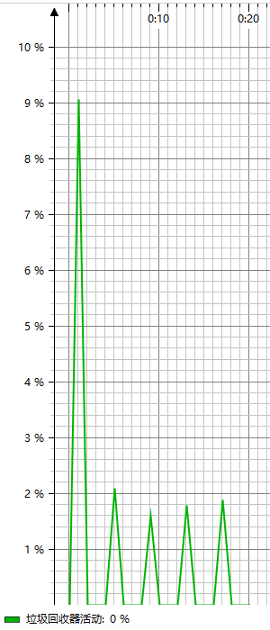
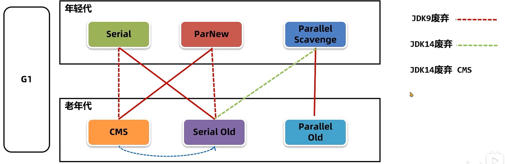
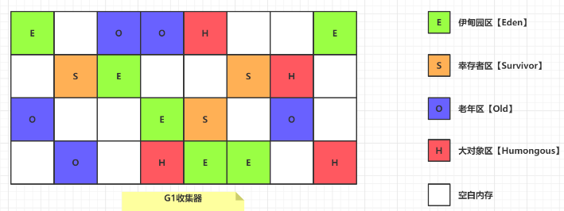
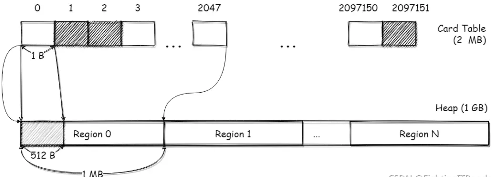
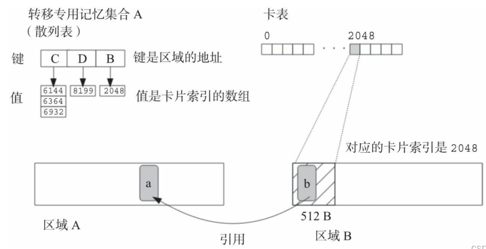

## 垃圾回收
- 程序计数器、虚拟机栈、本地方法栈的生命周期同线程，估线程结束时，这几个区的内存也会被回收，即不需要垃圾回收
- System.gc()可以手动触发垃圾回收，但不一定会立即回收，只是向JVM发送一个垃圾回收请求，JVM不一定会立即执行

### 方法区的垃圾回收
- 方法去中的垃圾回收分为废弃常量和无用的类

无用的类的回收
- 方法去中的类被回收是发生在卸载阶段
- 判断一个类是否可以被卸载，需要满足三个条件
  1. 类的所有实例都已经被回收，即java堆中不存在该类的实例
  2. 加载该类的类加载器已经被回收
  3. 类对应的java.lang.Class对象没有被引用，无法通过反射访问该对象
```java
public static void main(String[] args) throws Exception {
    while (true) {
        URLClassLoader classLoader = new URLClassLoader(new URL[]{new URL("file:C:\\Users\\Thepipixia\\Desktop\\temp\\")});
        Class<?> aClass = classLoader.loadClass("com.csj.JVMLearning.Class.Test1");
        Object o = aClass.newInstance();
        
        classLoader = null;
        aClass = null;
        o = null;
        System.gc();
        Thread.sleep(1000L);
    }
}
```
- 程序中的类一般是有ApplicationClassLoader加载，该加载器不会被回收，估程序中的类不会被回收
- 支持热部署的应用中，一个类对应一个类加载器，当需要热部署一个类时，需要回收类和类加载器，并重新创建类加载器以加载新的类

### 堆内存的垃圾回收
> 堆中的对象是否能被回收，是由对象是否还被引用决定
```java
public static void main(String[] args) {
    // 栈帧的局部变量表中的有Object实例的引用，实例可以被局部变量访问，估不能回收
    Object o = new Object();
    // 引用不再存在，实例无法被访问，回收
    o = null;
    System.gc();
}
```
难点是如何判断一个对象是否可以还被引用

#### 引用计数法
- 每个对象维护一个计数器，当对象被引用时计数器+1，取消引用时-1，当计数器为0时，说明该对象没有引用
- 缺点：对象需要维护计数器，对性能有影响；无法解决循环引用问题 -> 导致内存泄漏
```java
// 循环引用问题
public class Test {
  public static void main(String[] args) {
    ClassA classA = new ClassA();
    ClassB classB = new ClassB();
    // ClassB中引用ClassA
    classB.classA = classA;
    // ClassA中引用ClassB
    classA.classB = classB;
    // 局部变量表不再引用A、B
    classA = null;
    classB = null;
    
    System.gc();
  }
}
class ClassA {
  ClassB classB;
  // 用于占内存，让GC日志中内存变化更大
  byte[] bytes = new byte[1024*1024*10];
}
class ClassB {
  ClassA classA;
  byte[] bytes = new byte[1024*1024*10];
}
```
- 以上案例中，如果使用的是引用计数法，即使局部变量表不再引用A、B，但由于A引用B、B引用A，他们俩的计数器都不为0，估不会被回收
```text
[GC (System.gc())  25395K->960K(233984K), 0.0008829 secs]
```
- 使用-verbose:gc参数可以查看GC日志，发现GC清理了大约23M内存，修改占用内存的字节数组大小，回收的内存也在变化，说明A和B对象已经被回收，即JVM不是使用的引用计数法

#### 可达性分析
- 可达性分析会将对象分为GC Root对象和普通对象，若从GC Root对象通过引用链可以访问到普通对象，则该对象是可到达的，否则不可到达
- 当多个对象之间有循环引用时，因为无法通过GC Root访问，即使互相之间有引用，也会被判定为不可达

以下的对象可以作为GC Root对象：
1. 栈帧中本地变量表中引用的对象 -> 即方法参数、方法中变量引用的对象
2. 方法区中静态属性引用的变量
3. 方法区中常量引用的对象
4. 本地方法栈中Native方法引用的对象 -> 本地方法调用时访问的全局对象、参数等

#### Java引用
上一小节中的GC Root中所谓的“引用”，只是Java引用中的一种，即强引用
##### 强引用
> 代码中的Object obj = new Object()就是强引用，只要强引用存在，被引用的对象就永远不会被回收
##### 软引用
> 若一个对象被软引用关联的对象，当系统内存不足将要发生OOM时，将会被回收。可以使用SoftReference类来使用软引用关联对象 -> 用于描述有用但非必要的对象，如缓存
```java
// -Xmx200m 设置堆最大为200m
public static void main(String[] args) throws IOException, InterruptedException {
    // 当内存不足时会将byte数组回收，若回收后仍然不足，则会抛出OOM
    byte[] bytes = new byte[1024 * 1024 * 100];
    // SoftReference的对象本身也需要被GC Root引用 -> reference存在栈帧中的本地变量表中
    SoftReference<byte[]> reference = new SoftReference<>(bytes);
    // 将bytes的强引用去除，由于有softReference软引用，此时byte数组还不会被回收
    bytes = null;
    // 输出[B@1b6d3586
    System.out.println(reference.get());

    // 由于设置堆最大为200m，此时堆已经不足100m，此时会将软引用引用的第一个byte数组回收
    byte[] bytes1 = new byte[1024 * 1024 * 100];
    // 输出null
    System.out.println(reference.get());

    // 堆内存空间不足，且没有软引用可以回收，此时会抛出OOM
    byte[] bytes2 = new byte[1024 * 1024 * 100];
}
```
- 当**软引用中的对象**被回收后，*软引用对象本身*就没有存在的意义了，但*软引用对象*被强引用（变量）关联，不会被回收。
若在**软引用中的对象**还存在的时候，将强引用置空来回收*软引用对象*，则会导致**软引用中的对象**一并被回收

> 软引用对象指SoftReference的实例，软引用中的对象指软引用对象关联的对象

- SoftReference构造函数中传入一个队列，当软引用中的对象被回收时，会将软引用对象加入队列中，此时可以回收软引用对象
```java
// -Xmx200m
public class Test {
    static int count = 0;
    public static void main(String[] args) throws IOException, InterruptedException {
        List<SoftReference<byte[]>> list = new ArrayList<>();
        ReferenceQueue<byte[]> softReferenceQueue = new ReferenceQueue<>();
        for (int i = 0; i < 5; i++) {
            byte[] bytes = new byte[1024 * 1024 * 100];
            SoftReference<byte[]> reference = new SoftReference<>(bytes, softReferenceQueue);
            System.out.println(reference);
            // 使用强引用关联软引用对象
            list.add(reference);
        }
        System.out.println("==================");
        Reference<? extends byte[]> reference = null;
        // 内存快溢出时，被回收的软引用中的对象所对应的软引用对象会被加入队列中
        while ((reference = softReferenceQueue.poll()) != null) {
            System.out.println(reference);
            Thread.sleep(4000L);
            // 移除list中的强引用
            list.remove(reference);
            // 移除变量的强引用，此时软引用对象也会被回收
            reference = null;
            count++;
        }
        System.out.println(count);
    }
}
```

- 第一次回收较多是回收软引用中的对象（即占位字节数组），后几次是回收软引用对象本身

##### 弱引用
> 弱引用和软引用类似，弱引用中的对象在垃圾回收时都会被回收，与内存紧张无关 -> 用于ThreadLocal
- 弱引用通过WeakReference实现

##### 虚引用
> 无法通过虚引用获取到其指向的对象 -> 用于对象被回收时，可以接收到对应的通知
- 虚引用通过PhantomReference实现
```java
public class Test {
    public static void main(String[] args) {
        // 向直接内存中申请空间
        ByteBuffer byteBuffer = ByteBuffer.allocateDirect(1024 * 1024 * 2);
        // 当ByteBuffer对象被回收时，会触发Deallocator的run方法，此时会释放直接内存，防止内存泄露
        byteBuffer = null;
    }
}

class DirectByteBuffer {
    // 构造器
    DirectByteBuffer(int cap) {
        // 申请直接内存
        base = unsafe.allocateMemory(size);
        // 创建一个虚引用，虚引用中的对象是当前对象，当当前对象被回收时，触发Deallocator中的run方法
        cleaner = Cleaner.create(this, new Deallocator(base, size, cap));
    }

    private static class Deallocator implements Runnable {
        // 单独启动一个线程
        public void run() {
            // 回收直接内存
            unsafe.freeMemory(address);
        }
    }
}

// 继承了虚引用
public class Cleaner extends PhantomReference<Object> {
}
```

##### 终结器引用
> 对象将要被回收的时候，对象会和终结器引用关联

###### 对象自救
一个对象最终被回收要经历两次标记的过程
- 第一次标记后，会判断是否重写了finalize方法和是否调用过finalize方法，若重写了且没有调用过finalize方法，随后会将该对象放入F-Queue的队列中
创建一个低优先级的线程Finalizer去通过非阻塞的形式执行finalize方法
- 第二次是GC会对F-Queue中的对象进行第二次标记，若在这之前对象与其他对象建立的引用链，此时对象会被移除F-Queue，不会被回收，若被打上第二次标记，则会被回收
```java
class FinalizeEscape {
    static FinalizeEscape saveObj = null;
    public void isAlive() {
        System.out.println("对象仍然存活");
    }
    @Override
    protected void finalize() throws Throwable {
        super.finalize();
        System.out.println("finalize被执行");
        // 将当前对象保存到静态变量中，进行自救
        FinalizeEscape.saveObj = this;
    }
    public static void main(String[] args) throws InterruptedException {
        saveObj = new FinalizeEscape();
        // 将强引用移除
        FinalizeEscape.saveObj = null;
        // 此时被终结器引用关联，调用finalize方法的时候被自救
        System.gc();
        Thread.sleep(500L);
        if (saveObj != null) {
            saveObj.isAlive();
        }
        else {
            System.out.println("对象已经死亡");
        }
        FinalizeEscape.saveObj = null;
        // 第二次被回收，此时已经调用过finalize方法，无法被自救，被回收
        System.gc();
        Thread.sleep(500L);
        if (saveObj != null) {
            saveObj.isAlive();
        }
        else {
            System.out.println("对象已经死亡");
        }
    }
}
/*
输出：
finalize被执行
对象仍然存活
对象已经死亡        
 */
final class Finalizer extends FinalReference<Object> {
    
    private static ReferenceQueue<Object> queue = new ReferenceQueue<>();

    private static class FinalizerThread extends Thread {
        public void run() {
            // 开一个新线程，从队列中拿到终结器引用
            Finalizer f = (Finalizer) queue.remove();
            f.runFinalizer(jla);
        }
    }

    private void runFinalizer(JavaLangAccess jla) {
        // 从终结器引用中获取对象
        Object finalizee = this.get();
        // 执行对象的finalize方法
        jla.invokeFinalize(finalizee);
    }
}
```
- 由于GC对对象的回收是不确定的，所以finalize的执行时机是完全不可控的，尽量不要使用这种方法

### 垃圾回收算法

##### Stop The Word 
- GC线程进行垃圾回收时，需要标记哪些对象是可达的，需要从GC Root上逐个检查，此操作会消耗很多时间
- GC线程进行可达性分析的时候需要在一个能保持一致性的快照中进行，即停顿所有Java线程，该操作被称为Stop The Word
- 如果在可达性分析的时候，线程正在运行，会导致对象的引用关系在不断变化，使得可达性分析的结果不准确

##### 回收算法的维度
1. 吞吐量 = CPU执行代码的时间 / (CPU执行代码的时间 + GC时间)
2. 最大STW时间
3. 堆使用效率
- 三者不可以兼得，需要根据实际应用场景选择

#### 标记清除
- 步骤：先标记出所有可达的对象，再将没有被标记的对象清除
- 优点：简单
- 缺点：1. 效率低，标记和清除的效率不高；2.清除后会产生大量不连续的内存碎片，无法存储需要连续内存的较大的对象

#### 复制算法
- 步骤：
  1. 将内存划分为两块大小相同的空间（from和to），每次分配对象只使用from空间；
  2. GC时，会将from中存活的对象复制一份，按顺序存到to空间中
  3. 清除掉from空间
- 优点：1. 不会有碎片化问题；2. 由于只需要遍历一次存活对象，估吞吐量高
- 缺点：内存使用效率低
- 适用场景：大量回收，少量存活 -> 新生代中有大量对象被回收，少量对象存活，复制算法只需复制少量的存活的对象就可以实现完成回收

#### 标记整理
- 步骤：原理同标记清理，在清除的阶段，让所有存活的对象向一端移动，再清理到要回收的对象
- 优点：不会有碎片化问题，且内存使用效率高
- 缺点：需要移动对象，所以需要遍历所有对象，导致效率低下


#### 分代GC算法
> 分代GC算法是将堆内存划分为多个区域，每个区域根据实际情况使用不同的回收算法

##### 堆内存划分：
- 新生代（young）：存放存活时间短的对象 -> 使用-Xmn参数设置新生代的大小
  - 伊甸园区（Eden）：存放新生对象
  - 幸存者区（Survivor）：用于实现复制算法，分为S0和S1区，对应复制算法中的from区和to区 -> 使用-XX:SurvivorRatio参数设置eden和survivor的比例，默认为8
- 老年代（old）：存放存活时间长的对象
- 分区分代的优点：
  1. 可以针对不同区域采用不同回收算法 -> 新生代中存活的对象较少，一般采用复制算法；老年代中存活的对象较多，一般采用标记整理/标记清除算法
  2. 分代分区可以避免每次垃圾回收堆都进行FullGC，每次回收只需要执行MinorGC，大大减少垃圾回收的时间
##### MinorGC：
1. 创建的对象首先会存放在eden区
2. 当eden区满时，触发年轻代GC（Minor GC）
3. MinorGC会将eden区和from区中的存活对象复制到to区，然后清理掉from区
4. 每次执行MinorGC，会给存活下来的对象记录年龄，初始值为0，每次+1
5. 当对象长期存活时，会在from和to区来回移动，当年龄达到阈值后会被移动到老年代

##### 分配担保机制：
- 当年轻代的survivor区无法存下所有存活的对象时，会将多余的对象直接存入老年代中
- 当大对象大小超过阈值（-XX:PretenureSizeThreshold）时，会直接存入老年代中

##### FullGC：
- 老年代中内存较少时，若survivor区中晋升的对象大小 大于 老年代可用的内存时，则会触发FullGC
- 统计到的survivor区中晋升对象的平均大小 大于 老年代的剩余空间
- System.gc()会建议jvm执行FullGC
- FullGC回对整个堆进行垃圾回收，耗时是MinorGC的10倍以上，估要避免FullGC


### 垃圾回收器
- 年轻代垃圾回收器：Serial、ParNew、Parallel Scaveng
- 老年代垃圾回收器：Serial Old、Parallel Old、Concurrent Mark Sweep(CMS)
- 垃圾回收器之间的关系，如图：


#### Serial/SerialOld
- Serial是一个单线程垃圾回收器，用于年轻代，使用复制算法
- SerialOld是一个单线程垃圾回收器，用于老年代，使用标记整理算法

- 优点：简单高效、单CPU下没有线程上下文切换，有较高的单线程回收效率
- 缺点：多CPU下，CPU利用率较低；垃圾回收时需要暂停所有线程，无法实现并发回收
- 适用场景：单CPU、堆内存小的场景，如client客户端模式
- 使用-XX:+UseSerialGC指定使用Serial/SerialOld垃圾回收器

#### ParNew
- ParNew是Serial的多线程升级版，用于年轻代，使用复制算法
- 优点：多CPU下，可以同时开多个回收线程，提高回收效率
- 缺点：单CPU下不如Serial
- 适用场景：多CPU的场景，如server服务端模式
- 使用-XX:+UseParNewGC指定使用ParNew/SerialOld垃圾回收器
```text
// ParNew：ParNew回收新生代    Tenured：老年代内存变化，一般为SerialOld回收老年代
[GC (Allocation Failure) [ParNew: 2247K->2247K(3072K), 0.0000165 secs][Tenured: 5313K->6337K(6848K), 0.0030605 secs] 7560K->7484K(9920K) [Times: user=0.00 sys=0.00, real=0.00 secs] 
```

#### CMS
- CMS（Concurrent Mark Sweep）用于老年代，使用标记清除算法
- CMS 是一种以最短回收停顿时间为目的的垃圾回收算器，称为**并发低停顿回收器**
- 回收步骤：
  1. 初始标记：需要STW，标记GCRoots**直接**关联的对象，该操作速度较快
  2. 并发标记：基于直接关联的对象，对所有对象进行搜索，标记出所有可达的对象，该操作与用户线程并发执行
  3. 重新标记：需要STW，修正并发标记时由于线程继续执行而导致标记变化的对象，该操作时间远小于并发标记
  4. 并发清理：清理死亡的对象，该操作与用户线程并发执行
  5. 由于最耗时的并发标记和并发清理可以和用户线程并发工作，初始标记和重新标记的时间短，估停段时间较短
- 优点：垃圾回收时的停顿时间短，给用户带来的体验较好
- 缺点：
  1. 并发阶段，垃圾回收线程需要占用一部分CPU资源，导致用户线程的资源被抢占
  2. 无法处理浮动垃圾。当预留的内存无法满足并发清理阶段用户线程产生的垃圾，会出现Concurrent Mode Failure，此时会退化为SerialOld回收器进行老年代的垃圾回收
  > 浮动垃圾：在并发清理的阶段用户线程仍在运行，期间产生的垃圾是在标记后出现，无法回收，需要留到下一次GC清理。  
    因此CMS不能等到老年代几乎填满后再回收，而是需要预留一部分空间以应付并浮动垃圾。使用-XX:CMSInitiatingOccupancyFraction参数可以控制老年代占用率高于此值时进行GC，默认为68%
  3. CMS为标记清理算法，会有空间碎片产生，当有空间但无法存入大对象时，会触发FullGC进行碎片整理，导致停顿时间变长。使用-XX:+UserCMSCompactAtFullCollection参数可以设置在FullGC时是否进行碎片整理
    使用-XX:+CMSFullGCsBeforeCompaction参数可以设置在多少次FullGC后进行碎片整理，默认为0，即每次FullGC都进行碎片整理
- 适用场景：重视服务响应速度的服务端
- 使用-XX:+UseConcMarkSweepGC指定使用ParNew/CMS垃圾回收器
```text
// ParNew：ParNew：回收新生代
[GC (Allocation Failure) [ParNew: 2752K->320K(3072K), 0.0028804 secs] 2752K->1012K(9920K), 0.0029306 secs] [Times: user=0.00 sys=0.00, real=0.00 secs
// CMS Initial Mark：CMS初始标记
[GC (CMS Initial Mark) [1 CMS-initial-mark: 5111K(6848K)] 6318K(9920K), 0.0002396 secs] [Times: user=0.00 sys=0.00, real=0.00 secs] 
// CMS-concurrent-mark-start：CMS开始并发标记
[CMS-concurrent-mark-start]
[CMS-concurrent-mark: 0.000/0.000 secs] [Times: user=0.00 sys=0.00, real=0.00 secs] 
[CMS-concurrent-preclean-start]
[CMS-concurrent-preclean: 0.000/0.000 secs] [Times: user=0.00 sys=0.00, real=0.00 secs] 
[CMS-concurrent-abortable-preclean-start]
[CMS-concurrent-abortable-preclean: 0.000/0.000 secs] [Times: user=0.00 sys=0.00, real=0.00 secs] 
// CMS Final Remark： CMS重新标记
[GC (CMS Final Remark) [YG occupancy: 2273 K (3072 K)][Rescan (parallel) , 0.0003666 secs][weak refs processing, 0.0000140 secs][class unloading, 0.0003120 secs][scrub symbol table, 0.0005126 secs][scrub string table, 0.0001374 secs][1 CMS-remark: 5111K(6848K)] 7385K(9920K), 0.0013845 secs] [Times: user=0.00 sys=0.00, real=0.00 secs] 
// CMS-concurrent-sweep-start：CMS开始并发清理
[CMS-concurrent-sweep-start]
[CMS-concurrent-sweep: 0.000/0.000 secs] [Times: user=0.00 sys=0.00, real=0.00 secs] 
[CMS-concurrent-reset-start]
[CMS-concurrent-reset: 0.000/0.000 secs] [Times: user=0.00 sys=0.00, real=0.00 secs]
```

#### Parallel Scavenge/Parallel Old
- jdk8的默认GC回收器
- Parallel Scavenge是多线程回收器，用于年轻代，使用复制算法
- Parallel Old是多线程回收器，用于老年代，使用标记整理算法
- Parallel Scavenge/Parallel Old是为了尽可能缩短垃圾收集时的停顿时间，达到一个可控制的吞吐量，称为**吞吐量优先**回收器
- 通过-XX:+UseAdaptiveSizePolicy默认启动，可以自动调节新生代大小（-Xmn）、eden和survival区的比例（-XX:SurvivorRatio）、晋升老年代对象大小（-XX:PretenureSizeThreshold）等参数，称为GC自适应的调节策略 -> 建议不要手动设置堆最大值
- 优点：虚拟机自动调整堆参数，吞吐量高且可控
  > -XX:GCTimeRatio设置吞吐量  
  > -XX:MaxGCPauseMillis设置最大停顿时间，若设置较小，GC为了达到目标值，会牺牲吞吐量和新生代空间，会将新生代空间缩小，导致回收更加频繁，吞吐量也相应下降
- 缺点：无法保证停顿时间
- 适用场景：后台任务，对停顿时间不敏感，对吞吐量高敏感；容易产生大量对象
- 使用-XX:+UseParallelGC或-XX:+UseParallelOldGC指定使用Parallel Scavenge/Parallel Old垃圾回收器
```text
// Ergonomics指GC自适应的调节策略     PSYoungGen：Parallel Scavenge回收年轻代     ParOldGen：Parallel Old回收老年代
[Full GC (Ergonomics) [PSYoungGen: 8318K->2876K(9216K)] [ParOldGen: 9540K->9453K(10240K)] 17858K->12330K(19456K)
```

#### G1
- 优点：暂停时间短，适用于大堆
- G1是既可以回收年轻代，又可以回收老年代的垃圾回收器，采用region上复制算法，整体上基于标记整理
- G1仍采取分区分代，但各个区物理上不再连续，而是将堆分为多个大小相等的独立区域（Region），每个Region可以是任何一个区
- 每个region大小为 堆空间/2048，可以通过参数-XX:G1HeapRegionSize来调整，注意必须是2的倍数，范围为1m~32m
- 由于每个region空间较小，若需要存入大对象（大于Region的1/2），则会将多个region合并，称为humongous区 -> 属于老年代  

- -XX:+UseG1GC指定使用G1垃圾回收器

##### YoungGC
1. 当eden区占用较大时（默认60%），会标记出eden和survivor区中存活的对象，同其他GC
2. 根据最大暂停时间（-XX:MaxGCPauseMillis），选择某些region将里面存活的对象复制到survivor区
> G1会记录各个Region回收获得的大小和回收所需要的时间的平均值，并维护一个优先列表，再根据最大暂停时间选择回收价值最大的region回收（该机制是Garbage-First的由来）
3. 当对象年龄大于某个阈值时，将会被放入老年代

###### Remembered Set
- 问题：G1将堆分为多个Region，在年轻代回收时，存在老年代Region中的对象持有年轻代Region的引用，想要找出这部分对象，则需要遍历所有的老年代Region
- 解决：G1通过维护一个记忆集Remembered Set来解决该问题，也被称为RSet

> 卡表Card Table  
> - 将Region划分为物理连续的512byte的小块，称为卡页Card Page，对每个卡页进行编号，存在字节数组中，该字符数组被称为卡表Card Table
> 

- 在建立引用关系时，会在代码后插入写屏障，写屏障内可以代码，判断该次引用关系的建立，是否是从老年代到年轻代
- 每个Region都有一个卡表，若是老年代到年轻代的引用，此时会到年轻代的卡表进行修改，将卡表中引用的所在的卡表的位置置为0，称为脏卡，并通过GC线程更新到RSet中
- RSet是一个Map类型的数据结构，key存放着老年代Region的地址，value存放着脏卡的下标
- 在进行YoungGC时，会去查看RSet，根据key定位到Region，根据value，去自己的卡表里寻找脏卡，并将脏卡对应的卡页内的对象加入GCRoots中

- 老年代中的引用的对象被加入GCRoots后，YoungGC时，就可以通过这些GCRoots，将 被老年代对象引用的对象 打上标记

##### MixedGC
1. old + humongous占堆内存的空间占比（[是老年代占堆空间比例，还是堆的使用比例？](https://heapdump.cn/article/2712390)）超过阈值（-XX:InitiatingHeapOccupancyPercent）时，
会在YoungGC执行时同时执行concurrent marking
2. concurrent marking流程与CMS类似对GCRoots 进行标记；并发标记和最终标记同CMS；清理空的Region
> concurrent marking流程：
> 1. 初始标记：此阶段标记所有的GCRoots。与YoungGC共用STW时间，即附带在YoungGC上执行。
> 2. 根区域扫描阶段：对初始标记阶段中标记的幸存者区域中的对象进行臊面，扫描他们所指向老年代的引用，并标记这些引用的对象，并发
> 3. 并发标记阶段：根据1.2.被标记的对象，查找堆中可达的对象
> 4. 重新标记阶段：重新标记并发导致的没有被标记的对象
> 5. 清理阶段：清理完全空白的区域，识别出需要进行混合回收的区域
3. concurrent marking后，可以统计出堆中可回收的垃圾占堆的比例
4. MixedGC会将部分老年代中的Region（选择统计中回收效益最高的region）放入CSet
5. MixedGC和YoungGC相同，只是还会回收一部分老年代Region，由于也是采用的复制算法，估不会有内存碎片 -> 这里我发现MixedGC前必有一次YoungGC，我才是为了先执行一次YoungGC清理掉新生代中的对象，减少MixedGC的停顿时间
6. 经过多次MixedGC，直至回收足够数量的老年代Region后（达到-XX:G1HeapWastePercent的要求），恢复回YoungGC


##### FullGC
- 当尝试YoungGC和MixedGC后仍没有足够的内存，会执行FullGC
- FullGC使用的是类似于Serial的单线程模式，会触发STW，且执行效率低

```text
// eden快满了，触发youngGC
[GC pause (G1 Evacuation Pause) (young), 0.0019288 secs]

// 到达阈值，在进行youngGC同时进行concurrent marking
[GC pause (G1 Evacuation Pause) (young) (initial-mark), 0.0016054 secs]
    // 可以看到，在concurrent marking中也会执行YoungGC
    [Eden: 1024.0K(1024.0K)->0.0B(1024.0K) Survivors: 1024.0K->1024.0K Heap: 7054.8K(10240.0K)->6533.4K(10240.0K)]

// eden快满了，触发youngGC
[GC pause (G1 Evacuation Pause) (young), 0.0013562 secs]
// 执行过concurrent marking，且垃圾大于阈值，故触发多次MixedGC，直至清理了足够的老年代Region
[GC pause (G1 Evacuation Pause) (mixed), 0.0014668 secs]

[GC pause (G1 Evacuation Pause) (mixed), 0.0014479 secs]

[GC pause (G1 Evacuation Pause) (mixed), 0.0015160 secs]

// 依然没有足够空间，触发fullGC
[Full GC (Allocation Failure)  10194K->7996K(10240K), 0.0035471 secs]
```