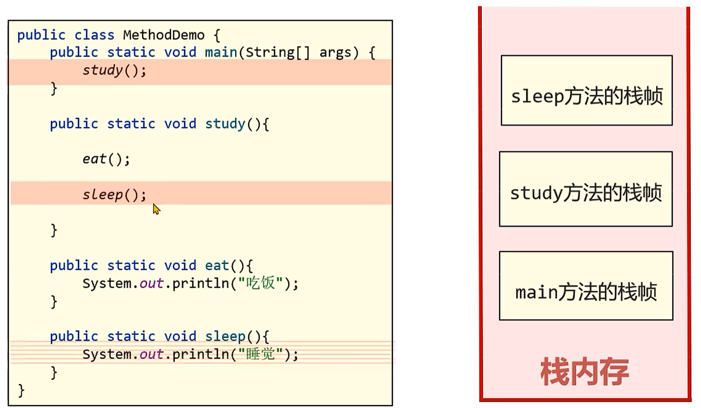
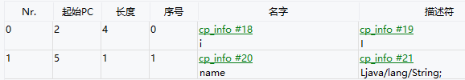
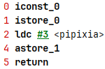
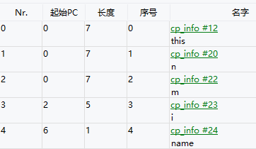
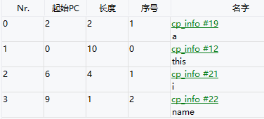

## 栈
> 栈分为Java虚拟机栈和本地方法栈，前者用于保存Java方法的信息，  
> 后者用于保存native修饰的方法（即C/C++编写的方法）的信息  
> 
> hotspot中只使用Java虚拟机来保存方法信息
1. Java虚拟机栈  
Java虚拟机栈采用栈来管理方法的信息和调用，特点为**先进后出**，每一个方法的调用使用一个**栈帧**（Stack Frame）来保存
2. 运行过程  
2.1. 当进入一个方法时，使用一个栈帧来保存方法信息，并将栈帧入栈
2.2. 当方法执行结束时，将栈帧出栈  
2.3. 若在方法执行中调用其他方法，则使用新的栈帧来保存方法信息，并将栈帧入栈

3. 生命周期  
Java虚拟机栈随着线程的创建而创建，在回收线程时销毁
4. 栈帧的组成  
4.1. 局部变量表  
局部变量表是在方法执行中存放所有的局部变量，在编译完成后就可以看到局部变量表中的内容


- Nr.变量的声明顺序
- 起始PC：表示变量声明完后，从哪一行字节码文件开始可以使用该局部变量（如i的起始PC为2，表明从第2行字节码文件后可以使用i）
- 长度：表示局部变量可以被访问的长度（如i的长度为4，表示可以从第2行到第5行着4行中可以访问i）  
- 序号：表示栈帧中的局部变量表中，局部变量的起始槽的索引
> 字节码中的局部变量表是用于安全性校验，而栈帧中的局部变量表是一个**数组**。  
> 数组中每个位置称之为槽，其中long和double类型变量会占用两个槽，其他数据类型占用一个槽
- 如果方法是实例方法，则序号0的位置保存的是this，即当前方法运行时的对象
- 方法参数也会保存在局部变量表中
- 顺序为this -> 方法参数 -> 局部变量
```java
public void test(int n, int m) {
    int i = 0;
    String name = "pipixia";
}
```
对应的局部变量表为：  

- 当某个局部变量不在生效时，槽就可以再次被利用
```java
public void test() {
    {
        int a = 1;
        int b = 2;
    }
    int i = 0;
    String name = "pipixia";
}
```
```
0 iconst_1 
1 istore_1 // 将a存入1号槽中
2 iconst_2
3 istore_2 // 将b存入2号槽中
4 iconst_0
5 istore_1 // 将i存入1号槽中
6 ldc #5 <pipixia>
8 astore_2 // 将name存入2号槽中
9 return
```
  
解释：this占第0号槽，执行代码块时，a和b占第1号和第2号槽，当代码块执行完时，a和b不再生效，第1号和第2号槽就可以再次被利用，
因此，i和name也占第1号和第2号槽
5. 栈的内存溢出
- 栈的默认大小由操作系统和计算机结构决定，可以使用-Xss或-XX:ThreadStackSize参数来设置栈的大小
- 栈大小最小值为180k，最大值为1024m
- 栈空间一般不会溢出，可以设置-Xss256k来节省内存
6. 本地方法栈
- 本地方法栈用于存储native方法的栈帧
- Java虚拟机栈和本地方法栈共用一个栈空间