## 启动arthas
在arthas-boot.jar同级目录下执行如下命令启动arthas
```shell
java -jar arthas-boot.jar
```
## 常用命令

### dashboard
从上往下分别为：线程信息、内存信息、JVM信息、操作系统信息
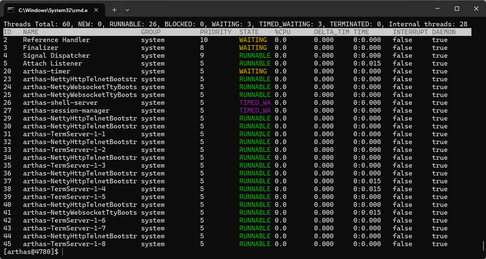
###### 线程信息
- ID：线程ID 
- NAME：线程名称
- GROUP：线程组
- PRIORITY：优先级(0-10，默认为5，越大优先级越高)
- STATE：线程状态
- %CPU：占用CPU百分比
- TIME：运行时间
- TNTERRUPTE：是否被中断
- DAEMON：是否为守护线程
###### 内存信息Memory
- used：已使用的内存大小
- max：最大内存大小
- usage：内存使用百分比
### jad
jad + 全类名 可以将字节码文件进行反编译
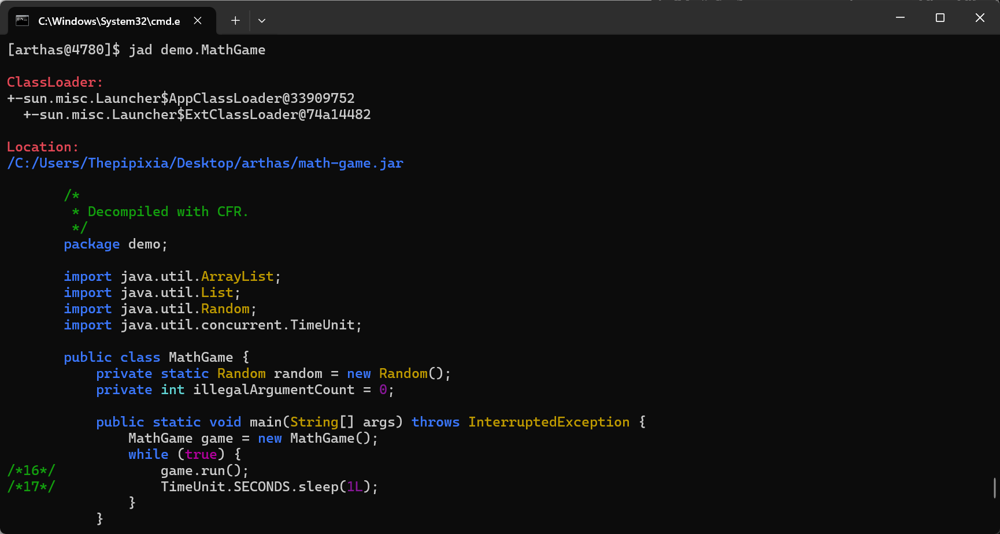
- ClassLoader加载该类的类加载器
- Location 类所在的jar包
- 源代码
### watch
监视指定类的指定方法的调用信息，包括参数、返回值、耗时等
> 格式： watch [包名].[类名] [方法名] [返回值]
```shell
watch demo.MathGame primeFactors returnObj
```
###### quit和stop
1. quit：退出当前会话，但不关闭Arthas进程
2. stop ：关闭Arthas进程，将会停止所有会话

## 线程有关命令
### thread
显示所有的线程信息
> thread 1 显示线程ID为1的线程的堆栈信息  
> thread -n 3 显示最烦忙的3个线程 thread   
> thread -b 显示阻塞的线程  
> thread --status WAITING 显示状态为WAITING的线程  

- 通过thread + 序号 可以显示指定线程的堆栈信息
#### jvm
查看jvm信息
#### sysprop
查看或修改Jvm的系统属性
- sysprop [key] 查看指定key的value，如sysprop java.home
- sysprop [key] [value] 修改指定key的value，如sysprop usr.country CN
#### sysenv
当前JVM的环境变量
> sysenv [key] 查看指定key的value，如sysenv JAVA_HOME
#### vmoption
查看或修改JVM的配置参数
#### getstatic
可以查看类的静态属性
> getstatic 类名 属性名
```shell
getstatic demo.MathGame random
```
#### ognl
可以通过ognl表达式来查看对象的属性
> ognl '[表达式]' 如： orgl '@demo.MathGame@random'

## Class和ClassLoader命令
#### sc
查看JVM中已加载的所有类的信息
> sc [全类名/全限定名] 支持通配符  
> sc -d [全类名/全限定名] 输出类的详细信息，包括文件来源、类加载器、声明等  
> sc -f [全类名/全限定名] 输出类成员变量信息
#### sm
查看已加载类的方法信息 
> sm [全类名/全限定名] 查看该类下的所有方法  
> sm -d [全类名/全限定名] 查看该类下的所有方法的详细信息
#### jad
将字节码反编译成java源码
> jad [全类名/全限定名] [方法名] 输出指定类的指定方法的源码
#### mc
memory compiler：将内存中的源代码(.java)编译为字节码文件(.class)
> mc [java文件地址] -d [指定输出目录]
### redefine
将字节码文件重新加载到jvm中
> redefine不能增加新的成员变量和成员方法，否则会失败；redefine无法恢复原来的类；无法修改正在执行的函数
### 结合使用实现热更新
```shell
# --source-only表示只读取源码， > 表示输出到的文件路径
jad --source-only demo.MathGame > MathGame.java
```
```shell
# 将修改后的源码重新编译为字节码文件，生成的class文件默认位于./类名/文件名.class
mc MathGame.java
```
```shell
redefine ./demo/MathGame.class
```
### dump
将当前jvm中的类信息的字节码文件导出到本地文件，默认输出路径为logs/arthas/dump/类加载器-类加载器的hashchode/包名/
> dump [全类名/全限定名]
### classloader
获取类加载器信息

| 参数                               | 作用                  |
|:---------------------------------|:--------------------|
| [l]                              | 展示类加载器实例的数量         |
| [a]                              | 展示所有的类加载器加载的类       |
| [-c 类加载器hashcode<br/> -r 资源路径 ]  | 使用指定的类加载器查找对应的资源的路径 |
| [-c 类加载器hashcode<br/> -load 全类名] | 使用指定类加载起加载指定类          |

[l]：
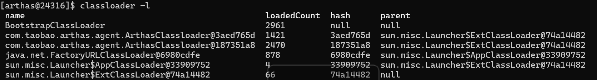
- loadedClassCount：该类加载器加载的类数量
- hash: 类加载器的hashcode
- parent：该类加载器的父类加载器，其中BootstrapClassLoader和ExtClassLoader为null，表明是顶层加载器，由操作系统启动

[-c -r]：
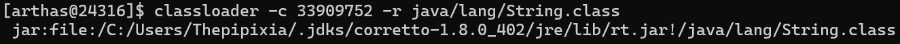

## 监视命令
#### monitor
监视指定类中方法的执行情况(无法监视方法调用的具体参数、返回值等信息)，执行命令后不会立即返回，而是等待目标的Java进程返回信息后再显示
> monitor [全类名/全限定名] [方法名] -c [统计周期，默认120s]  

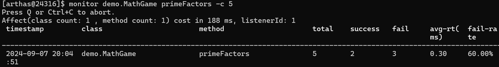
- 统计了5s之内该方法的调用次数、成功失败次数、平均耗时、失败率等信息
#### watch
观察指定方法的调用情况，能够获取到方法调用的参数、返回值、异常、入参等
> watch [全类名/全限定名] [方法名] [观察表达式] [条件表达式]

案例1：
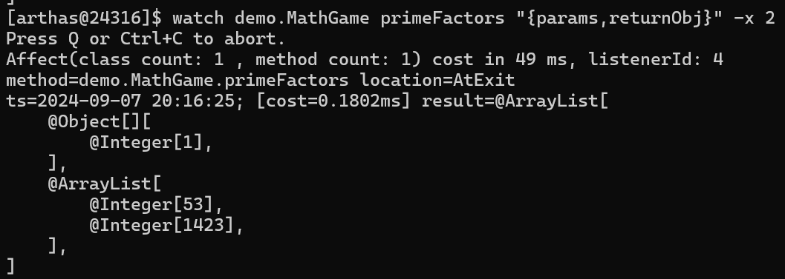
- "{params,returnObj}" ：观察表达式，OGNL表达式，表示获取入参和返回值，并将他俩作为列表返回
- -x：遍历深度，默认为1，此案例中遍历深度2意味着会将返回值(@Object[]和@ArrayList)内的值再进行遍历，若为1则只会展示两个对象，不会展示其中的数据  
- -f：在函数调用后观察，默认开启

案例2：在方法执行前进行监控，此时返回值为空  

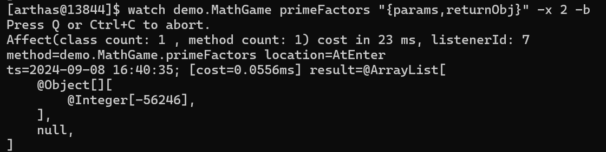
- -b：在函数调用前观察，默认关闭，此时返回值和异常为空

案例3：查看方法运行前后调用的对象中的属性，使用target[.field_name] 
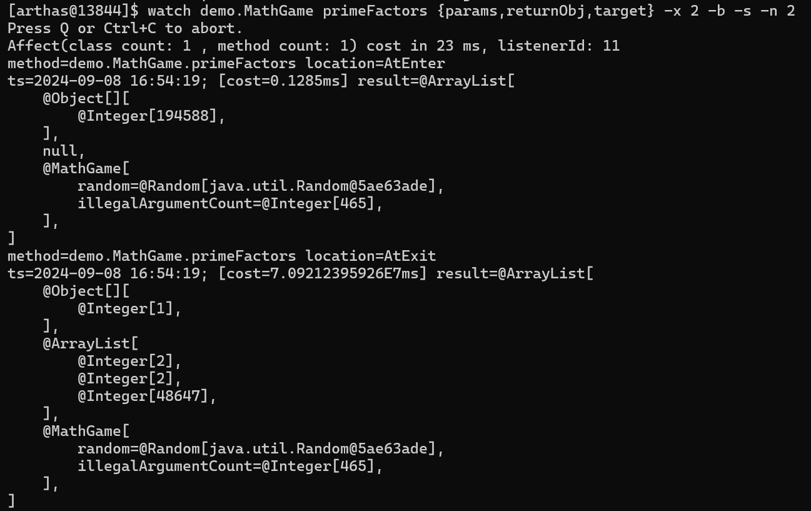
- 将观察表达式改为target[.field_name]，即可获取调用该方法的对象的成员变量，[.field_name]是用于查看某一个属性时
- -s：在函数返回后观察，默认关闭
- -n Integer：观察次数，此案例中-b -s为两次，故会返回方法调用前后的结果

案例4：使用条件表达式，输出第一个参数小于0的情况
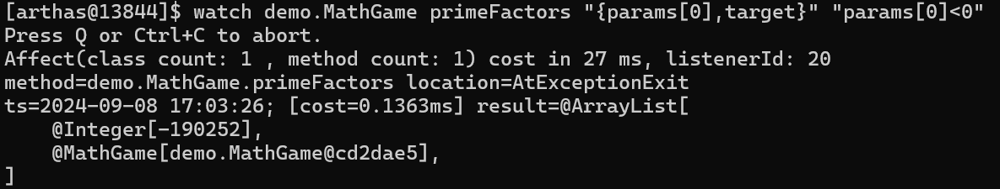
- "params[0]<0"：条件表达式
- -e：在函数抛出异常后观察，默认关闭

#### trace
追踪方法内部调用的路径，获取到方法路径上的每个节点的信息
> trace [全类名/全限定名] [方法名]

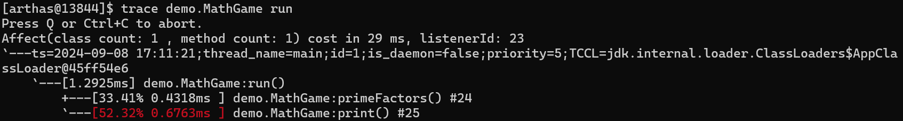
- 最耗时的调用方法会用红色标记

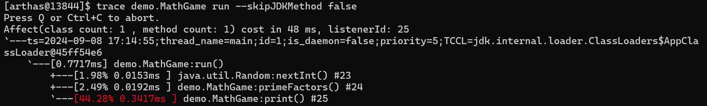
- 默认会跳过JDK执行的方法，若要显示JDK方法，加上--skipJDKMethod false

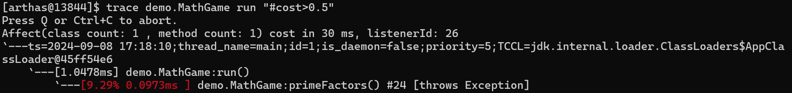
- #cost耗时条件过滤，耗时是只过滤整个函数的耗时，而不是过滤内部函数的耗时

#### stack
输出当前方法被调用的调用路径
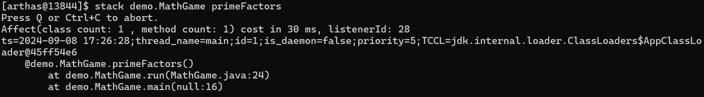
- 输出方法调用的栈帧信息
- 同样支持条件表达式，#cost耗时过滤

#### tt
记录指定方法每次调用的入参和返回值，功能与watch类似，但是tt是记录下所有信息并保存
> tt -t [全类名/全限定名] [方法名]  

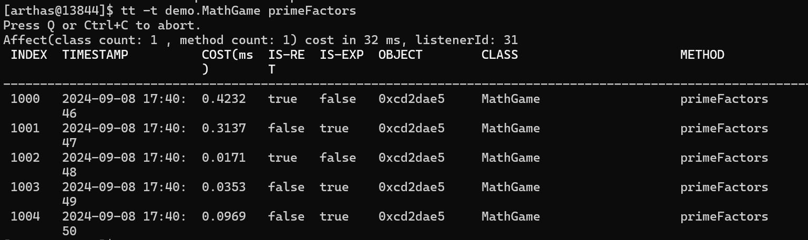
- INDEX：编号
- TIMESTAMP：执行时间戳
- COST：执行耗时
- IS-RET：是否返回
- IS-EXP：是否抛出异常
- OBJECT：执行对象的hashCode
- CLASS：执行的对线的类
- METHOD：方法名

> tt -l 显示已经记录的信息
> tt -s "method.name=='primeFactors'" 搜索指定的记录
> tt -i [INDEX] 查看指定序号的记录
> tt -i [INDEX] -p 让指定序号的记录重新执行一遍

## OGNL表达式
- 调用对象的方法：[variable].[methodName\]() 例：target.toString()
- 调用静态方法：@[全类名]@[方法名] 例：@java.lang.String@valueOf()