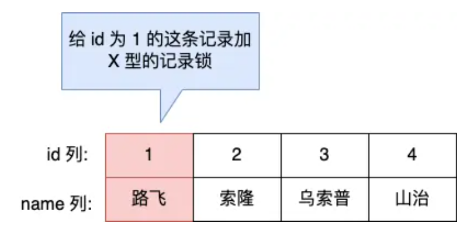
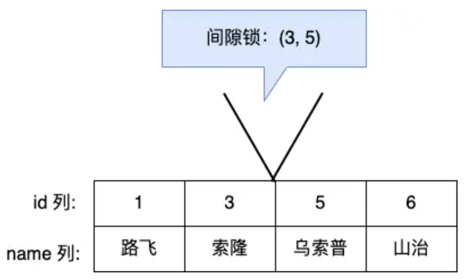
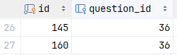
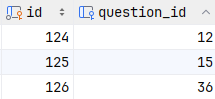
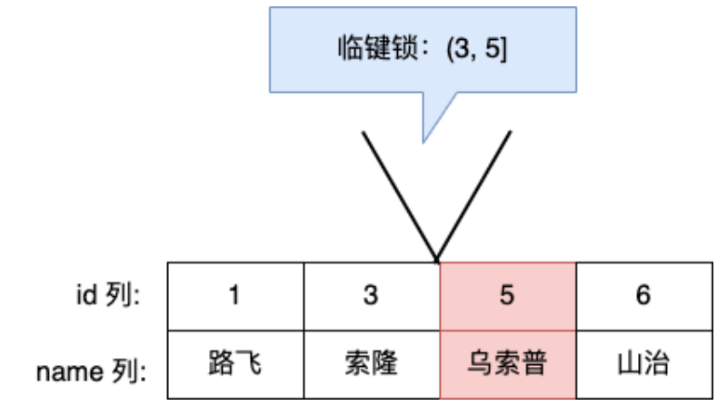
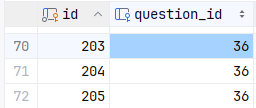
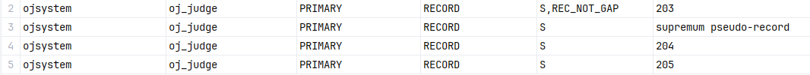

## 锁

### 全局锁
> 锁住整个数据库
- 全局锁是对整个数据库实例加锁，加锁后数据库只读不写
- 出现场景：全库的备份，加全局锁保证数据的完整性 -> 备份语句：mysqldump 数据库名 > 文件名.sql，可以通过加入参数--single-transaction，可以实现不加锁备份
- 加锁语句：flush tables with read lock
- 缺点：锁期间无法执行更新操作；主从模式中，从表无法同步二进制文件(binlog)
### 表级锁

#### 表锁
- 分为共享读锁（read lock）和独占写锁（write lock）
- 读锁：不阻塞读操作，当前客户端写数据报错，其他客户端阻塞等待
- 写锁：当前客户端即可读也可写，其他客户端读写阻塞
- 加锁语句：lock tables 表名 read/write
- 释放锁：unlock tables 或客户端断开连接

#### 元数据锁
- 元数据锁（MDL）是对表的元数据进行加锁，元数据指的表的结构等信息
- 目的：为了维护表的元数据的数据一致性
- 当一张表中有事务未提交的时候，是不能对元数据进行修改的，避免DML和DDL冲突；MDL锁是完全自动的，无序程序员手动加锁
- performance_schema.metadata_locks中记录有元数据锁的信息

加锁过程：
- 对表进行select操作时，加shared_read锁；对表进修改操作时，加shared_write锁；对表进行DDl操作时，加exclusive锁
- 作用：防止在修改表结构的过程中，另一个事务按照原本的表结构插入一条数据，导致数据不一致
- shared_read和shared_write不互斥，可以并发运行
- exclusive和shared锁互斥
- 注意：session1获得shared锁，session2执行ddl导致阻塞，此时session3执行DML与session1不互斥，但由于session2处于阻塞，会导致session3也在后面排队阻塞

#### 意向锁
- 问题：意向锁用于解决行锁和表锁的冲突，没有意向锁的情况下，若session1加了行锁，session2想加表锁时需要检查每一行是否加有行锁和加的锁是否兼容
- 分类：意向锁分为意向共享锁（IS），select...in share mode语句；意向排他锁（IX），insert、update、delete语句
- 兼容：意向共享锁与表锁共享锁不互斥，与表锁排他锁互斥；意向排他锁与表锁共享锁和表锁排他锁互斥；意向共享锁与意向排他锁不互斥
- 查询：performance_schema.data_locks中记录有意向锁的信息
- 效果：session1执行语句时，会对行加行锁和表加意向锁；此时session2想加表锁，就可以只去检查表是否有加意向锁，从而来判断是否可以加表锁，不用去检查每一行了

### 行级锁
- 行级锁每次只锁住对应的行数据，行级锁是基于innodb引擎的，MyISAM等其他引擎不支持
- 共享锁（S）：允许事务读一行数据，与其他事务的共享锁不互斥，与其他事务的排他锁互斥
- 排他锁（X）：允许获取排他锁的事务更新数据，阻止其他事务获得共享锁和排他锁
- select ... lock in share mode加共享锁，select不加锁，select for ... update/insert/update/delete加排他锁
- InnoDB的数据是基于索引组织的（所有的数据都是存在聚集索引下的），行级锁是对索引加的锁，而不是对行记录加锁
- 行级锁分为：记录锁Record Lock、间隙锁Gap Lock、临键锁Next-Key Lock

#### 记录锁
> 记录锁锁住的是索引记录  
> 
- 当某列没有索引时，InnoDB的行锁将对所有行加锁
- 作用：防止其他事务对该行进行update和delete
- 在LOCK_MODE中显示为REC_NOT_GAP，LOCK_DATA显示为加锁索引的id

#### 间隙锁
> 间隙锁锁住的是索引和索引之间的间隙  
> 
- 作用：防止其他事务在间隙中insert，从而产生幻读
- LOCK_MODE：显示为GAP，LOCK_DATA显示为加锁索引的id
- 防止幻读原理：幻读，在RR的隔离等级下，解决了脏读问题，即当事务1的执行过程中，事务2插入了数据，此时事务1是无法查到事务2提交的数据的。
  但当事务1插入id相同的数据时，会发现该条数据已存在，出现幻读现象。间隙锁在事务1查询存在的时候，会在该索引的前后加上间隙锁，此时事务2
  再想去插入数据，需要等待间隙锁的释放，无法插入数据，解决了幻读问题。

加间隙锁的情况
- 默认是加临键锁，遇到以下情况会退化为间隙锁 -> 无论是等值查询还是范围查询，本质都是为了锁住查询的值，防止其他事务在该id上插入
1. 在唯一索引列等值查询时，等号后边是不存在的值时，优化为间隙锁 -> 由于值不存在，估不需要锁住后面的值
- 
- 如：select * from oj_judge where id = 150 lock in share mode;
- 锁住(145,160)，实际上间隙锁是要锁住id=150这一点，防止其他事务插入导致幻读，但由于id=150不存在，只有锁住离他最近的间隙(145,160)
- 锁信息：ojsystem,oj_judge,PRIMARY,RECORD,"S,GAP",160
2. 在普通索引列等值查询时，若不存在则同第一条，若存在还会锁住该条的前后的间隙
- 
- 如：select * from oj_judge where question_id = 15 lock in share mode;
- 存在question_id=15的值，会锁住id为125，和question_id为(12,15]、(15,36)，因为普通索引里面可能插入索引key相同的数据，
由于不能确定是在question_id=15的前面还是后面插入，所以就前后的间隙都锁住
3. 在唯一索引列范围查询时，会锁住查询区间
- 如：select * from oj_judge where id >= 145 and id < 155 lock in share mode;
- 锁住[145,160)，因为id = 145能匹配，估还要对该行加记录锁，防止其他事务修改该值导致不可重复读

#### 临键锁
> 临键锁锁住的是索引之间的间隙和索引记录，即记录锁 + 间隙锁  
> 
- 临键锁在LOCK_MODE中不显示
- 作用：既可以防止其他事务对当前记录update和delete，又可以防止其他事务在当前记录前后的间隙中insert

加临键锁的场景
1. 在唯一索引列范围查询时
- 如：select * from oj_judge where id = 155 and id <= 160 lock in share mode;
- 由于id=160是存在的，估需要锁住(145,160)和160该行，合并就成了临键锁(145,160]
- 输出结果：ojsystem,oj_judge,PRIMARY,RECORD,S,160
2. 间隙锁的第二个例子中，question_id存在，所以要同时锁住(12,15)、(15,36)和15本身，(12,15)和15可以合并为临键锁
3. 唯一索引中范围查询单边开口的情况
- 如：select * from oj_judge where id >= 203 lock in share mode;
- 
- id = 203存在，所以应该要锁住\[203,+无穷)，会对id=203加行锁，对(203,204\]、(204,205\]、(205.+无穷) 加锁
- 
- 可以得出，最大范围的锁就是临键锁，即左开右闭，若想加锁的范围更大，则需要多个临键锁拼接而成

#### 总结

总结一下，前面讲的有点乱糟糟的
- 无论是等值还是范围，中心思想是锁住查询的值或区间，不让其他事务趁机插入
- 当查询的值不存在时，由于值不存在，无法锁住当前这条数据，只有通过前后的key来搭建间隙锁，才能锁住该值
- 锁默认都是加的临键锁，遇到特定情况才会退化为间隙锁或记录锁 -> 其实可以理解为若锁住(12,15)和15，就可以合并为临键锁(12,15]。
可以这样理解，但是实际是相反的，实际是本来锁住(145,160]，但由于条件没有对160取等，退化为(145,160)
- 是否锁住边界值，只需要看条件中对边界有等值判断，若有则也得一并锁起来，举例：where id >= 145 and id < 155中id=145是存在的，则要锁起来；
where id = 150由于条件中没有等值查询边界145和160，估不锁边界，即(145,160)

