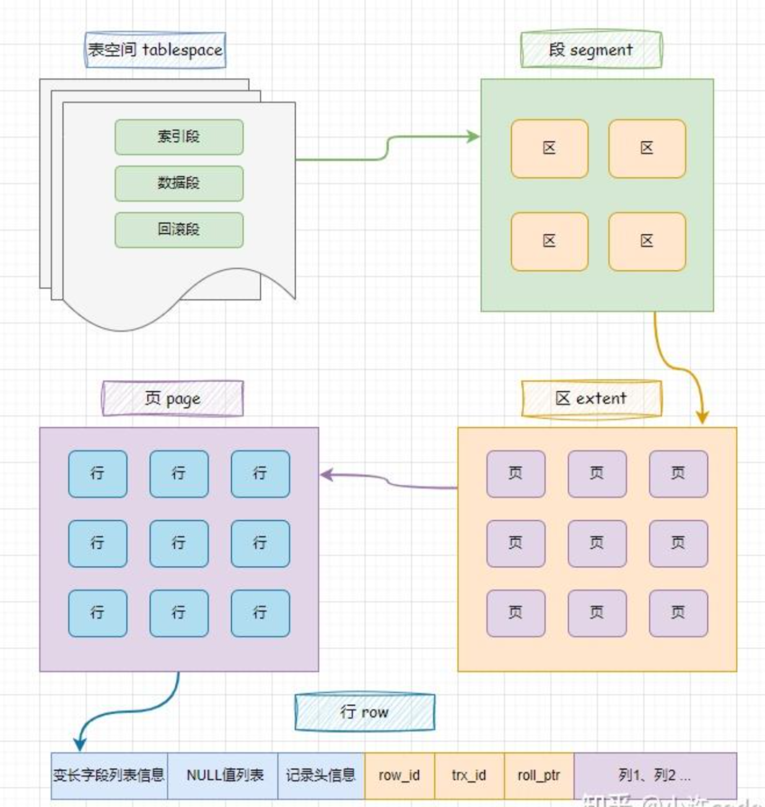
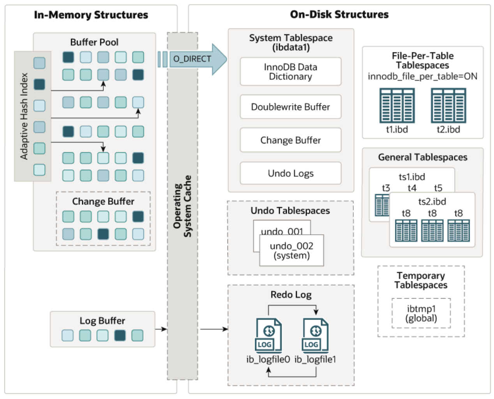
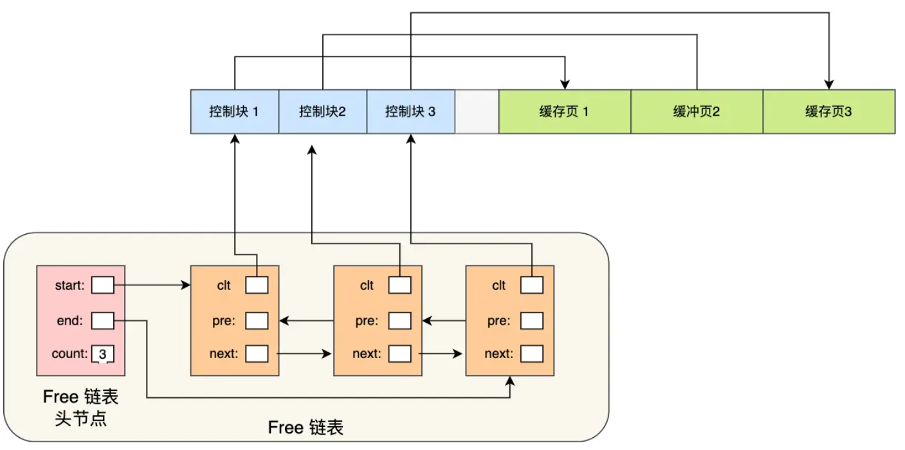
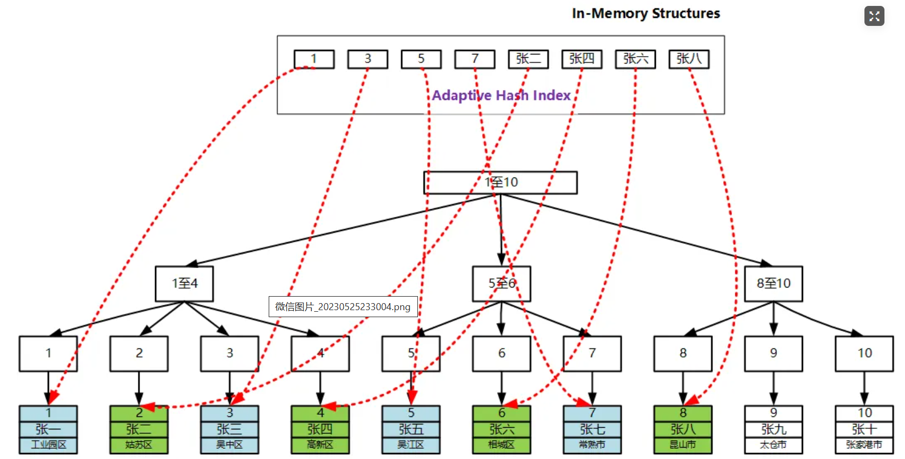
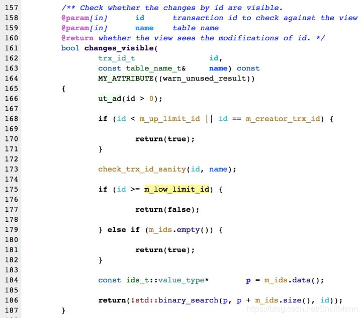

## 存储引擎
MySQL支持的存储引擎：InnoDB、MyISAM、Memory  

### InnoDB
- MySQL默认存储引擎  
- 每一张表对应一个.ibd文件，里面存储有表结构、数据、索引 -> innodb_file_per_table=1时，每一个表都对应一个.ibd文件
- 适用于：对数据频繁更新的业务，对并发性能要求高，对事务完整性要高

特点：
- DML遵循ACID模型
- 支持事务
- 支持行级锁
- 支持外键

### MyISAM
- 早期（MySQL5.5以前）MySQL的默认存储引擎
- 一张表对应一个.sdi存放表结构、.MYD存放数据、.MYI存放索引
- 适用于：读和写操作为主，更新操作较少
- 可用MongoDB替代

特点：
- 不支持事务，不支持外键
- 支持表锁，不支持行级锁
- 访问速度快

### Memory
- Memory引擎的表数据存放在内存中，不能持久化存储，适合临时表或缓存
- 只有.sdi表结构文件，因为数据存放在内存中，所以不需要数据文件
- 适用于：临时表、缓存，数据量小
- 可用Redis替代

特点：
- 数据存放在内存中，速度快
- 使用哈希索引

## InnoDB
- InnoDB表空间结构

- [InnoDB的存储模型](https://dev.mysql.com/doc/refman/5.7/en/innodb-architecture.html)

### 内存结构

#### BufferPool
- BufferPool由缓存页、索引页、自适应哈希索引、ChangeBuffer、锁信息、undo页组成
- InnoDB会将数据划分为页，以页作为磁盘和内存交互的基本单位，每页的大小为16KB
- BufferPool会申请一片连续的内存空间，按照16KB分页，称为缓冲页；缓冲页前面还为每一个缓冲页创建一个控制块，包含缓冲页的表空间、页号、缓存页地址、

##### 缓冲页
缓冲页运行详情
1. 缓存页被分为：空闲页（未使用）、被使用页（有数据但数据未修改）、脏页（数据被修改，和磁盘中的数据不一致）
2. 缓冲池中没有数据，会将磁盘中的数据加载进缓冲池
> 如何知道BufferPool中是否有数据呢？维护一个Map，其中key为数据页的页号的哈希值，value为缓冲页的控制块地址，只需要去查Map中是否存在对应的哈希值即可
3. 修改时，会先对缓冲池中的数据修改，并将该页标记为脏页
4. 当出现以下情况，会将脏页刷回磁盘
   - 访问了更改后的数据页
   - 后台线程会定期将脏页刷回磁盘
   - BufferPool空间不足
   - 数据库正常关闭时

- BufferPool 默认大小为128M
- 可以使用innodb_buffer_pool来修改，最小为5M

##### 管理BufferPool 
- 每一个缓存页都会有一个对应的控制块。所有控制块都在缓存页的前面，控制块中包含：缓存页的表空间、页号、缓存页地址、链表节点等信息
- 缓存页共有三种状态：空闲页、正常页、脏页，分别由Free链表、LRU链表、LRU和Flush链表管理 -> 实际运用中，每种状态的缓冲页都存在，当需要某种时，通过链表可以避免遍历所有页

Free链表  

- 链表中的头节点，记录了链表的长度、头尾节点地址，作为一个入口
- 每一个节点都有一个指向对应控制块，控制块又可以定位到对应的缓存页，即每个节点控制一个缓存页

Flush链表
- Flush链表的构造和Free链表相同

LUR链表
- LUR链表源于LRU算法（Least recently used）
- 该算法思想是：链表头部最近使用过的节点，链表尾部是最久没有使用的节点，当空间不足时，就淘汰掉最尾部的节点
- 实现：访问的缓存页在BufferPool中，就把该页对应的节点移动到链表头部；访问的页不在时，需要去磁盘中读取到BufferPool，并把对应的节点放到头部，并淘汰点尾部节点
- 当脏页中的数据刷新到磁盘后，就会变为正常页，估脏页即存在于Flush链表，也存在于LUR链表

简单的LRU算法有两个问题：预读失败和 BufferPool污染

预读失败
- 预读机制：在加载数据页时，会提前把它相邻的数据页一并加载进来，因为相邻的数据在未来很大概率会被访问到，目的是为了减少磁盘 IO
- 预读失效：当预读机制提前加载的数据页一直未被访问，大大降低了缓存命中率，而且会将频繁方外的数据挤到链表后端，提前被淘汰
- 解决预读失败
  - 将LUR链表分为old区域和young区域，其中young区域位于前半部分，old区域位于后半部分，使用innodb_old_blocks_pct调整young和old区域比例，默认是37（即y:o 63:37）
  - 预读的页被加入old区域的头部，当缓存页被访问时，才会被加入young区的头部
  - 预读的页若不会被使用，由于在old区域，估会先淘汰，避免了频繁访问的数据被淘汰

BufferPool污染
- SQL语句需要加载大量的数据，会将BufferPool中所有的缓存数据都淘汰。等到再次需要这些热点数据时，会导致缓存未命中，产生大量的磁盘IO，造成数据库性能下降，称为BufferPool污染
- 原因：大量只需要访问一次的数据进入young区，导致热点数据被淘汰
- 解决思路：提高old区进入young区的门槛
- 解决办法：第一次对old区的缓存页访问时，不会加入young区，而是记录下第一次访问的时间，后续访问时时间间隔没有超过阈值（innodb_old_blocks_time参数），则加入young区，否则不加入

##### ChangeBuffer
- 更改缓冲区，属于BufferPool中的一部分
- 当执行对非唯一的二级索引的更改且不需要立即返回变更后的数据时，若二级索引对应的数据不在缓冲页中，InnoDB不会将数据读入缓冲页，而是会将更改操作缓存到ChangeBuffer中 
- > 为什么是非唯一的二级索引呢？因为对唯一索引更改时，需要将唯一索引的数据页加载到BufferPool中，并进行唯一性校验（校验索引值是否重复）
- 每个更改操作在磁盘中都有对应的数据页，切数据页不在BufferPool中
- 当磁盘中的数据加载到BufferPool后（如读取数据页），更改缓冲区的操作会合并到对应的缓存数据页中，并完成更改
- 作用：防止每次更改操作都需要和磁盘IO，提高性能

读取数据流程
- 当修改的数据在BufferPool中时，修改时会直接对BufferPool中的数据修改，但不会写回数据库。当读取该数据时，会直接返回BufferPool中已经修改的数据，并将该脏页写回数据库
- 当修改的数据不在BufferPool中时，会将修改信息存放到ChangeBuffer中。当读取该数据时，会从磁盘读出旧数据存放到BufferPool中，并将ChangeBuffer中的修改信息Merge到BufferPool中，
在BufferPool完成修改后返回给用户，并写回数据库

##### 自适应哈希索引
问题：InnoDB中单表数据量较大时，索引B+数层数会变很大，导致查询时间过长  
解决：使用自适应哈希索引，以此来缩短寻路路径，但哈希表过大会导致维护成本高，且对查询性能影响很大；哈希表过小，导致命中率低。所以自适应就是能自适应哈希表的大小

- 自适应哈希索引，即Adaptive Hash Index（AHI），当判定建立AHI能够提升查询效率，则会在内存中建立相关哈希索引
- InnoDB不支持手动创建的hash索引，但InnoDB支持自适应哈希索引
- AHI的key是索引的键值，value是索引对应完整数据所在的page的地址（二级索引中是回表后的page地址）

能加入哈希表的索引的条件：
1. 索引被查询的次数大于17次
2. 使用相同查询条件大于100次 -> 匹配索引的个数、匹配的顺序都需要相同，如(A,B)是联合索引，A=1、A=1 and B=2、B=2 and A=1都不属于同一个查询条件
3. 索引所在的数据页使用相同查询条件的查询次数大于*该页中记录数/16* -> 确保数据页使用的次数较多

满足以上三个条件后，如二级索引A，满足的条件为A=1，所在回表后的完整数据的数据页的地址为P，则会将(A=1的哈希值, P)存放到自适应哈希表中，再次查询
- innodb_adaptive_hash_index可以查看是否开启自适应哈希索引

#### LogBuffer
- 用于保证要写到磁盘中的日志，包括redo log和undo log
- 默认大小为16M，可以修改innodb_log_buffer_size来修改
- logo buffer会定期刷新到磁盘中，可以使用innodb_flush_log_at_trx_commit来控制刷新时机，
默认为1，即每提交一个事务就刷新一次，为0时，每秒刷新一次，为2时，每提交一个事务后每秒刷新一次

### 硬盘结构

#### System Tablespace
- 系统表空间，存放在ibdata1文件中
- 包含ChangeBuffer、当innodb_file_per_table=0时，包含表的元数据和索引、MySQL5时包含undo logs
- 系统表空间中也包含ChangeBuffer，用于保证数据库重启后不丢失修改的操作信息

#### File-Per-Table-Tablespaces
- 每一个表对应一个.ibd文件，存储着表的数据、索引、表结构
- 通过innodb_file_per_table参数来控制，若关闭，则索引、表结构存放在System Tablespace中，即ibdata1文件中

#### General Tablespaces
- 通用表空间
- 可以通过create tablespace xxx add datafile 'file' engine=engine_name;来创建通用表空间
- 创建表时可以通过create table xxx(xxx) tablespace xxx;来指定表空间，而不会创建File-Per-Table

#### Doublewrite Buffer Files
- 双写缓冲区，文件是.dblwr
- 双写缓冲区分为内存中的Doublewrite Buffer和系统表空间中的Doublewrite Buffer
- 双写缓冲区是由2个区组成，一个区为64页（1M），总共2M

问题：当BufferPool中的脏页刷新到磁盘时，若中途发生错误，出现部分写入成功（称为部分页面写入），而RedoLog只能将旧数据重做为新数据，无法将部分插入的数据恢复（因为不知道部分插入了多少）

DoubleWrite工作流程：
1. 刷新脏页时，会先将脏页数据拷贝到内存中的doublwrite buffer，由于都在内存中，该操作速度很快
2. 分两次将内存中的doublwrite buffer写入系统表空间中的doublwrite buffer，由于是顺序写入，速度较比较快
3. 将内存中脏页的doublwrite buffer写入数据文件.ibd中，写完后将对应的数据标记为可覆盖，由于是随机覆盖，速度较慢
4. 若写入过程中出现错误，将系统表空间中的doublwrite buffer覆盖掉数据文件中被部分修改的数据，再执行RedoLog完成恢复

#### Redo Log
- 重做日志，存放在ib_logfile0和ib+logfile1文件中
- Redo Log分为Redo log buffer存放在内存的log Buffer中，和Redo log存放在磁盘的Redo log中
- Redo Log是实现事务持久性的主要方式
- 事务提交后会将修改信息存放到Redo Los中，当脏页刷新到磁盘时，若发生错误，可以用于数据恢复

### 后台线程
1. Master Thread
- 主线程，InnoDB的核心线程
- 负责调度其他线程
- 定期将BufferPool中的脏页刷新到磁盘中的数据页
- 定期将ChangePool中的操作记录Merge到BufferPool，并完成ChangeBuffer中的更改
- 定期将LogBuffer中的缓存刷新到磁盘中的Redo log
2. IO Thread
- 异步IO线程，提高并发访问能力
- Read Thread负责将磁盘数据读入到BufferPool中，当数据没有命中BufferPool时，读线程会异步的将磁盘中的数据读到BufferPool中，通过innodb_read_io_threads来控制数量，默认4个
- Write Thread负责将BufferPool中的脏页刷新到磁盘，通过innodb_write_io_threads来控制数量，默认4个
- Log Thread负责将logo buffer中的内容刷新到RedoLog中，日志线程只有一个，为了保持写入顺序和一致性，避免并发问题，且日志是顺序写入，不需要多线程，默认1个
- Insert Buffer Thread负责定时将ChangeBuffer中的操作刷新到磁盘，将多次插入合并为一次，减少了IO操作次数，默认1个
> 这里解释一下我之前没想明白的问题：这里也会把ChangeBuffer中的数据刷新到磁盘，不是所有的操作必须通过先和BufferPool中合并再刷新到磁盘，如果有的更改操作后长时间没有将对应的
数据页加载到BufferPool，就会导致更改操作长时间保存在ChangeBuffer中，这显然是不合理的
3. Purge Thread
- 清理线程
- 当事务提交后，undo log就不再需要，PurgeThread会定期扫描undolog，将不再需要的undo页回收
- 使用innodb_purge_threads来控制数量
4. Page Cleaner Thread
- 页面清理线程
- 协助MasterThread处理脏页的刷新，当需要刷新但MasterThread繁忙时，使用PageCleanerThread处理脏页的刷新

### 事务原理
- 事务是一组操作的集合，是一个原子性的操作单元，要么全部执行成功，要么全部执行失败

#### Redo log
- 重做日志，记录事务提交时对数据页的物理修改
- Redo log实现了事务的持久性
- Redo log分为Redo log buffer和Redo log，前者存放在内存中，后者存放在磁盘中

问题：事务提交后，只会对BufferPool中的数据修改，对应数缓存页变为脏页。当脏页数据刷新到磁盘的时，若发生错误导致数据库重启，此时BufferPool中的更改后的数据页丢失，但磁盘中的数据仍是
修改前的数据。事务提交但数据库并没有保存，ACID中的持久性不符合。  
解决：加入Redo Log  

Redo Log的操作流程：
1. 执行增删改操作时，会将数据页变化的在RedoLogBuffer中
2. 数据提交时，会将RedoLogBuffer中的数据刷新到磁盘中的RedoLog，该操作称为Write-Ahead Logging先写日志（WAL）
3. 当脏页刷新失败时，可以使用RedoLog对磁盘中的数据进行恢复，恢复到修改后的状态
4. 若脏页刷新正常执行，RedoLog就没用了，会通过PurgeThread来清理RedoLog

优点：
- 对RedoLog的刷新是在RedoLog文件后面追加，是一次顺序写入，效率是很高的。如果没有RedoLog，而是每次更改数据都将BufferPool中对于缓存页刷新到磁盘，由于更改操作是随机的，会造成大量随机IO，性能较低

#### Undo log
- 回滚日志，用于记录数据被修改前的信息，存储的时逻辑修改
> 此处说一下物理修改和逻辑修改：RedoLog中的物理修改，记录的是更改操作对应的初始值和更新值；UndoLog中的逻辑修改，记录的是更改操作
- UndoLog实现了回滚机制，保证事务的原子性；和MVCC，保证事务的隔离性
- UndoLog存放在系统表空间中

Undo Log的操作流程：
1. 执行增删改操作时，会将操作的前的数据存在BufferPool的undo页中，再更新BufferPool中缓存页的数据
2. 当事务执行过程发生异常或手动回滚时，会将undo log中存放的旧数据恢复 -> 事务原子性中的：要么都不执行
3. 若事务正常提交，此时还不会删除undo log，因为还可能会用于MVCC
4. undolog的持久化是跟随BufferPool刷新到磁盘中的系统表空间中，估也需要生成redolog保证持久性

Undo Log的存储结构：
- UndoLog存储在段（Segment）中，称为Rollback Segment回滚段,存储在ibdata共享表空间中，使用innodb_undo_directory可以指定UndoLog存储的位置
- 每一个回滚段中有1024个UndoLogSegement，每一个事务会使用一个UndoLogSegement，因此事务最大限制为1024个，现在InnoDB支持128个回滚段，即支持128*1024个事务
- 每一条UndoLog中记录着事务ID、下一条UndoLog的指针、表对象ID、旧的值 -> 注意：这里的事务ID是指的修改该数据的事务，而不是创建该UndoLog的事务
- 其中，对一个数据页进行多次修改时，每次修改都会生成一条新的UndoLog，下一条UndoLog指针用于指向前一个修改记录，最新的修改记录指针为null，这样形成了链表结构，称为版本链

### MVCC
- 多版本并发控制，是维持一个数据的多个版本，使得读写操作没有冲突
- 目的是为了读写冲突下也能做到不加锁，提高并发性能
- MVVC的具体实现依赖于三个隐式字段、undolog、ReadView
- MVCC + 锁 保存事务的隔离性

#### 当前读
- 读取的都是最新数据 -> RR隔离等级下，同一事务中仍能读到其他事务修改的数据
- 读取时会对数据进行加锁，保证其他事务不能修改当前数据 -> 加的是共享锁、排他锁和临键锁（详细见 3.锁/行级锁）
- 当前读操作：select ... lock in share mode、select ... for update、update、insert、delete

#### 快照读
- 读取的是数据的可见版本 -> 有可能是历史数据
- 不加锁
- 快照读操作：普通的select

- RC隔离等级下，每次select都会生成一个快照读
- RR隔离等级下，事务内的第一个select语句会生成快照读，后续的select语句会继续使用这个快照
- 在SERIALIZABLE隔离等级下，快照读会退化为当前读，以满足事物之间不允许并行

#### 三个隐式字段
- DB_TRX_ID：最近修改事务ID，记录最后一次更改（包括插入、更新、删除）该条记录的事务ID
- DB_ROLL_PTR：回滚指针，指向该记录的上一个版本
- DB_ROW_ID：隐式主键，当表中没有指定主键时，自动生成隐式主键
- 实际还有一个标识该行记录是否被删除的flag，当删除数据时只是讲flag设为true，只有当所有包含该记录的UndoLog都被删除时，该行记录才会被purge线程物理的删除

DB_ROLL_PTR和UndoLog
- UndoLog在事务提交后并不会立即删除，可能被用于MVCC
- 当操作是insert时，UndoLog只用于回滚，可以删除。操作是update、delete时，在快照读中需要，不可以删除
- 对记录进行修改后，隐式字段中的DB_ROLL_PTR指向最新的UndoLog，UndoLog中的指针指向前一个UndoLog，形成版本链

#### ReadView
- 读视图，记录当前未提交的事务的id，用于判断当前事务可以看见哪个版本的数据
- 每个事务都会分配一个ID，且这个ID是递增的，ID越大，事务越新

ReadView中包含四个字段：
1. m_ids：创建ReadView时数据库中未提交的事务的id列表
2. creator_trx_id：创建ReadView的事务ID
3. min_trx_id：创建ReadView时数据中最小事务ID，即ReadView中包含的最早未提交的事务ID
4. max_trx_id：创建ReadView时给下一个事务分配的ID，即ReadView中包含的最晚未提交的事务ID + 1

- 若一个事务ID小于min_trx_id，则说明该事务已提交
- 若一个事务ID大于max_trx_id，则说明该事务是在创建ReadView之后开始的
- 若一个事务ID等于creator_trx_id，则说明该事务是创建ReadView的事务

#### MVCC实现原理
终于讲完前置知识了，现在我们通过RC和RR隔离等级下，来看一下MVCC的实现原理

##### RC隔离等级
- RC隔离等级下，每一个快照读都会生成一个ReadView  

以下是一个RC等级下不可重复读的例子：zhangsan的余额刚开始为50

| 时间 |        事务1         | 事务2                |        事务3         |
|:--:|:------------------:|:------------------:|:------------------:|
| 1  | start transaction; | start transaction; | start transaction; |
| 2  |                    | 将zhangsan的余额-10    |                    |
| 3  |  查询zhangsan的余额为50  |                    |                    |
| 4  |                    | commit             |                    |
| 5  |                    |                    |  将zhangsan的余额-20   |
| 6  |  查询zhangsan的余额为40  |                    |                    |
| 7  |                    |                    |       commit       |

第一次查询
1. 事务2对该条数据进行了修改，会生成一条UndoLog，该行记录中的DB_ROLL_PTR这条UndoLog，DB_TRX_ID中记录着事务2的ID，该条UndoLog中记录着旧数据余额为50、事务ID为0（假设是事务0插入的该条数据） 
2. 事务1第一次查询时，会生成一个ReadView，其中m_ids为[1,2,3]、creator_trx_id为1、min_trx_id为1、max_trx_id为4
3. 根据记录中的DB_TRX_ID找到对应的事务ID，即2
4. 将该事务ID与ReadView中按一下规则比较
   - 
   - 源码中的m_up_limit_id对应min_trx_id，m_creator_trx_id对应creator_trx_id，m_low_limit_id对应max_trx_id
   1. 若ID<min_trx_id，则说明该事务已提交，该事务的修改操作对于查询事务来说是可见的，此时可以读取该条数据
   2. 若ID=creator_trx_id，则说明该事务是创建ReadView的事务，即当前事务的修改对自己来说是可见的，此时可以读取该条数据
   3. 若min_trx_id<ID<max_trx_id，且ID不在m_ids中，则说明该事务已提交，该事务的修改操作对于查询事务来说是可见的，此时可以读取该条数据
   4. 若ID>max_trx_id，则说明该事务是在创建ReadView之后开始的，此时无法读取该条数据，根据UndoLog中的DB_ROLL_PTR找到上一条数据，继续对比
   5. 其他情况也是无法读取该条数据
5. 根据规则比较，属于其他情况，估不能读取该条数据，根据DB_ROLL_PTR找到上一条UndoLog，其事务ID为0
6. 再次对比，满足ID<min_trx_id，读取该数据，即余额为50

第二次查询
1. 事务3对zhangsan的余额进行了修改，生成一条UndoLog，该行记录中的DB_ROLL_PTR指向该UndoLog，DB_TRX_ID为事务3的ID，该条UndoLog中记录着旧数据余额为40、事务ID为2，指针指向事务0生成的UndoLog，
2. 事务2第二次查询时，也会生成一个ReadView，其中m_ids为[1,3]、creator_trx_id为1、min_trx_id为1、max_trx_id为4
3. 根据记录中的DB_TRX_ID获取对应的事务ID，即3
4. 根据规则对比，不满足条件，根据DB_ROLL_PTR，获得上一条UndoLog，即事务3的UndoLog和事务ID，即2
5. 根据规则对比，满足min_trx_id<ID<max_trx_id，且ID不在m_ids中，则读取该条，余额为40

> 估计只有自己能看明白，可以去搜搜对应的图片要更直观

##### RR隔离等级
- RR隔离等级下，只有事务第一次快照读会生成ReadView，后续的快照读复用该ReadView

第一次查询同上，第二次查询：
1. 事务2第二次查询时，复用第一次的ReadView，即m_ids为[1,2,3]、creator_trx_id为1、min_trx_id为1、max_trx_id为4
2. 根据记录中的DB_TRX_ID获取对应的事务ID，即3
3. 根据规则，不满足条件，根据DB_ROLL_PTR，获得上一条UndoLog，即事务3的UndoLog和事务ID2
4. 根据规则，min_trx_id<ID<max_trx_id，但事务ID2在m_ids中，估仍不满足，再重复，获取的事务ID为0
5. 满足ID<min_trx_id，返回事务ID为0的UndoLog中存放的信息，即余额50

#### MVCC和幻读
实际上RR隔离等级下，InnoDB通过MVCC和临键锁可以大体上解决幻读问题，但在一些情况下仍无法避免

#### 快照读中解决幻读
- 快照读中是通过MVCC实现同一事务中多次快照读的结果相同
- 后续的select操作都会复用第一次select的ReadView，即使中间有其他事务增加了数据，但读到的数据是相同的，避免了幻读

#### 当前读中解决幻读
- 当前读通过读取的时候在索引之间的空隙中加入临键锁，阻塞其他事务在此期间插入数据
- 例如：查询5< id < 10时，会将索引5至10（不包括5和10）加上临键锁（即既锁住间隙，又锁住值本身），其他在该范围插入数据会导致阻塞

#### 出现幻读的情况
上述MVCC和临键锁大体实现在RR隔离等级下的幻读问题，但以下情况仍会出现幻读
> 很好理解，如果RR隔离等级下能完全解决幻读问题，那么要串行隔离等级的意义是什么呢，哈哈哈

第一种情况

| 时间 | 事务1                   | 事务2                |
|----|-----------------------|--------------------|
| 1  | start transaction;    | start transaction; |
| 2  | 查询id = 8的数据，结果为null   |                    |
| 3  |                       | 插入id为8的数据          |
| 4  |                       | commit             |
| 5  | 更新id为8的数据             |                  |                    |
| 6  | 查询id = 8的数据，结果为不为null |                    |

- 中间为查询的数据进行更新后，再次查询，结果为不为null，即幻读
- 出现的原因很简单，对数据进行更新操作后，记录中的DB_TRX_ID会为当前事务的ID
- 在进行快照查询时，满足ID=creator_trx_id，就直接将该条记录返回，不会去查版本链

第二种情况
- 该情况比较简单，直接口述
- 第一次查询是快照读，其他事务插入数据，第二次查询时当前读。结果是第一次查不到，第二次查得到。出现幻读
- 原因也很简单，快照读是可以读到最新数据的

第三种情况

| 时间 | 事务1                     | 事务2                |
|----|-------------------------|--------------------|
| 1  | start transaction;      | start transaction; |
| 2  | 查询id为3的数据，结果为空          |                    |
| 3  |                         | 插入id为3的数据          |
| 4  |                         | commit             |
| 5  | 插入id为3的数据，报错数据库中已经有该数据了 |                    |

- 第三种情况算是幻读的一个变体，大体是类似的
- 事务1的步骤5，换为更新也是一个道理
- 原因：MVCC只能确保读取的数据是该事务应当读取到的可见版本，但无法解决插入和更新等操作

[update语句执行流程](https://zhuanlan.zhihu.com/p/639174065)