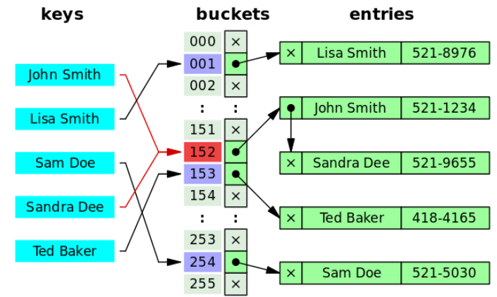
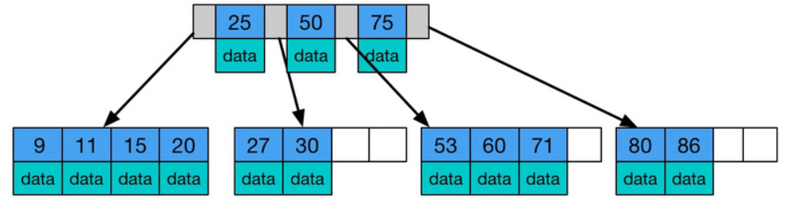
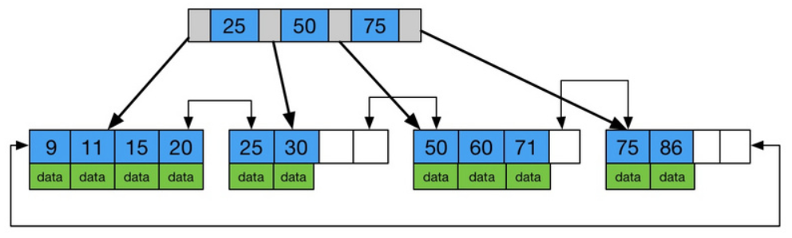
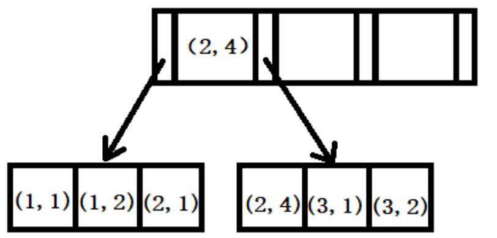

## 索引
> 索引是一种用于快速查询和检索数据的数据结构

优点：  
1. 能显著加快数据的检索速度
2. 唯一索引可以保证数据的唯一性  
缺点：  
1. 索引在增删改时需要动态维护，降低了SQL执行速度
2. 创建索引时会消耗时间
3. 需要有物理空间存储索引，会消耗一部分空间

### 索引结构
- 索引是在存储引擎层实现，不同的存储引擎有不同的索引实现
- 主流的索引类型：B+Tree索引、Hash索引、全文索引、空间索引

#### Hash
- Hash索引是通过哈希函数将键值映射到表中，然后通过哈希值快速定位到数据，从而实现快速查询
- 当两个key的哈希值相同时，会导致hash碰撞，此时可以将两个value通过一个链表连接  

- 优点：速度快
- 缺点：无法实现排序和范围查询，只能用于等值比较

自适应哈希索引


#### 二叉查找树树
> 左节点小于根节点、右节点大于根节点
- 缺点：当顺序插入二叉树时，会退化成链表，导致查询效率变的极低

#### 自平衡二叉树
> 通过旋转来保持平衡，使得左右子树的高度差不超过1  
- 优点：不会有斜树的情况
- 缺点：需要频繁旋转来保证树的平衡；由于是二叉树，每个节点只能存一个数据，当数据量较大时，数的深度较大，导致查询效率降低

#### 红黑树
> 也是一种自平衡二叉树，通过颜色和旋转来保持数的大致平衡
- 红黑树的具体规则详见"javaBasics/TreeMapSource.md"
- 红黑树不追求严格的平衡，而是大致的平衡。插入数据或删去数据时，不需要每次都旋转，而是可以通过改变颜色来保证平衡

#### B树
> 多路平衡查找树
- B树的所有节点即存放数据，也存放索引

- B树的叶子节点是独立的，在范围查询时，需要先找到最小值，再反向向上遍历

#### B+树
- 同B树，只有叶子节点存放数据，且叶子节点有一条引用链指向与它相邻的叶子节点
- 非叶子节点只存放索引，不存放数据


相对于B树的优点：
1. B+树的数据存放在叶子节点，每次查询的速度更稳定；B树在所有节点都有数据，会出现某些数据的查询速度高，某些低
2. 叶子节点之间有指向相邻节点的指针，在范围查询时只需要遍历链表即可

### 索引分类

按应用分为：主键索引、唯一索引、普通索引、全文索引  
按存储方式分为：聚簇索引和非聚集索引

#### 非聚集索引
- B+树中的data不包含数据，包含的是数据的地址或主键的索引
- 非聚集索引更新时只需要修改索引文件，不需要修改数据文件，所以适用于频繁更新的表
- 二级索引是非聚集索引的一种，其data存放的是主键的索引，唯一索引、普通索引都是二级索引
> MyISAM中索引文件.MYI和数据文件.MYD是分开的，其中索引就是采用非聚集索引，data存放的是数据所在的地址，根据索引取到data后需要根据地址找到数据

回调查询：即在二级索引中先拿到主键索引，再去主键索引/数据文件中查找数据。  
当二级索引的key和value（二级索引中的value就是主键）中包含所需要的数据，则不会回调，即**覆盖索引** -> 不要使用select *，这样可以更大概率是用上覆盖索引，而select *肯定不会使用覆盖索引

#### 聚集索引
- B+树中的data包含了行数据，索引的key是数据表的主键
- 由于聚集索引省去了通过地址找文件的步骤，所以查询速度更快；但当主键比较复杂时，查询和插入的速度会变的很慢，不适用于频繁更新的表
> InnoDB中索引文件数据文件.ibd是合并在一起的，可以实现聚集索引

#### 联合索引
> 使用多个字段创建的索引
```mysql
alter table `test` add index score_name_index(score, name);
```
##### 最左前缀匹配
> 当使用联合索引时，检索数据时从联合索引的最左边开始匹配
- 举例：当有联合索引(column1, column2, column3)时，会建立索引(column1),(column1, column2), (column1, column2, column3)
- 查询column1 = 89、column1 = 24 and column2 = 65时，会使用索引；但查询column2 = 43 and column3 = 65时，不会使用索引
- 查询column1 = 34 and column3 = 54时，会使用column1的索引

向右匹配直到遇到范围查询>、<时，范围列会使用索引，但范围列后面的列就无法使用索引
- 举例：联合索引(column1, column2, column3)，查询column1 > 12 and column2 = 11时，只会使用到column1的索引，column2无法使用索引
- 当遇到的是>=、<=、between、like时，由于他们是有边界值的，估边界值处可以用到后面列的索引

联合索引的原理：
- 索引的key是一个集合，如(column1, column2)中，会优先给column1排序，当column1相同时，才对column2排序，如图：
- 
- 可以看到column1（1、1、2、2、3、3）是有序的，而column2（1、2、1、4、1、2）是无序的
- 当column1确定时，如column1 = 1时，column2才是有序的 -> 这就是有边界值的范围查询时，范围列后面的列也能用上索引的原因。
但是column2的索引只能用于确定column2开始的边界，比如column1>=12 and column2=32，column1定位到12时，column2可以确定开始的边界是(12,32)，但是后面的仍需要通过遍历链表
- 联合索引可以走覆盖索引，在多个查询条件时优先使用联合索引，但需要注意索引使用频率来确定顺序
> 在使用联合索引的时候，把常用的字段放在最左边


### SQL性能分析

#### 查询操作类型的次数
- show [session|global] status like 'com_______' 可以查看数据库的查询、更新、插入、删除的次数

#### 慢查询日志
- show variables like 'slow_query_log'; 查看是否开启慢查询
- show variables like 'long_query_time'; 查看慢查询的阈值
- set global slow_query_log=on; 开启，重启后失效；永久生效需要在my.cnf中配置
- show variables like 'slow_query_log_file'; 所在的文件就是慢查询日志

#### profile
- select @@profiling; 查看是否开启profile -> @@表示系统变量
- set profiling = 1; 开启profile
- show profiles; 查看profile，可以查看到SQL语句的查询时间
- show profile for query (queryId); 可以查看指定queryId的SQL语句的profile信息
```mysql
+--------------------------------+----------+
| Status                         | Duration |
+--------------------------------+----------+
| starting                       | 0.000124 |
| Executing hook on transaction  | 0.000005 | # 事务回调
| starting                       | 0.000007 | 
| checking permissions           | 0.000005 | # 检查权限
| Opening tables                 | 0.000041 | # 打开表
| init                           | 0.000004 | # 初始化查询
| System lock                    | 0.000007 | # 系统锁
| optimizing                     | 0.000009 | # 优化查询计划
| statistics                     | 0.000032 | # 收集统计信息
| preparing                      | 0.000018 | # 准备查询
| executing                      | 0.000046 | # 执行查询
| end                            | 0.000003 | 
| query end                      | 0.000003 |
| waiting for handler commit     | 0.000008 | # 等待体检
| closing tables                 | 0.000007 | # 关闭表
| freeing items                  | 0.000041 | # 释放资源
| cleaning up                    | 0.000009 | # 清理
+--------------------------------+----------+
```

#### explain
> explain sql 语句可以查看执行计划
- explain不会真正的执行SQL语句，只会显示通过SQL优化器后的执行计划

举例：
explain select * from dish where id in (select dish_id from dish_flavor where name = '辣度');  
其执行计划如下：  
```mysql
+----+--------------+-------------+------------+--------+---------------+---------+---------+---------------------+------+----------+-------------+
| id | select_type  | table       | partitions | type   | possible_keys | key     | key_len | ref                 | rows | filtered | Extra       |
+----+--------------+-------------+------------+--------+---------------+---------+---------+---------------------+------+----------+-------------+
|  1 | SIMPLE       | <subquery2> | NULL       | ALL    | NULL          | NULL    | NULL    | NULL                | NULL |   100.00 | NULL        |
|  1 | SIMPLE       | dish        | NULL       | eq_ref | PRIMARY       | PRIMARY | 8       | <subquery2>.dish_id |    1 |   100.00 | NULL        |
|  2 | MATERIALIZED | dish_flavor | NULL       | ALL    | NULL          | NULL    | NULL    | NULL                |   63 |    10.00 | Using where |
+----+--------------+-------------+------------+--------+---------------+---------+---------+---------------------+------+----------+-------------+
```
##### id
> 用于标识每个select语句的执行顺序
- id相同，则从上往下依次执行
- id不同，id越大越先执行
- 本例中，先执行

##### select_type
> 用于区分查询的类型
1. SIMPLE： 简单查询，没有子查询或UNION
2. PRIMARY： 包含主查询时，外层select
3. DERIVED： from中的子查询
4. SUBQUERY： select或where中的子查询
> explain select (select 1 from dish_flavor where name = '辣子鸡') from (select * from dish where price < 10000) as temp;  
> 其中对dish的子查询是DERIVED，对dish_flavor的子查询是SUBQUERY
5. UNION: UNION之后出现的select
6. UNION RESULT：UNION的结果
> explain select 1 from dish_flavor where name = '辣子鸡' union (select 1 from dish where price = 7800);
> 其中对dish的子查询是UNION，其结果时UNION RESULT，对dish_flavor的子查询是PRIMARY

##### table
> 用于显示数据是关于哪个表的
- 当是from子查询时，table为<derivedN>，意味着from引用了id为N的子查询
- 当有子查询时，table为<subqueryN>，意味着引用了id为N的查询结果
- 当有union时，table为<unionN,M>，意味着引用了id为N和M的查询结果UNION的结果

##### type
> 显示查询执行的类型  

由快到慢依次为：null > system > const > eq_reg > ref > range > index > all
1. null：不需要查表的语句，如select 1 from dish;
2. system：表中只有一行数据，如select * from (select * from dish where id = 1397849739276890114) as temp
3. const：查询结果只有一行，如select * from dish where id = 1397849739276890114;
4. eq_ref：连表查询时，主表一行的外键与从表中只有一行对应，一般从表是主键或唯一索引，如select * from dish_flavor left join dish on dish_flavor.dish_id = dish.id
5. ref：使用索引作为查询条件，结果可能有多行，如select * from dish_flavor where dish_id = 1397850851245600769，dish_id是普通索引
6. range: 对索引列进行范围查询，如select * from dish where price < 8000.00;其中price是普通索引
7. index：扫描全索引
8. all：扫描全表

##### possible_key
> 显示可能用到的索引

##### key
> 显示实际用到的索引

##### key_len
> 用到的索引的最大字节数
- 字符串中一个字母或数字占1个字节，汉字占3个字节
- int 占4个字节、 bigint 占8个字节
- 长度最大限制为768个字节，超过最大字节的字符串会将字符串的前半部分提取出来做索引，称为**前缀索引**，可以通过创建索引时在列后加上(n)代表给前几个字符创建前缀索引
> 前缀索引越短越好，当太短了会导致区分度不够，此时可以通过select count(distinct(substring(text, 1, n))) / count(*) from dish_flavor; 来计算出截取前n的字符的区分度
- 联合索引时，是多个列的长度和

##### rows
> 根据表统计，大致估算出的所需要读的行数

##### ref
>  表示是通过哪个字段来过滤的
- select * from dish_flavor left join dish on dish_flavor.dish_id = dish.id; ref为dish_flavor.dish_id表示使用这行来过滤的
- select * from dish_flavor where dish_id = 1397851370462687234; ref为const，表示使用的是常量来过滤的

##### filtered
> 显示返回的条数占读取的条数的百分比

##### extra
> 额外信息
1. distinct：匹配到第一行后，剩余的行不再搜索
2. Using filesort: 排序时使用来外部索引排序，而没有使用表内索引排序，如对没有索引的字段排序 -> 会先保留主键和排序字段，然后对排序字段排序，最后再检索
3. Using index：表示使用了覆盖索引，不需要回调查询，如select id from dish where id = 1397849739276890114;
4. Using index condition：表示查询优化器使用了索引下推
> 索引下推：Server层的操作下推给存储引擎层做  
> select * from user where name like '张%' and age = 18; 其中name和age是联合索引
> 若没有索引下推，存储引擎会先查出name like '张%'的数据，将数据返回给Server层，再对age过滤后； 开启索引下推后，存储引擎会直接查出name like '张%'和age = 18的数据
5. Using temporary：创建临时表，如对没有索引的列进行distinct，select distinct name from dish_flavor; -> 先创建临时表，再distinct
6. Using where：使用where进行条件过滤，如select * from dish where price > 7800;
7. Using join buffer：连表查询中从表连接字段没有使用索引，需要将主表查出放入join buffer，再遍历从表进行查询

### 索引失效
- 在索引列上进行运算操作
- 索引列出现类型转换，如select * from dish where code = 222222222;但code是varchar型的
- 索引模糊查询like '%abc'或'%abc%' -> 可以理解为最左匹配
- or操作时，两边有一个列没有索引，就会导致索引都失效 -> 既然一个字段没有索引需要全表扫描，就没有必要走索引了
- 两列有索引的列作比较
- 当全表扫描比走索引快，则索引失效，如范围查询中，查询的范围很大 -> 此时走索引还需要回表，比全表扫描更慢
- is not null，如select * from dish where price is not null; -> 不为空的较多，全表扫描比索引更优(原理同上一条)

### 索引设计原则
1. 条件、排序、分组的字段建立索引 
2. 选择区分度高的字段作为索引：不选择如状态、性别、年龄等


3. 尽量使用联合索引：联合索引更有可能走覆盖索引；索引过多会导致空间占用多、修改耗时多，使用联合索引让多个字段共用一个索引，可以节省空间
4. 字符串字段使用前缀索引：前缀索引相比于普通索引可以使占用空间更小  


5. 经常修改但查询较少的字段不建索引
6. 每张表的索引数量不能太多：太多会导致需要MYSQL优化器判断索引的效率，此操作也会耗时 
7. 避免索引失效

## SQL优化

### 插入数据
- 插入多条数据时，使用批量插入可以减少与数据库连接的建立和销毁
```mysql
insert into dish values(value1, value2, value3),(),();
```
- 手动提交事务，可以避免MySQL频繁的自动创建和提交事务，但注意一个事务不要太大，否则会导致内存占用过大
```mysql
start transaction;
insert into dish values(value1, value2, value3),(),();
insert into dish values(value1, value2, value3),(),();
insert into dish values(value1, value2, value3),(),();
commit;
```
- 主键顺序插入
- 大批量数据插入时，使用load指令
  - 连接数据库时加上参数mysql --local-infile -u root -p
  - 设置全局参数set global local_infile=1;
  - 执行load命令：load data local infile 'file' into table 'table' fields terminated by ',' lines terminated by '\n'，其中fields terminated by指定字段分隔符，lines terminated by指定行分隔符

### 主键优化
- 降低主键的长度，可以降低二级索引的data数据部分所占用的空间
- 插入数据时选择主键顺序插入，使用自增主键
- 尽量不要使用UUID作为主键，UUID长度较长，且是无序的
- 不要对主键进行修改

#### 主键生成方案
UUID  
- 优点：简单； 全球唯一 -> 数据合并不会有主键冲突
- 缺点：无序；字符串格式，查询效率低；长度较长，占用空间大；ID无含义，可读性差  

MYSQL自增  
- 优点：有序，id自增；查询效率高
- 缺点：依赖于数据库，高并发下数据库压力大；规律明显，安全性低；高并发下会有自增锁的争强；数据迁移时会有主键冲突  

MYSQL集群主键自增
- 实现：每个数据库实例的步长不同，可以实现集群主键自增，且无冲突
- 优点：实现集群主键自增
- 缺点：无法拓展

雪花算法
- 实现：1位为0，41位时间戳，10为机器标识码，12为毫秒计数
- 优点：速度快；有时间戳，总体是递增
- 缺点：依赖于时间，若时间回拨可能导致重复主键；长度较长

Redis生成
- 实现：Redis是单线程，可以使用INCR/INCRBY原子命令自增key
- 优点：自增；不依赖于数据库；可以实现日期 + 流水号，处理订单之类的主键
- 缺点：依赖于Redis，若Redis宕机主键会丢失；高并发下每次都需要访问Redis，网络性能开销大；不具有全局唯一性

### 排序优化
- Using filesort：将筛选的行存入缓冲区后再在缓冲区中完成排序
- Using index：直接通过有序的索引返回有序的数据
- 当是二级索引且没有使用到覆盖索引时，仍然使用filesort，因为二级索引需要回表遍历整个表，再去查索引多此一举
- 给排序字段创建索引可以大大提升排序的效率（默认走覆盖索引）
- 联合索引中，若排序时第一个字段和第二个字段的排序方向不同，则会导致第一个字段走索引，第二个字段不走索引；都为倒序，则是反向扫描索引 -> 索引默认为升序，可以使用desc指定索引顺序
- 可以适当增大sort_buffer_size，大数据量排序时，若超过sort_buffer_size，则会在磁盘中排序，性能低

### 分组优化
- 若分组的列没有索引，会创建临时表，再进行分组，创建临时表会导致内存占用，且性能低
- 对常进行分组的列创建索引，可以防止创建临时表，分组索引也会遵守最左前缀

#### group by 和 distinct

distinct  
- select distinct name from dish_flavor; 返回：辣度、忌口、温度、甜味
- distinct用于去除查询结果中的重复行，只能返回去重列的信息，会丢失其他列的信息
- 一般跟在select关键字后

group by
- select name from dish_flavor group by name;返回：辣度、忌口、温度、甜味
- group by将结果按照一列进行分组，并饭返回每组中的第一条数据。不会去除其他信息，估分组后可以进行聚合计算
- 一般跟在from或where子句后

区别  
1. 通常情况下可以认为distinct是一个去除其他列的group by，是一个的group by
2. 二者都支持索引扫描
3. distinct只返回查询列，而group by会保留其他数据，支持聚合函数，支持更复杂的处理
4. distinct不会排序，而group by在MYSQL8.0以前会对分组字段进行隐形排序

### limit优化
- 大数据量时，使用limit进行分页，越往后效率越低  

问题
- select * from dish_flavor order by dish_id limit 10000,10; 
- 由于dish_id是二级索引，Mysql会取出前10010行的非聚集索引下的主键id，并通过id回表查出10010行数据，再截取最后10行

优化
- select d.* from dish_flavor as d right join (select id from dish_flavor order by dish_id limit 10000,10) as t on d.id = t.id;
- 先使用覆盖索引，通过索引dish_id查出10000到10010行的id，由于是覆盖索引，只需要取出前10010条索引即可，不需要回表
- 由于只需要回表查询10条数据，效率更高。由于子查询中不允许出现limit语句，可以使用连接查询
- 另一个思路是select * from dish_flavor where dish_id > (上一次的最大id) limit 查询条数

### count优化
- InnoDB执行count时，会将数据每一行读出来，再进行累计计数。当数据量较大时，count的性能很慢
- 用法：count(字段)，若字段值不为null，则累加值+1；count(*)/count(主键) 返回总条数；count(1)将每行查出来数据为1，并用于累计，由于不是null，估也是返回总条数
- count(*)不用把字段取出来，直接返回行数，效率更高
- count(1)将每行数据置为1，也不需要读取字段值
- count(主键)，由于主键不为null，所以不需要判断是否为null，直接取出主键进行累计
- count(字段)，字段可能为null，估需要取出字段值判断是否为null
- 综上，count(1) > count(1) > count(主键) > count(字段)

