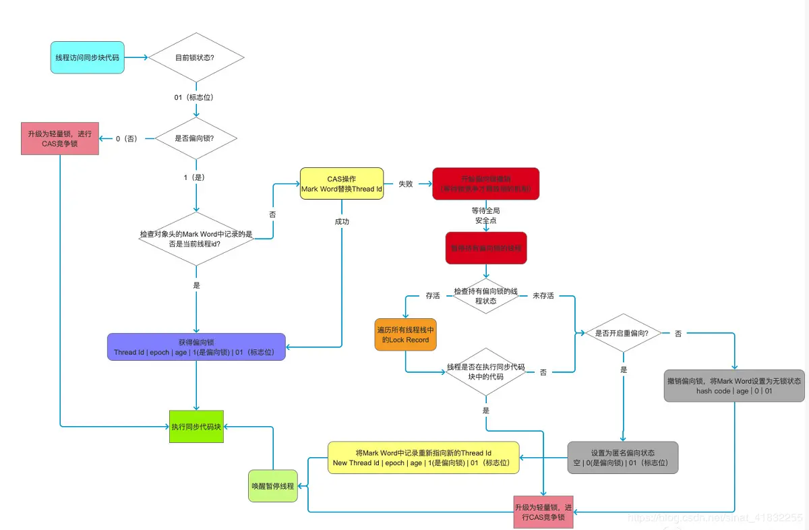
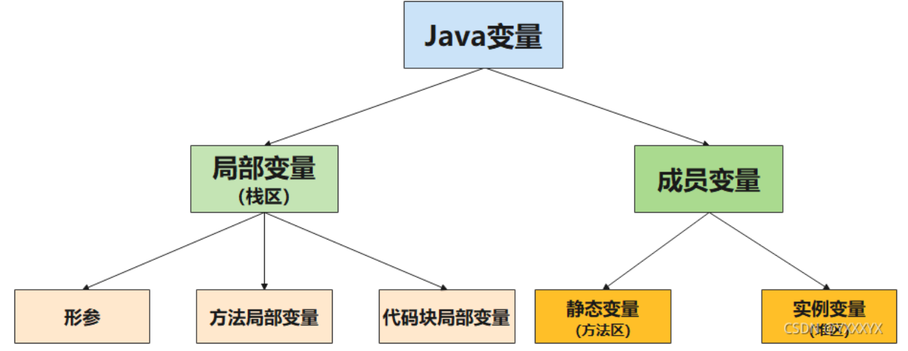

###### 操作静态变量
在操作静态变量时，会在线程内创建一个变量并将静态变量赋值给该变量，最后再将值存入静态变量
- getstatic i
- iconst_1
- 自定义操作
- putstatic i
###### 共享资源遇到的问题
当多个线程**读**共享资源不会有问题，当多个线程**读写**共享资源时，会出现脏读的问题
#### synchronized
##### synchronized对象锁
```java
synchronized(对象) {
    // 线程读写共享资源的代码
}
```
- 只有锁住同一个对象的方法才能实现同步
- 可以将synchronized的代码块封装在一个类中，创建线程安全的方法
```java
class SafeClass {
    private int counter = 0;
    
    public void increment() {
        // 锁住调用该方法的对象
        synchronized(this) {
            counter++;
        }
    }
    
    public void decrement() {
        synchronized(this) {
            counter--;
        }
    }
    
    public int print() {
        synchronized(this) {
            return counter;
        }
    }
}

public class Test {
    public static void main(String[] args) {
        SafeClass safeClass = new SafeClass();
        // 锁住同一个对象，可以实现同步
        Thread thread1 = new Thread(() -> safeClass.increment());
        Thread thread2 = new Thread(() -> safeClass.decrement());
        thread1.start();
        thread2.start();
        // 锁住不同的对象，无法实现同步
        SafeClass safeClass1 = new SafeClass();
        SafeClass safeClass2 = new SafeClass();
        Thread thread3 = new Thread(() -> safeClass1.increment());
        Thread thread4 = new Thread(() -> safeClass2.decrement());
        thread3.start();
        thread4.start();
    }
}
```
##### synchronized方法锁
```java
class MyClass {
    private int counter = 0;
    public synchronized void increment() {
        counter++;
    }
    
    /*
        当synchronized修饰方法时，锁住的是当前对象
        等价于：
        public void increment() {
            synchronized(this) {
                counter++;
            }
        }
     */
}
```
##### synchronized静态方法锁
```java
class MyClass {
    private int counter = 0;
    public static synchronized void increment() {
        counter++;
    }
    
    /*
         当synchronized修饰静态方法时，锁住的是当前类的Class对象
         等价于：
         public static void increment() {
            synchronized(MyClass.class) {
                counter++;
            }
         }
     */
}
```
- 由于类对象MyClass.class是唯一的，所以静态方法的锁也是唯一的，即该类的所有的对象的静态方法都可以实现同步

##### synchronized原理
###### 同步代码块字节码
synchronized在字节码层面上是由两行字节码monitorenter/monitorexit控制
```java
public void test() {
    synchronized (this) {

    }
}
```
```Java
// 从局部变量表加载this到操作数栈
 0 aload_0
// 复制栈顶引用，即this
 1 dup
// 将操作数栈顶元素弹出，保存到局部变量表1位置
 2 astore_1
// 对操作数栈顶对象弹出，并加锁
 3 monitorenter
// 将局部变量表中1位置的对象加载到操作数栈
 4 aload_1
// 对操作数栈顶对象弹出，并解锁
 5 monitorexit
// 正常下返回
 6 goto 14 (+8)
// 异常下，将异常的对象存到局部变量表2位置         
 9 astore_2
// 将局部变量表中1位置的对象加载到操作数栈
10 aload_1
// 对操作数栈顶对象解锁
11 monitorexit
// 将局部变量表中2位置的对象加载到操作数栈，即异常的对象
12 aload_2
// 抛出异常对象
13 athrow
14 return
```
- 可以看到，字节码中通过monitorenter进行加锁，monitorexit进行解锁，且是成对出现
- monitorenter和monitorexit是对操作数顶的对象进行加锁和解锁
- 1行中将this复制，是一个用于存入局部变量表，一个用于加锁
- 一个monitorenter对应两个monitorexit，一个用于正常解锁，一个用于**异常解锁**，保证发生异常时不会导致死锁
###### 同步方法字节码
```java
public void synchronizedMethod() {
}
```
- 同步方法的字节码中没有monitorenter/monitorexit，而是通过在访问标志上添加synchronized关键字，最后在执行该方法前后隐式的调用monitorenter/monitorexit
###### Mark Word
- Java对象可分为三个部分：对象头Header、实例数据Instance Data、对齐填充Padding
- 其中对象头分为两部分：一部分是Mark Word（4个字节），用于存储对象的运行数据，另一部分为类型指针（4个字节），指向对象的类型元数据的指针，用于确定该对象是哪个类的实例
- 若对象是Java数组，则在对象头中还有一部分用于记录数组长度的数据
- 对象的运行时数据有很多，但Mark Word的长度只有32/64位，因此Mark Word被设计为有着动态的数据结构，以尽可能存入更多的数据

Mark Word的动态结构

| MarkWord存储内容（30bit）                                     | 标志位（2bit） | 状态   |
|---------------------------------------------------------|-----|------|
| 对象哈希值（25bit）、对象分代年龄（4bit）、是否偏向锁为0（1bit）                 | 01  | 未加锁  |
| 指向Monitor对象的指针（30bit）                                   | 10  | 重量级锁 |
| 线程栈帧中LockRecord的指针                                      | 00  | 轻量级锁 |
| 线程ID（23bit）、偏向时间戳Epoch（2bit）、对象分代年龄（4bit）、是否偏向锁为1（1bit） | 01  | 偏向锁  |
| 无                                                       | 11  | GC标记 |


###### Monitor
Monitor管程，当使用synchronized给对象上重量级锁时，该对象头的MarkWord就会存储设置为Monitor对象的指针

Monitor的实现是ObjectMonitor，由C++编写，其数据结构如下：
```c++
ObjectMonitor() {
    _header       = NULL;
    _count        = 0; //锁的计数器，获取锁时count数值加1，释放锁时count值减1
    _waiters      = 0, //等待线程数
    _recursions   = 0; //锁的重入次数
    _object       = NULL; 
    _owner        = NULL; //指向持有ObjectMonitor对象的线程地址
    _WaitSet      = NULL; //处于wait状态的线程，会被加入到_WaitSet
    _WaitSetLock  = 0 ;
    _Responsible  = NULL ;
    _succ         = NULL ;
    _cxq          = NULL ; //阻塞在EntryList上的单向线程列表
    FreeNext      = NULL ;
    _EntryList    = NULL ; //处于等待锁block状态的线程，会被加入到该列表
    _SpinFreq     = 0 ;
    _SpinClock    = 0 ;
    OwnerIsThread = 0 ;
  }
```
###### Monitor加锁的过程
1. 线程1获取到重量级锁后，锁住的对象的MarkWord标志位改为10，内容为指向Monitor的指针
2. 该Monitor的_owner属性设置为获取所的线程1的地址
> 此时线程2尝试获取锁
3. 判断对象MarkWord的标志位是否为10，若为10，则表明该对象已经被锁住
4. 根据指针找到对应的Monitor对象，并根据Monitor对象中的_owner属性判断是否为当前线程
5. 若为当前线程，则进行锁重入，即_count +1、recursions +1；若不是，则进入_EntryList等待队列中，并进入阻塞（block）状态
6. 若线程1释放锁，则_owner属性会设置为NULL，此时_EntryList中的线程开始竞争锁

###### wait/notify原理
- 当_owner线程调用wait()方法时，会释放锁，并进入等待状态，进入_WaitSet等待队列中，等待被唤醒，此时位于_EntryList中的线程开始竞争锁
- 当其他的_owner线程调用notify()时，会唤醒_WaitSet中的线程，并加入到_EntryList队列中竞争锁

##### 锁膨胀（锁升级）
由于加重量级锁对性能的消耗较大，且锁住的代码实际运用中大部分时间不会有竞争，所以使用轻量级锁来降低性能
- 锁一共有偏向锁、轻量级锁、重量级锁
- 锁的膨胀过程：无锁 -> 偏向锁 -> 轻量级锁 -> 重量级锁

###### 轻量级锁
- 轻量级锁的使用场景：当多个线程交替执行代码块但未发生竞争时，使用轻量级锁
- 轻量级锁 -> 重量级锁：当多个线程同时访问临界区代码块时，即发生竞争，会从轻量级锁膨胀为重量级锁

加锁过程：
1. 线程1判断对象是否无锁，如果无锁则在线程的栈帧中创建一个锁记录Lock Record
2. 将锁对象的对象头中的MarkWord复制一份，存入Lock Record中，被称为Displaced Mark Word，并将LockRecord中的owner指向锁对象
3. 使用cas操作，将锁对象的对象头中的MarkWord指向LockRecord的指针
4. 若MarkWord标志位已经是01，则cas成功，并将标志位设置为00（即轻量级锁）
5. 若标志位是00，则判断MarkWord指向的栈帧所在的线程是否是当前线程 -> 是跳转6，不是跳转7
6. 如果是，则再生成一个LockRecord，Displaced Mark Word设置为null，owner指向锁对象，完成锁重入
7. 如果不是，则自选等待，超过等待时间后，说明有锁的竞争，需要膨胀为重量级锁，此时MarkWord标志位为10，并指向Monitor地址，线程加入EntryList等待队列

解锁过程：
1. 解锁时的操作相反
2. 若LockRecord中的Displaced Mark Word为null，说明是重入，减少一个LockRecord
3. cas将Displaced Mark Word替换为当前的MarkWord
4. 若当前的MarkWord没有变，即标志位为00，则cas成功，完成解锁
5. 若当前MarkWord标志位为10，说明有其他线程竞争锁，且锁已经膨胀为重量级锁，重量级锁的解锁过程 -> 
通过Markword找到对应的Monitor对象，将Monitor的_owner设置为null，并唤醒_entryList中的线程，完成解锁

###### 自旋
当线程A已经获得锁，线程B竞争锁时，线程B不会立即阻塞，而是尝试在当前线程内自旋，自旋一定次数后，线程B才进入阻塞状态
- 优点：线程从运行态变为阻塞状态，对系统资源开销大（需要存储线程的信息）；若临界区代码执行时间短，所以锁会很快释放，可以避免线程阻塞
- 缺点：若临界区代码执行时间长，自旋时间过长，且自旋时进入忙等待，需要占用CPU资源，会造成CPU浪费，
- 适用场景：临界区代码执行时间短，多核CPU
- 自适应：JDK6后，自旋的次数是由上次在同一个锁上的自旋时间决定，若自旋刚刚成功过，则会认为这次成功的可能性更高，就会允许自旋的次数更多，反之亦然

###### 偏向锁
当临界区代码大多数情况下，总是被一个线程多次获得，多线程竞争很少时，轻量级锁每次加锁都需要执行CAS操作，对性能依旧有影响，因此引入偏向锁来减少CAS操作

加锁过程：
1. 线程1获取锁时，会判断对象的MarkWork是否是可偏向的（即最后三位是否为101），若不是（即001无锁），则直接升级为轻量级锁
2. 若是可偏向的，则会判断MarkWord中的线程ID是否是当前线程，若是，则直接进入临界区
3. 若不是，则会通过CAS操作尝试将MarkWord改为当前线程ID
4. 若修改成功，则说明该偏向锁没有被其他线程占用，则进入临界区，即该偏向锁偏向当前线程
5. 若修改失败，说明其他线程已经拥有该偏向锁，当到达全局安全点safepoint时，会判断拥有该锁的线程2是否在执行同步代码块中的内容：若已经退出，则会撤销偏向锁，
并将MarkWord变为无锁状态，其他线程只能获取轻量级锁；若未退出，则线程2的偏向锁升级为轻量级锁后，再继续执行代码
> 撤销偏向锁：将可偏向的锁变为不可偏向的锁，该对象锁后面不能再被偏向，即101 -> 001  
> 全局安全点safepinot：代码中的一些特殊的位置，当线程执行到safepoint时，线程暂停，并保存线程的运行信息，此时线程的信息才是确定的，估此时可以获得任意线程的所有信息

解锁过程：  
偏向锁不会解锁，只有当其他线程也来尝试获取锁时，才会自动解锁 -> 加锁过程的第五步

```java
public static void main(String[] args) throws InterruptedException {
    Object o = new Object();
    System.out.println(ClassLayout.parseInstance(o).toPrintable()); // 0x0000000000000005 -> 101偏向锁
    synchronized (o) {
        System.out.println(ClassLayout.parseInstance(o).toPrintable()); // 0x000001dc14a05005 -> 线程ID + 101偏向锁
    }
    System.out.println(ClassLayout.parseInstance(o).toPrintable()); // 0x000001dc14a05005 -> 线程ID + 101偏向锁 -> 该锁已经偏向main线程
    Thread.sleep(100L);
    Thread thread = new Thread(() -> {
        synchronized (o) {
            System.out.println(ClassLayout.parseInstance(o).toPrintable()); // 0x0000004a764ff6b8 -> 栈帧LockRecord指针 + 00轻量级锁 -> 锁膨胀
        }
        System.out.println(ClassLayout.parseInstance(o).toPrintable()); // 0x0000000000000001 -> 001 无锁
    });
    thread.start();
    thread.join();
    System.out.println(ClassLayout.parseInstance(o).toPrintable());// 0x0000000000000001 -> 001 无锁 -> 有了竞争，不会再变为偏向锁
}
```
- 在对对象加锁前，如果调用了对象的hashCode()方法，会禁用掉对象的偏向锁，因为对象头需要存储哈希码，导致没有足够的空间存线程ID，估禁用掉偏向锁
- 轻量级锁和重量级锁的hashCode会分别存放在栈帧的LockRecord和Monitor中，估不会有这个情况
```java
public static void main(String[] args) {
    Object o = new Object();
    o.hashCode();
    System.out.println(ClassLayout.parseInstance(o).toPrintable()); // 0x0000001e643faf01 -> hachCode + 001 无锁 -> 偏向锁被禁用了
    synchronized (o) {
        System.out.println(ClassLayout.parseInstance(o).toPrintable()); // 0x000000871b9ff1b0 -> 栈帧LockRecord指针 + 00轻量级锁
    }
    System.out.println(ClassLayout.parseInstance(o).toPrintable()); // 0x0000001e643faf01
}
```


###### 偏向锁的批量重定向和批量撤销
批量重定向：当一个类的实例的偏向锁多次被同一个线程撤销，导致锁膨胀，达到阈值（BiasedLockingBulkRebiasThreshold，默认20）后，会将这些实例的偏向锁重定向到该线程。  
批量重撤销：当一个类的实例的偏向锁重定向后仍然其他线程撤销，达到阈值（BiasedLockingBulkRevokeThreshold，默认40）后，会将该类的所有实例的偏向锁撤销，包括之后new的对象
```text
t1线程：第40个 0x000001ee3ee3f805 -> 偏向t1线程
t2线程：第19个 0x0000000000000001 -> 锁撤销
       第20个 0x000001ee3f15d105 -> 重定向到t2线程
t3线程：第40个 0x0000000000000001 -> 锁撤销
       第41个new出来的对象 0x0000000000000001 -> 不再是偏向锁
```

#### 线程安全

- 对局部变量进行操作是线程安全的，因为每调用一次方法都会在独立的栈帧中生成一个局部变量
```java
public static void test() {
    // 该变量为局部变量，该变量存储在栈帧中，即每次调用该方法都会创建一个局部变量
    int i = 0;
    i++;
}
```
- 对成员变量进行操作是线程不安全的，因为成员变量存储在堆中，多个线程共享同一个对象中的成员变量

```java
import java.util.ArrayList;
import java.util.List;

class UnsafeClass {
    // 成员变量，线程共享同一个对象中的变量，即每次创建一个对象都会创建一个成员变量
    List<String> list = new ArrayList<>();
    public void main(String[] args) {
        for (int i = 0; i < 1000; i++) {
            add();
            remove();
        }
    }
    public void add() {
        list.add("a");
    }
    public void remove() {
        list.remove("a");
    }
}

// 修改后的安全的操作
class SafeClass {
    public void main(String[] args) {
        // 将list从成员变量变为局部变量，每个线程都会有独立的list
        List<String> list = new ArrayList<>();
        for (int i = 0; i < 1000; i++) {
            add(list);
            remove(list);
        }
    }
    private void add (List list) {
        list.add("a");
    }
    private void remove (List list) {
        list.remove("a");
    }
}
```

- 局部变量暴露给外部也会导致线程安全问题
```java
class SafeClass {
    public void main(String[] args) {
        // 将list从成员变量变为局部变量，每个线程都会有独立的list
        List<String> list = new ArrayList<>();
        for (int i = 0; i < 1000; i++) {
            // 由于add()和remove()是可以被重写的，导致被暴露给了子类
            add(list);
            remove(list);
        }
    }
    public void add (List list) {
        list.add("a");
    }
    public void remove (List list) {
        list.remove("a");
    }
}

class SubClass extends SafeClass {
    @Override
    public void add (List list) {
        // 子类重写了方法，且在方法中创建了新的线程修改了list，导致创建的线程与原线程共享了list变量
        Thread thread = new Thread(() -> {
           list.add("a"); 
        }).start();
        // private可以保护线程安全
    }
}
```

##### 常见线程安全类
- String 只读不改，修改String的内容都会生成一个新的对象，且String是被final修饰，避免了子类修改String内的方法导致的变量暴露，
所以String线程是安全的
- Integer等包装类
- StringBuffer
- Random
- Vector List的线程安全实现类
- Hashtable Map的线程安全实现类
- juc下的类

注意：线程安全指多个线程调用同一个对象的方法时，是线程安全的

##### wait-notify

###### wait和notify
- wait()会让已经获得到锁的线程进入waitSet进行等待
- notify()会让在waitSet中等待的线程**随机**选取一个唤醒，nofityAll()则会唤醒所有
- notify()方法需要由已经获取锁的线程调用，位于EntryList中的线程无法调用该方法
- wait(long timeout)等待，超过时限后自动唤醒，线程处于TIMED_WAITING有时限的等待，
wait()实际上是wait(0)，即WAITTING无时限的等待
###### sleep(long timeout)和wait(long timeout)
- sleep是Thread中的静态方法，wait是Object中的方法
- sleep不会释放锁，而wait会释放锁
- sleep不需要获取到锁，而wait需要获取到锁后才能执行
- sleep和wait都是让线程进入TIMED_WAITTING状态

##### 保护性暂停
- 适用场景：一个线程等待另一个线程的执行结果
- 使用案例：join()和Future中get()的实现
- 原理：让两个线程关联同一个GuardedObject对象
```java
class GurdedObject {

    private Object response;

    public Object get(long timeout) {
        synchronized (this) {
            long start = System.currentTimeMillis();
            long waitTime = 0;
            // 执行notifyAll()时，会唤醒所有等待线程，此时若response仍然为null，则继续等待，防止虚假唤醒
            while (response == null) {
                try {
                    // 每次只用等待剩余的时间，
                    this.wait(timeout - waitTime);
                } catch (InterruptedException e) {
                    e.printStackTrace();
                }
                // 超时退出
                waitTime = System.currentTimeMillis() - start;
                if (waitTime > timeout) {
                    System.out.println("超时退出");
                    break;
                }
            }
            return response;
        }
    }

    public void done(Object result) {
        synchronized (this) {
            this.response = result;
            // 唤醒所有等待线程，不能使用notify()，因为notify()会随机唤醒一个线程，可能会唤醒其他线程
            // 由于使用了notifyAll()，则等待线程需要使用while循环，防止其他线程被错误唤醒后无法再次进入等待状态
            this.notifyAll();
        }
    }
}

public class Test {

    public static void main(String[] args) {
        GurdedObject gurdedObject = new GurdedObject();

        new Thread(() -> {
            System.out.println("等待结果中......");
            Object result = gurdedObject.get(5000);
            System.out.println(result);
        }).start();

        new Thread(() -> {
            System.out.println("开始下载......");
            String result = download();
            gurdedObject.done(result);
        }).start();

    }

    public static String download() {
        try {
            Thread.sleep(8000);
            return "下载结果";
        } catch (InterruptedException e) {
            throw new RuntimeException(e);
        }
    }
}

/*Thread类中的join源码
public final synchronized void join(long millis)
        throws InterruptedException {
    long base = System.currentTimeMillis();
    long now = 0;

    if (millis > 0) {
        while (isAlive()) {
            // 当前循环需要等待的时间
            long delay = millis - now;
            // 不需要等待了则跳出循环
            if (delay <= 0) {
                break;
            }
            // 等待delay时间
            wait(delay);
            // 更新需要等待的时间
            now = System.currentTimeMillis() - base;
        }
    }
}
*/
```
##### 生产者消费者模式
- 区别：保护性暂停是一对一的模式，生产者消费者是一对多的模式
- 使用案例：阻塞队列
```java
class MessageQueue {

    private LinkedList<Message> list = new LinkedList<>();

    private Integer capacity;

    public MessageQueue(Integer capacity) {
        this.capacity = capacity;
    }

    public void put(Message message) {
        synchronized (list) {
            while (list.size() >= capacity) {
                System.out.println("队列已满，等待中...");
                try {
                    list.wait();
                } catch (InterruptedException e) {
                    throw new RuntimeException(e);
                }
            }
            System.out.println("生产者生产消息：" + message);
            list.addLast(message);
            list.notifyAll();
        }
    }

    public Message take() {
        synchronized (list) {
            while (list.isEmpty()) {
                System.out.println("队列为空，等待中...");
                try {
                    list.wait();
                } catch (InterruptedException e) {
                    throw new RuntimeException(e);
                }
            }
            list.notifyAll();
            System.out.println("消费者消费消息：" + list.getFirst());
            return list.removeFirst();
        }
    }
}

final class Message {
    private Integer id;
    private Object content;

    public Message(Integer id, Object content) {
        this.id = id;
        this.content = content;
    }

    public Integer getId() {
        return id;
    }

    public Object getContent() {
        return content;
    }

    @Override
    public String toString() {
        return "Message{" +
                "id=" + id +
                ", content=" + content +
                '}';
    }
}

public class Test {
    public static void main(String[] args) {
        MessageQueue queue = new MessageQueue(2);
        for (int i = 0; i < 3; i++) {
            int finalI = i;
            new Thread(() -> {
                queue.put(new Message(finalI, "message" + finalI));
            }).start();
        }

        new Thread(() -> {
            while (true) {
                try {
                    Thread.sleep(1000);
                } catch (InterruptedException e) {
                    throw new RuntimeException(e);
                }
                queue.take();
            }
        }).start();
    }
}
```

#### Park和UnPark
- LockSupport.park()是对当前线程进行阻塞，而LockSupport.unpark(Thread thread)是对指定的线程进行唤醒
- 现象：先执行unpark()，再执行park()，线程不会被阻塞
- 原理：底层会维护一个最大为1的counter，park()会让counter--，unpark()会让counter++，当counter < 0时，线程会被阻塞，当counter >= 0 时，线程会被唤醒 

##### 死锁
- t1持有锁A，t2持有锁B，t1需要锁B，t2需要锁A，造成死锁
- 定位死锁：1. 使用jstack命令；2.jconsole工具

##### 活锁
- 两个线程互相改变对方的结束条件，导致两个线程都以为自己可以结束，从而无法结束
- 解决：增加随机睡眠时间

##### 线程饥饿
- 线程优先级太低，无法获取CPU调度，导致无法结束该线程

### ReentrantLock
- 特点：
  - 可重入
  - 可中断
  - 可以设置锁超时时间
   - 可设置为公平锁
  - 多个条件变量 


##### 基本语法
```java
import java.util.concurrent.locks.ReentrantLock;

public static void main(String[] args) {
    ReentrantLock reentrantLock = new ReentrantLock();
    try {
      reentrantLock.lock();
    }
    finally {
        reentrantLock.unlock();
    }
}
```
##### 可重入
- 指一个线程第一次获得ReentrantLock对象锁后，可以再次对该对象进行加锁

##### 可打断
- 指线程在未竞争到锁等待的时候，可以被其他线程打断
```java
public class Test {
    static ReentrantLock lock = new ReentrantLock();
    public static void main(String[] args) {
        Thread thread = new Thread(() -> {
            try {
                // 当锁被占用时，该线程无法获得锁，从而进入阻塞队列等待，此时可以被其他线程使用interrupt()方法打断
                lock.lockInterruptibly();
            } catch (InterruptedException e) {
                // 被打断时执行的代码
                e.printStackTrace();
                return;
            }
            try {
              //临界区代码
            } finally {
                lock.unlock();
            }
        }, "t1");

        lock.lock();
        thread.start();

        thread.interrupt();
    }
}
```

##### 锁超时
- 指线程在未竞争到锁，等待的时候，可以设置等待的超时时间，避免线程无限等待
```java
public class Test {
  static ReentrantLock lock = new ReentrantLock();
  public static void main(String[] args) {
    Thread thread = new Thread(() -> {
      try {
        // 尝试过的锁，返回是否获取到锁
        // 若不能获得锁，则进入阻塞队列等待，等待时间超过1秒则返回false
        boolean b = lock.tryLock(1, TimeUnit.SECONDS);
        if (!b) {
          System.out.println("线程" + Thread.currentThread().getName() + "获取锁失败");
          return;
        }
      } catch (InterruptedException e) {
          //在等待的过程中也可以被打断
        throw new RuntimeException(e);
      }
      try {
        // 临界区代码
        System.out.println("线程" + Thread.currentThread().getName() + "获取锁成功");
      } finally {
        lock.unlock();
      }
    }, "t1");

    lock.lock();
    thread.start();
  }
}
```
##### 多条件变量
- 多条件变量指的是一个锁对象有多个条件变量，一个条件变量对应一个waitSet
  - 通俗来讲，就是当一个线程获取锁时，线程会进入等待队列进行等待，多个条件变量有多个等待队列，持有锁的对象可以指定所要唤醒的等待队列，其他的等待队列不会被唤醒
```java
public class Test {
    static ReentrantLock lock = new ReentrantLock();
    static Condition waitWater = lock.newCondition();
    static Condition waitFood = lock.newCondition();

    static boolean hasWater = false;
    static boolean hasFood = false;
    public static void main(String[] args) {
        new Thread(() -> {
            lock.lock();
            try {
                // 由于等水的和等食物的线程通过多个条件变量去分开了，所以不用担心被notifyALl()给虚假唤醒，就不需要保护性暂停了
                if (!hasWater) {
                    //没有水，等待
                    try {
                        waitWater.await();
                    }
                    catch (InterruptedException e) {
                        e.printStackTrace();
                    }
                }
                System.out.println("有水了，可以开始做菜了");
            } finally {
                lock.unlock();
            }
        }).start();

        new Thread(() -> {
            lock.lock();
            try {
                if (!hasFood) {
                    //没有水，等待
                    try {
                        waitFood.await();
                    }
                    catch (InterruptedException e) {
                        e.printStackTrace();
                    }
                }
                System.out.println("有饭了，可以开始吃饭了");
            } finally {
                lock.unlock();
            }
        }).start();

        new Thread(() -> {
            lock.lock();
            try {
                hasWater = true;
                waitWater.signal();
            }
            finally {
                lock.unlock();
            }
        }).start();

        new Thread(() -> {
            lock.lock();
            try {
                hasFood = true;
                waitFood.signal();
            }
            finally {
                lock.unlock();
            }
        }).start();
    }
}
```

### 控制运行顺序

#### 固定顺序运行
##### wait-notify
```java
public class Test {

    static Object lock = new Object();
    static boolean isRunned = false;

    public static void main(String[] args) {
        Thread thread1 = new Thread(() -> {
            synchronized (lock) {
                while (!isRunned) {
                    try {
                        lock.wait();
                    } catch (InterruptedException e) {
                        e.printStackTrace();
                    }
                }
            }
            System.out.println("第一个线程");
        });

        Thread thread2 = new Thread(() -> {
            synchronized (lock) {
                System.out.println("第二个线程");
                isRunned = true;
                lock.notify();
            }
        });

        thread1.start();
        thread2.start();
    }
}
```

##### park-unpark
```java
public class Test {

    static Object lock = new Object();
    static boolean isRunned = false;

    public static void main(String[] args) {
        Thread thread1 = new Thread(() -> {
            LockSupport.park();
            System.out.println("第一个线程");
        });

        Thread thread2 = new Thread(() -> {
            System.out.println("第二个线程");
            LockSupport.unpark(thread1);
        });

        thread1.start();
        thread2.start();
    }
}
```
#### 交替输出
- !!!很重要!!!

##### wait-notify
- 两个线程之间使用boolean，两个以上的变量则可以用int
```java
public class Test {
    public static void main(String[] args) {
        Util util = new Util();
        Thread thread1 = new Thread(() -> {
            util.print("A", 1, 2);
        });
        Thread thread2 = new Thread(() -> {
            util.print("B", 2, 3);
        });
        Thread thread3 = new Thread(() -> {
            util.print("C", 3, 1);
        });
        thread1.start();
        thread2.start();
        thread3.start();
    }
}

class Util {
    // 由passFlag为1的线程开始执行
    private int flag = 1;
    public void print(String content, int passFlag, int nextFlag) {
        for (int i = 0; i < 10; i++) {
            synchronized (this) {
                while (flag != passFlag) {
                    try {
                        this.wait();
                    } catch (InterruptedException e) {
                        throw new RuntimeException(e);
                    }
                }
                System.out.print(content);
                flag = nextFlag;
                this.notifyAll();
            }
        }
    }
}
```

##### ReentrantLock
```java
public class Test {
    public static void main(String[] args) {
        Util util = new Util();
        Condition a = util.newCondition();
        Condition b = util.newCondition();
        Condition c = util.newCondition();

        new Thread(() -> util.print("A", a, b)).start();
        new Thread(() -> util.print("B", b, c)).start();
        new Thread(() -> util.print("C", c, a)).start();

        util.lock();
        try {
            a.signal();
        } finally {
            util.unlock();
        }
    }
}

class Util extends ReentrantLock {

    public void print(String content, Condition currentCondition, Condition nextCondition) {
        for (int i = 0; i < 10; i++) {
            lock();
            try {
                try {
                    currentCondition.await();
                    System.out.print(content);
                    nextCondition.signal();
                } catch (InterruptedException e) {
                    throw new RuntimeException(e);
                }
            } finally {
                unlock();
            }
        }
    }
}
```

##### park-unpark
```java
public class Test {

    static Thread thread1;
    static Thread thread2;
    static Thread thread3;

    public static void main(String[] args) {
        thread1 = new Thread(() -> {
            LockSupport.park();
            System.out.print("A");
            LockSupport.unpark(thread3);
        });
        thread2 = new Thread(() -> {
            LockSupport.park();
            System.out.print("B");
            LockSupport.unpark(thread1);
        });
        thread3 = new Thread(() -> {
            LockSupport.park();
            System.out.print("C");
            LockSupport.unpark(thread2);
        });

        thread1.start();
        thread2.start();
        thread3.start();

        LockSupport.unpark(thread3);
    }
}
```