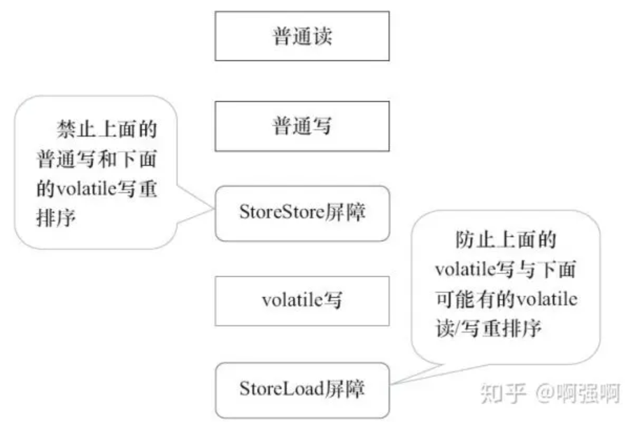
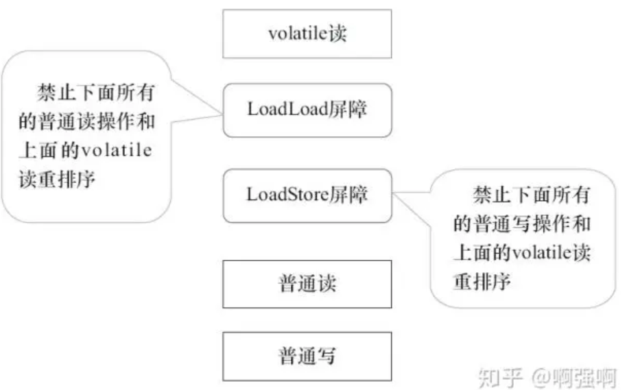

### volatile关键字

#### 可见性
- 可见性：多个线程访问同一个变量时，一个线程修改了该变量的值，其他线程能够立即得到修改后的值
- volatile用于修饰成员变量和静态变量，可以保证变量的可见性
```java
public class Test {
    static boolean flag = true;
    public static void main(String[] args) throws InterruptedException {
        new Thread(() -> {
            while (flag) {
            }
            System.out.println("thread over");
        }).start();
        Thread.sleep(1000);
        flag = false;
    }
}
```
- 现象：当flag变为false时，线程并不会停止
- 原因：共享变量存放在**主内存**中，而每个线程有各自的**本地内存**（可以理解为缓存），当线程频繁读取共享变量（超过某个阈值）时，
  会将主内存中共享变量拷贝一份到本地内存，此时再修改主内存中的共享变量，本地内存中的变量不会立即更新，所以线程无法停止
- 解决：使用volatile关键字，保证线程每次都从主内存中读取共享变量，不会拷贝到本地内存中读取
```java
public class Test {
    volatile static boolean flag = true;
    public static void main(String[] args) throws InterruptedException {
        new Thread(() -> {
            while (flag) {
            }
            System.out.println("thread over");
        }).start();
        Thread.sleep(1000);
        flag = false;
    }
}
```
- synchronized也可以保证变量的可见性，只需要在使用到共享变量的代码前加上synchronized即可
- synchronized既可以保证原子性，也可以保证可见性，但性能开销大；volatile只能保证线程读到的是最新的值，当线程1读取静态变量到本地内存并修改本地内存的值，但尚未写回
  主内存时，线程2读到的是旧值，估无法保证原子性（线程安全）

##### 两阶段终止
- 使用volatile实现两阶段终止
```java
class Monitor {
    private Thread thread;
    // 不同线程之间访问同一共享变量，使用volatile保证多线程可见
    private volatile boolean stop = false;

    public void start() {
        thread = new Thread(() -> {
            while (true) {
                Thread currentThread = Thread.currentThread();
                // 直接使用停止标记
                if (stop) {
                    System.out.println("后续操作");
                    break;
                }
                try {
                    Thread.sleep(1000L);
                    System.out.println("记录监控信息");
                } catch (InterruptedException e) {
                    currentThread.interrupt();
                    throw new RuntimeException(e);
                }
            }
        });
        thread.start();
    }

    public void stop() {
        stop = true;
    }
}
```

#### 有序性

##### 指令重排
- 现代处理器可以通过乱序执行技术来提高执行效率，编译器重新安排指令的执行顺序可以增加处理器的并行执行效率，从而提高执行速度
- 指令重排使得代码的执行顺序和输入的顺序不一致，在单线程下不会改变程序的执行结果，但在多线程下
- Java中指令重排有两次，分别为编译器重排和处理器重排
- 示例：
```java
// 懒汉式单例模式
class Singleton {
    private Singleton() {}
    private static Singleton instance = null;
    public static Singleton getInstance() {
        // 第一次判断，防止每次调用getInstance()都要获取锁
        if (instance == null) {
            synchronized (Singleton.class) {
                // 第二次判断，获取到锁后再判断是否需要创建实例
                if (instance == null) {
                    /* 该操作为线程不安全，执行过程：
                    1.创建内存空间
                    2.初始化对象
                    3.将instance对象指向内存（此时instance不为空）
                     */
                    instance = new Singleton();
                }
            }
        }
        return instance;
    }
}

// 可以使用静态内部类实现
class Singleton { 
    private Singleton() {}
    // 类的加载是懒汉式的，只有第一次调用getInstance()时才会用到内部类，此时才会加载内部类
    // 静态内部类，初始化内部类时创建，且只会初始化一次，则保证了只会创建一个实例 
    private static final class InstanceHolder {
      static final Singleton instance = new Singleton();
    }
  
    private static Singleton getInstance() {
      return InstanceHolder.instance;
    }
}
```
- 此处通过字节码来分析为什么会有指令重排的问题
``` java
 // 先获取静态变量instance的值，放入栈顶
 0 getstatic #2 <com/csj/Thread/Singleton.instance : Lcom/csj/Thread/Singleton;>
 // 判断是否为null
 3 ifnonnull 37 (+34)
 // 获取Singleton类对象的引用地址，并放入栈顶
 6 ldc #3 <com/csj/Thread/Singleton>
 // 复制栈顶元素，即Singleton类对象，用于后续加锁解锁
 8 dup
 // 将栈顶元素存入局部变量表
 9 astore_0
// 对Singleton类加锁
10 monitorenter
11 getstatic #2 <com/csj/Thread/Singleton.instance : Lcom/csj/Thread/Singleton;>
14 ifnonnull 27 (+13)


// 创建Singleton实例的引用
17 new #3 <com/csj/Thread/Singleton>
// 复制了一份Singleton实例的引用
20 dup
// 调用复制的引用的构造函数
21 invokespecial #4 <com/csj/Thread/Singleton.<init> : ()V>
// 将原引用赋值给instance
24 putstatic #2 <com/csj/Thread/Singleton.instance : Lcom/csj/Thread/Singleton;>


// 加载局部变量表中0号元素，即Singleton类对象
27 aload_0
// 解锁
28 monitorexit
29 goto 37 (+8)
32 astore_1
33 aload_0
34 monitorexit
35 aload_1
36 athrow
// 获取instance的值，放入栈顶
37 getstatic #2 <com/csj/Thread/Singleton.instance : Lcom/csj/Thread/Singleton;>
// 返回栈顶元素
40 areturn
```
- instance = new Singleton();操作中，21行和24行可能会因为指令重排导致执行顺序进行交换（即17->20->24->21），当线程1执行到24行时，instance变量已经不为null，但对象尚未初始化完，
此时线程2的3行if语句不成立，返回了未初始化完的对象
- instance = new Singleton;被synchronized保护，synchronized内的代码仍然可以重排序，当共享变量的所有操作都被锁保护的时候，该共享变量对外来说是不会有有序性问题的。
该例子中，instance变量在synchronized外被访问，所以不能保证对外的有序性
##### volatile 保证有序性
```java
private volatile static Singleton instance = null;
```
#### 原理
##### 保证可见性
- 操作volatile修饰的变量时，生成的汇编指令中会多出lock指令，作用如下
- 在对volatile修饰的共享变量进行写操作时，会将当前本地内存（缓存）中的数据刷新到主内存中，并使得其他线程的本地内存中该内存地址的数据被标记为无效，
其他线程读取该共享内存是由于本地内存中该数据为无效，则需要从主内存中重新获取
```java
public class Test {
    volatile static boolean flag = true;
    public static void main(String[] args) throws InterruptedException {
        new Thread(() -> {
            while (flag) {
            }
            System.out.println("thread over");
        }).start();
        Thread.sleep(1000);
        flag = false;
    }
}
```
##### 保证有序性
- LoadLoad屏障：Load1;LoadLoad;Load2; 保证Load1的数据先读，Load2以后的数据再读取
- LoadStore屏障：Load1;LoadStore;Store2; 保证Load1的数据先读，Store2以后的数据刷新到主内存
- StoreStore屏障：Store1;StoreStore;Store2; 保证Store1的数据先刷新到主内存，Store2以后的数据后刷新
- StoreLoad屏障：Store1;StoreLoad;Load2; 保证Store1的数据先刷新到主内存，Load2以后的数据再读取  

JMM对volatile读写的内存屏蔽：
- 在volatile写前加上StoreStore屏障，在volatile写后加上StoreLoad屏障
  - 
  - StoreStore：屏障前的普通写无法与volatile写重排序，否则无法满足屏障前的数据先刷新到主内存（即对所有线程可见）
  - StoreLoad：避免volatile写后面的volatile读写操作重排序，由于无法判断在volatile写后是否需要屏障（当volatile写后没有后续操作，则不需要屏障），
  出于保守策略，则加入StoreLoad屏障
- 在volatile读后加上LoadLoad屏障，在volatile读后加上LoadStore屏障
  - 
  - LoadLoad：屏障后的普通读无法与volatile读重排序
  - LoadStore：屏障后的普通写无法与volatile读重排序


总的来说：
- volatile写操作前的操作不会被重排序到volatile写操作后：普通写 -> 屏障 -> volatile写，不能出现 屏障 -> volatile写 -> 普通写
- volatile读操作后的操作不会被重排序到volatile读操作前：volatile读 -> 屏障 -> 普通读，不能出现 普通读 -> volatile读 -> 屏障

还是用刚才的字节码举例：
```
 0 getstatic #2 <com/csj/Thread/Singleton.instance : Lcom/csj/Thread/Singleton;> //volatile读
 // LoadLoad屏障、LoadStore屏障
......
21 invokespecial #4 <com/csj/Thread/Singleton.<init> : ()V> //普通写
// StoreStore屏障 -> 21不能排序到24后
24 putstatic #2 <com/csj/Thread/Singleton.instance : Lcom/csj/Thread/Singleton;> //volatile写
// StoreLoad屏障
```
- 通过加入屏障，可以保证指令重排后的执行顺序和输入的顺序一致，保证了有序性

### 拓展问题
#### 单例模式
##### 单例模式中反序列化

```java
import java.io.ObjectInputStream;
import java.io.ObjectStreamClass;

public class Singleton implements Serializable {
  private Singleton() {
  }
  
  // 静态成员变量会在类加载阶段初始化，JVM会保证类加载阶段的线程安全
  private static final Singleton instance = new Singleton();

  public static Singleton getInstance() {
    return instance;
  }

  // 继承了Serializable，当反序列化时会生成一个新的对象，破坏了单例模式
  // 当反序列化时，若反序列化的对象中有readResolve()方法，则会返回该方法的返回值，而不是返回新的对象
  public Object readResolve() {
    return instance;
  }
}

// 具体源码如下
// ObjectStreamClass#<init>(Class<?>)
// 通过反射获取类中的readResolve方法
readResolveMethod = getInheritableMethod(cl, "readResolve",null,Object .class);

// ObjectInputStream#readOrdinaryObject(boolean)
if (readResolveMethod != null) {
    // 当存在readResolve方法时，调用该方法
    Object rep = desc.invokeReadResolve(obj);
    obj = rep;
}
return obj;

// ObjectStreamClass#invokeReadResolve(Object)
// 通过反射调用readResolve方法，并返回其返回值
return readResolveMethod.invoke(obj, (Object[]) null);
```