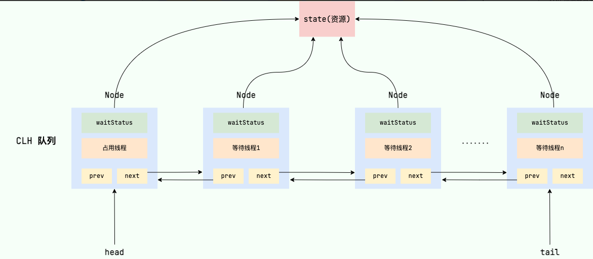
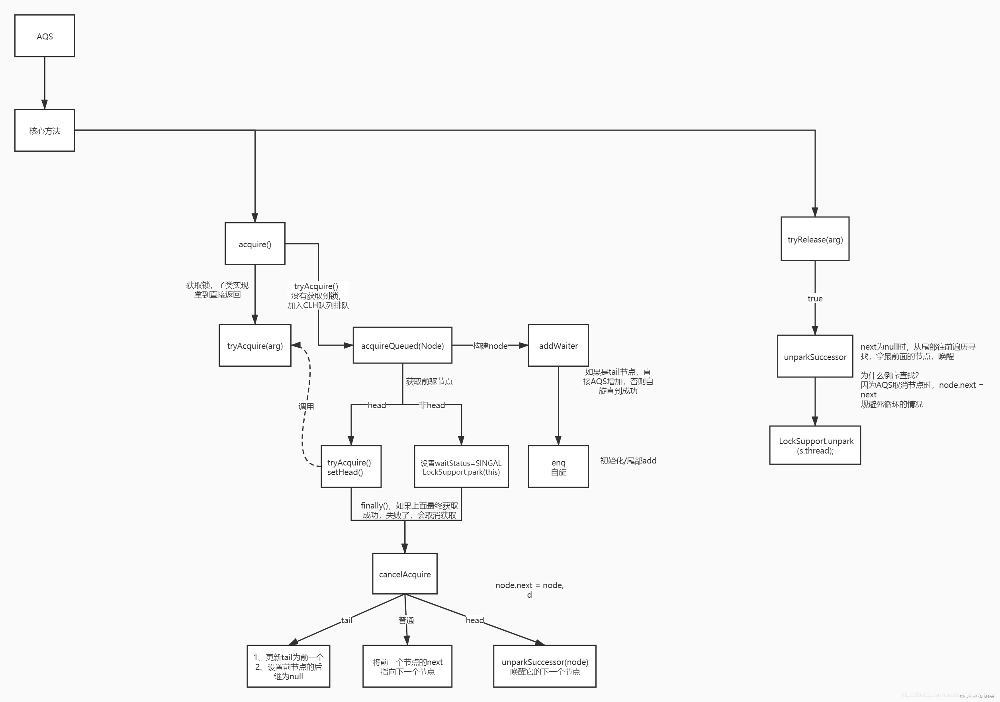

### AQS/ReentrantLock
AQS，即AbstractQueuedSynchronizer，是阻塞式锁和同步器框架  

```java
public abstract class AbstractQueuedSynchronizer extends AbstractOwnableSynchronizer implements java.io.Serializable {
    
    // 队列头，锁被占用时的等待队列
    private transient volatile Node head;

    // 队列尾
    private transient volatile Node tail;

    // 共享资源状态 -> 0表示当前资源空闲  1表示资源被占用  >1表示资源被占用且被重入的次数
    private volatile int state;

    // 来自AbstractOwnableSynchronizer
    // 当前获取锁的线程
    private transient Thread exclusiveOwnerThread;
    
}
```
总的来说：AQS内有一个state变量，用于记录资源的占用状态，用CAS来修改资源状态，内部维护了一个FIFO队列用于存放等待的线程，用exclusiveOwnerThread存放当前获取锁的线程
#### 加锁
```java
public class ReentrantLock implements Lock, java.io.Serializable {

    private final Sync sync;

    // 构造函数中默认实现是NonfairSync
    public ReentrantLock() {
        sync = new NonfairSync();
    }
    
    public void lock() {
        // ReentrantLock实际调用的是Sync的acquire方法
        sync.acquire(1);
    }
    
    static final class NonfairSync extends Sync {
        private static final long serialVersionUID = 7316153563782823691L;
        protected final boolean tryAcquire(int acquires) {
            return nonfairTryAcquire(acquires);
        }
    }
    
    //了解Sync就至关重要了
    abstract static class Sync extends AbstractQueuedSynchronizer {
        @ReservedStackAccess
        final boolean nonfairTryAcquire(int acquires) {
            final Thread current = Thread.currentThread();
            // 获取共享资源状态
            int c = getState();
            // 资源是空闲的，即锁是释放的
            if (c == 0) {
                // 通过CAS设置状态为1，即获取锁
                if (compareAndSetState(0, acquires)) {
                    // 设置资源占用线程为当前线程
                    setExclusiveOwnerThread(current);
                    return true;
                }
            }
            // 锁被占用，如果占用线程是否为当前线程
            else if (current == getExclusiveOwnerThread()) {
                // 重入，将状态叠加
                int nextc = c + acquires;
                if (nextc < 0) // overflow
                    throw new Error("Maximum lock count exceeded");
                // 不用进行CAS，因为锁时当前线程独占
                setState(nextc);
                return true;
            }
            return false;
        }
    }
}
```

```java
public abstract class AbstractQueuedSynchronizer extends AbstractOwnableSynchronizer implements java.io.Serializable {

    static final class Node {
        // 共享模式
        static final Node SHARED = new Node();
        // 独占模式
        static final Node EXCLUSIVE = null;

        //由于超时或中断，节点已被取消
        static final int CANCELLED =  1;
        // 表示该节点需要唤醒后继节点
        static final int SIGNAL    = -1;
        // 表示节点在条件队列中等待
        static final int CONDITION = -2;
        static final int PROPAGATE = -3;

        // 节点状态，初始化为CONDITION；通过CAS操作原子更新
        volatile int waitStatus;
    }
    
    
    public final void acquire(int arg) {
        // 先去获得锁
        if (!tryAcquire(arg) &&
                // 获得失败，将该线程插入FIFO队列
                acquireQueued(addWaiter(Node.EXCLUSIVE), arg))
            // 若线程是被interrupted打断，由于会清除打断标志，所以这里竞争到锁后，会重新打上打断标记
            selfInterrupt();
    }
    
    // Node.EXCLUSIVE 表示为独占模式
    private Node addWaiter(Node mode) {
        // 该节点包含当前线程
        Node node = new Node(mode);
        for (; ; ) {
            // 判断尾节点是否为空
            Node oldTail = tail;
            // 尾节点不为空，说明FIFO队列已经创建，将该节点插入，并将尾节点指向该节点
            if (oldTail != null) {
                // 第一次创建的时候是一个空节点指向当前节点
                node.setPrevRelaxed(oldTail);
                // 将尾节点指向该节点
                if (compareAndSetTail(oldTail, node)) {
                    // 上一个节点的next指向该节点
                    oldTail.next = node;
                    return node;
                }
            } else {
                // 尾节点为空，说明FIFO队列还未创建
                // 创建一个节点，并将头节点和尾节点都指向该节点
                initializeSyncQueue();
            }
        }
    }

    private final void initializeSyncQueue() {
        Node h;
        // 将头节点设置为一个空节点，而不是将线程信息存入节点，因为头节点（即占用资源的节点）的线程信息可以通过exclusiveOwnerThread获取
        if (HEAD.compareAndSet(this, null, (h = new Node())))
            tail = h;
    }

    final boolean acquireQueued(final Node node, int arg) {
        boolean interrupted = false;
        try {
            for (;;) {
                // 获取前一个节点
                final Node p = node.predecessor();
                // 如果前一个节点是头节点，则自旋尝试获取锁
                if (p == head && tryAcquire(arg)) {
                    // 若自旋的时候获取锁成功，则将当前节点设置为头节点
                    /* 
                     * setHead中，将节点的thread和prev设为null，
                     * thread为null是因为头节点是虚拟节点，线程信息在exclusiveOwnerThread
                     * prev为null，是配合后面p.next = null把前一个节点置为不可达
                     * */
                    setHead(node);
                    // 前一个节点出队，使得其不可达，由GC回收
                    p.next = null; // help GC
                    return interrupted;
                }
                // 前置节点为SIGNAL
                if (shouldParkAfterFailedAcquire(p, node))
                    // park当前线程，且返回当前线程是否被打断过，并清楚打断标记，清楚打断标记后下次还能park（详见park unpark），会回到循环继续等待，即被打断后仍留在队列
                    // 若是unpark唤醒后获取的锁，则是false，如果是被打断后获取的锁，则返回true
                    interrupted |= parkAndCheckInterrupt();
                    // 当被执行了unpark后，则会继续执行该循环，并竞争锁
            }
        } catch (Throwable t) {
            // 如果执行出现异常，则会被标记为CANCEL
            cancelAcquire(node);
            if (interrupted)
                selfInterrupt();
            throw t;
        }
    }

    private static boolean shouldParkAfterFailedAcquire(Node pred, Node node) {
        // 前一个节点的状态
        int ws = pred.waitStatus;
        // 为SIGNAL
        if (ws == Node.SIGNAL)
            return true;
        if (ws > 0) {
            // 移除取消状态的节点，将他们置为不可达，由GC回收
            do {
                node.prev = pred = pred.prev;
            } while (pred.waitStatus > 0);
            pred.next = node;
        } else {
            // 前置节点不为SIGNAL，则通过CAS设置状态为SIGNAL
            pred.compareAndSetWaitStatus(ws, Node.SIGNAL);
        }
        return false;
    }
    
}
```
#### 释放锁
```java
public class ReentrantLock implements Lock, java.io.Serializable {
    
    public final boolean release(int arg) {
        // 释放锁
        if (tryRelease(arg)) {
            Node h = head;
            // 头节点不为空，说明队列不为空 -> 由之前分析知道：若只有一个线程则不会创建队列，若有两个线程则会创建一个空节点和另一个现成的节点
            if (h != null && h.waitStatus != 0)
                // 唤醒后继节点 -> LockSupport.unpark()
                unparkSuccessor(h);
                // 由于ReentrantLock是非公平锁，所以需要竞争，若失败，则重新park
            return true;
        }
        return false;
    }
    
}

public class ReentrantLock implements Lock, java.io.Serializable {
    
    abstract static class Sync extends AbstractQueuedSynchronizer {
        @ReservedStackAccess
        protected final boolean tryRelease(int releases) {
            int c = getState() - releases;
            if (Thread.currentThread() != getExclusiveOwnerThread())
                throw new IllegalMonitorStateException();
            boolean free = false;
            if (c == 0) {
                free = true;
                // 占用线程设为null
                setExclusiveOwnerThread(null);
            }
            setState(c);
            return free;
        }
    }
}
```

#### 锁重入
```java
public class ReentrantLock implements Lock, java.io.Serializable {
    abstract static class Sync extends AbstractQueuedSynchronizer {
        
        @ReservedStackAccess
        final boolean nonfairTryAcquire(int acquires) {
            int c = getState();
            if (c == 0) {
                ......
            }
            // 锁被占用，如果占用线程是否为当前线程
            else if (current == getExclusiveOwnerThread()) {
                // 重入，将状态叠加
                int nextc = c + acquires;
                if (nextc < 0) // overflow
                    throw new Error("Maximum lock count exceeded");
                // 不用进行CAS，因为锁时当前线程独占
                setState(nextc);
                return true;
            }
            return false;
        }

        @ReservedStackAccess
        protected final boolean tryRelease(int releases) {
            // 释放锁的时候，如果是重入，则释放一次锁后state仍不为0，即锁仍被占用
            int c = getState() - releases;
            ......
            boolean free = false;
            // 此时占用线程仍不为null
            if (c == 0) {
                free = true;
                setExclusiveOwnerThread(null);
            }
            setState(c);
            // 返回false
            return free;
        }
    }
}
```
总的流程：尝试获取锁 -> 失败 -> 加入队列 -> 再次尝试获取锁 -> 失败 -> park当前线程 -> 前驱节点释放锁 -> unpark当前线程 -> 竞争锁 -> 成功 -> 将自己设置为头节点，把前驱节点踢出队列
-> 执行代码 -> 释放锁 -> unpark后续线程


#### 可打断
```java
public abstract class AbstractQueuedSynchronizer {

    // 不可打断锁
    final boolean acquireQueued(final Node node, int arg) {
        for (;;) {
            if (p == head && tryAcquire(arg)) {
                // ......
            }
            if (shouldParkAfterFailedAcquire(p, node))
                // 如果是打断的，则回到循环，继续等待
                interrupted |= parkAndCheckInterrupt();
        }
    }
    
    
    // 可打断锁
    public final void acquireInterruptibly(int arg) throws InterruptedException {
        if (Thread.interrupted())
            throw new InterruptedException();
        if (!tryAcquire(arg))
            doAcquireInterruptibly(arg);
    }
    // 抛出异常
    private void doAcquireInterruptibly(int arg) throws InterruptedException {
        if (shouldParkAfterFailedAcquire(p, node) &&
                // 如果是被打断的，则返回true
                parkAndCheckInterrupt())
            // 抛出异常
            throw new InterruptedException();

    }
}
```

#### 公平锁
```java
// 非公平锁
public class ReentrantLock {


    abstract static class Sync extends AbstractQueuedSynchronizer {
        
        final boolean nonfairTryAcquire(int acquires) {
            int c = getState();
            // 若当前资源没有被占用，则直接和AQS队列中的线程一起竞争锁，若没竞争到则进入AQS队列
            if (c == 0) {
                if (compareAndSetState(0, acquires)) {
                    setExclusiveOwnerThread(current);
                    return true;
                }
            }
        }

        static final class FairSync extends Sync {
            
            protected final boolean tryAcquire(int acquires) {
                int c = getState();
                // 若没有资源
                if (c == 0) {
                    // 判断队列中是否有第二个节点（因为头节点是空节点），则说明有线程排在前面，直接进队列
                    if (!hasQueuedPredecessors() &&
                            // 若没有，则说明下一个就到该线程，则尝试CAS竞争锁，成功就不用进入队列了，没成功则进入队列慢慢等
                            compareAndSetState(0, acquires)) {
                        setExclusiveOwnerThread(current);
                        return true;
                    }
                }
            }    
        }        
    }
}
```

#### 条件变量
```java
public abstract class AbstractQueuedSynchronizer {

    public class ConditionObject implements Condition, java.io.Serializable {

        // ConditionObject中也维护了一个队列（单向队列），具体实现逻辑同AQS中的队列，但该队列没有虚拟头节点
        
        public final void await() throws InterruptedException {
            if (Thread.interrupted())
                throw new InterruptedException();
            // 生成一个包含当前线程的节点，且节点状态为CONDITION，添加到条件队列中
            Node node = addConditionWaiter();
            // 释放节点中的线程（当前线程）的所有锁（可能有重入的情况），并唤醒等待队列中的下一个节点来竞争锁
            // -> 自己要去条件队列了，把锁释放后把资源给下一个节点
            int savedState = fullyRelease(node);
            int interruptMode = 0;
            while (!isOnSyncQueue(node)) {
                // 阻塞当前线程
                LockSupport.park(this);
                if ((interruptMode = checkInterruptWhileWaiting(node)) != 0)
                    break;
            }
            if (acquireQueued(node, savedState) && interruptMode != THROW_IE)
                interruptMode = REINTERRUPT;
        }

        public final void signal() {
            // 判断当前线程是否持有锁
            if (!isHeldExclusively())
                throw new IllegalMonitorStateException();
            // 找到条件队列中的第一个节点
            Node first = firstWaiter;
            if (first != null)
                doSignal(first);
        }

        private void doSignal(Node first) {
            do {
                // 将第一个节点中条件队列中移出
                if ( (firstWaiter = first.nextWaiter) == null)
                    lastWaiter = null;
                first.nextWaiter = null;
                // 将节点从条件队列转移到AQS队列， 若等待期间线程被打断，说明放弃了对锁的竞争，则继续循环，继续尝试把下一个节点移动到AQS队列
            } while (!transferForSignal(first) &&
                    (first = firstWaiter) != null);
        }

        final boolean transferForSignal(Node node) {
            // 将节点状态置为0 -> AQS队列中的节点状态都为0， 当节点被取消时，状态为1，此时CAS失败，则返回false
            if (!node.compareAndSetWaitStatus(Node.CONDITION, 0))
                return false;
            // 将节点移动到AQS队列的末尾，返回前驱节点
            Node p = enq(node);
            int ws = p.waitStatus;
            // 将前驱节点的状态改为-1，让前驱节点需要唤醒当前节点
            if (ws > 0 || !p.compareAndSetWaitStatus(ws, Node.SIGNAL))
                // 当前驱线程为取消，或者置为-1失败，则唤醒该线程，由于此时已经在同步队列了，跳出await中的while循环去竞争锁，并重新入队，否则前驱节点（p）无法唤醒当前节点（node）
                LockSupport.unpark(node.thread);
            return true;
        }
    }
}
```
总体流程图：


### ReentrantReadWriteLock
读写锁：实际场景中读多写少，且读和读之间不会有线程安全问题，读和写之间需要需要互斥。读写锁能让读读操作并行，读写操作互斥
#### 用例
```java
class DataObject {
    private Object data;

    private ReentrantReadWriteLock lock = new ReentrantReadWriteLock();
    private ReentrantReadWriteLock.ReadLock readLock = lock.readLock();
    private ReentrantReadWriteLock.WriteLock writeLock = lock.writeLock();

    public Object read() {
        readLock.lock();
        try {
            System.out.println("read");
            try {
                Thread.sleep(1000L);
            } catch (InterruptedException e) {
                throw new RuntimeException(e);
            }
            return data;
        } finally {
            readLock.unlock();
        }
    }

    public void write(Object data) {
        writeLock.lock();
        try {
            System.out.println("write");
            this.data = data;
        } finally {
            writeLock.unlock();
        }
    }
}
```
- 不支持条件变量
- 支持锁重入，但获取到读锁时不能重入写锁，获得写锁时可以重入读锁

```java
class DataObject {
    private Object data;
    // data是否有效
    volatile boolean dataValid;
    final ReentrantReadWriteLock lock = new ReentrantReadWriteLock();
    void useData() {
        lock.readLock().lock();
        // 数据无效，则重新获取数据
        if (!dataValid) {
            // 获取写锁前需要释放掉读锁，否则会死锁
            lock.readLock().unlock();
            lock.writeLock().lock();
            try {
                // 可能在释放读锁和获取写锁之间，其他线程更新了数据
                if (!dataValid) {
                    data = ....;
                    dataValid = true;
                }
                // 获取写锁可以重入读锁，可以在释放写锁后立即获得读锁，防止在释放写锁和获取读锁之间，其他线程更新了数据
                lock.readLock().lock();
            }
            finally {
                lock.writeLock().unlock();
            }
        }
        try {
            use(data);
        }
        finally {
            lock.readLock().unlock();
        }
    }
}
```
#### 原理
ReentrantReadWriteLock原理同ReentrantLock，内部只维护了一个AQS，一个state中高低16位为表示写锁的状态，高16位为表示读锁的状态
```java
// 写锁的lock方法
protected final boolean tryAcquire(int acquires) {
        Thread current = Thread.currentThread();
        int c = getState();
        // 获取低16位 -> 写锁
        int w = exclusiveCount(c);
        // 锁被占用
        if (c != 0) {
            // 写锁没被占用，即读锁被占用
            if (w == 0 || current != getExclusiveOwnerThread())
                // 要加写锁，读写锁互斥，加锁失败
                return false;
            if (w + exclusiveCount(acquires) > MAX_COUNT)
                throw new Error("Maximum lock count exceeded");
            // 加写锁，或重入写锁
            setState(c + acquires);
            return true;
        }
        // 没被占用，直接竞争锁
        if (writerShouldBlock() ||
            !compareAndSetState(c, c + acquires))
            return false;
        setExclusiveOwnerThread(current);
        return true;
    }
    
// 读锁的lock方法
protected final int tryAcquireShared(int unused) {
    Thread current = Thread.currentThread();
    int c = getState();
    // 判断写锁是否被占用
    if (exclusiveCount(c) != 0 &&
            getExclusiveOwnerThread() != current)
        // 写锁被占用，直接获取锁失败 -> 写锁不能重入读锁
        return -1;
    // 获取高16位 -> 读锁状态
    int r = sharedCount(c);
    if (!readerShouldBlock() &&
            r < MAX_COUNT &&
            // 将高位尝试+1 -> 并没有对重入读锁的线程做判断，意味着不同的线程可以重入读锁
            compareAndSetState(c, c + SHARED_UNIT)) {
        // ......
        // 读锁加锁成功
        return 1;
    }
    return fullTryAcquireShared(current);
}

// 读读锁可以连续唤醒
private void doAcquireShared(int arg) {
    // 以SHARED状态插入
    final Node node = addWaiter(Node.SHARED);
    boolean interrupted = false;
    try {
        for (;;) {
            final Node p = node.predecessor();
            if (p == head) {
                // 位于第二个，且是写锁
                int r = tryAcquireShared(arg);
                if (r >= 0) {
                    // 替换头节点
                    setHeadAndPropagate(node, r);
                    p.next = null; // help GC
                    return;
                }
            }
            if (shouldParkAfterFailedAcquire(p, node))
                // 这里被park，当前驱节点执行完后，会unpark第二个节点，继续循环
                interrupted |= parkAndCheckInterrupt();
        }
    } catch (Throwable t) {
        cancelAcquire(node);
        throw t;
    } finally {
        if (interrupted)
            selfInterrupt();
    }
}

private void setHeadAndPropagate(Node node, int propagate) {
    Node h = head;
    setHead(node);
    if (propagate > 0 || h == null || h.waitStatus < 0 ||
            (h = head) == null || h.waitStatus < 0) {
        // 获取到后继节点
        Node s = node.next;
        // 判断后继节点是否是SHARED状态
        if (s == null || s.isShared())
            doReleaseShared();
    }
}

private void doReleaseShared() {
    for (;;) {
        // 头节点即当前节点（已经把当前节点替换位头节点了）
        Node h = head;
        if (h != null && h != tail) {
            int ws = h.waitStatus;
            if (ws == Node.SIGNAL) {
                // 将当前节点的状态从SIGNAL改为0 -> 由于读读不互斥，所以在当前线程还没唤醒后继节点时，可能会有新的线程来发现头节点的状态发位SIGNAL，此时也会唤醒后继节点，造成重复唤醒
                if (!h.compareAndSetWaitStatus(Node.SIGNAL, 0)) 
                    continue;       
                // 唤醒后继节点，由于后继节点也是SHARED状态，估也会将当前节点弹出去，继续执行之前的逻辑，直至遇到一个不是SHARED的节点
                unparkSuccessor(h);
            }
            else if (ws == 0 &&
                    !h.compareAndSetWaitStatus(0, Node.PROPAGATE))
                continue;              
        }
        if (h == head) 
            break;
    }
}


/*
        总的来说：当当前节点是SHARED状态的读锁节点时，会将后继节点唤醒，并将自己弹出队列。
                 若后继节点也是SHARED，则还会继续执行，直至遇到独占锁状态的节点。
                 此操作会将所有SHARED状态的节点唤醒，并同时执行读操作。
        读读线程可以并发执行， 估一次全唤醒
 */
```

### StampedLock
由于AQS每次加锁需要使用CAS操作导致性能有锁下降，StampedLock在读锁写锁的时候配合Stamp（戳）实现乐观锁，从而进一步提高性能
- 不支持条件变量，不支持可重入
#### 用例
```java
class DataObject {
    private Object data;

    private final StampedLock lock = new StampedLock();

    public Object read() {
        long stamp = lock.tryOptimisticRead();
        // 判断读锁是否有效
        if (lock.validate(stamp)) {
            // 有效说明没有其他线程修改共享变量
            return data;
        }
        // 无效，锁升级
        stamp = lock.readLock();
        try {
            return data;
        }
        finally {
            lock.unlockRead(stamp);
        }
    }

    public void write(Object data) {
        long stamp = lock.writeLock();
        try {
            this.data = data;
        }
        finally {
            lock.unlockWrite(stamp);
        }
    }
}
```

### Semaphore
Semaphore：信号量，用于限制访问共享资源的线程上限

#### 用例
```java
public static void main(String[] args) {
    // 访问共享资源的线程上限为3
    Semaphore semaphore = new Semaphore(3);
    for (int i = 0; i < 10; i++) {
        int finalI = i;
        new Thread(() -> {
            try {
                semaphore.acquire();
            } catch (InterruptedException e) {
                throw new RuntimeException(e);
            }

            try {
                Thread.sleep(1000L);
                System.out.println(finalI);
            } catch (InterruptedException e) {
                throw new RuntimeException(e);
            } finally  {
                semaphore.release();
            }

        }).start();
    }
}
```
适用场景：限流、数据库连接池（一个线程对应一个连接）

#### 原理
```java
//构造方法
public class Semaphore {
    public Semaphore(int permits) {
        sync = new NonfairSync(permits);
    }
    static final class NonfairSync extends Sync {
        NonfairSync(int permits) {
            super(permits);
        }
    }
    // 实际还是AQS，只是可以手动设置资源的个数
    abstract static class Sync extends AbstractQueuedSynchronizer {
        Sync(int permits) {
            setState(permits);
        }

        // 获取资源（acquire）
        final int nonfairTryAcquireShared(int acquires) {
            for (;;) {
                int available = getState();
                int remaining = available - acquires;
                if (remaining < 0 ||
                        // 修改资源数量
                        compareAndSetState(available, remaining))
                    return remaining;
            }
        }
        
        /*
                竞争锁失败后，进入AQS队列park阻塞，同上的逻辑
                
                释放锁的逻辑和AQS队列唤醒逻辑相同
         */
    }
}
```

### CountdownLatch
等待计数归零后唤醒线程，用于线程间的同步协作
#### 用例
```java
public static void main(String[] args) {
    // 初始计数器为2
    CountDownLatch countDownLatch = new CountDownLatch(2);

    new Thread(() -> {
        try {
            Thread.sleep(1000L);
        } catch (InterruptedException e) {
            throw new RuntimeException(e);
        }
        // 让计数器减1
        countDownLatch.countDown();
        System.out.println("计数减1");
        System.out.println(countDownLatch.getCount());
    }).start();

    new Thread(() -> {
        try {
            Thread.sleep(2000L);
        } catch (InterruptedException e) {
            throw new RuntimeException(e);
        }
        countDownLatch.countDown();
        System.out.println("计数减1");
        System.out.println(countDownLatch.getCount());
    }).start();

    try {
        // 主线程等待，直到计数器为0时被唤醒
        countDownLatch.await();
    } catch (InterruptedException e) {
        throw new RuntimeException(e);
    }
    System.out.println("等待结束");
}
```
#### 应用
等到所有玩家加载完毕后，再开始游戏
```java
public static void main(String[] args) {
    ExecutorService threadPool = Executors.newFixedThreadPool(10);
    CountDownLatch countDownLatch = new CountDownLatch(10);
    Random random = new Random();
    String[] result = new String[10];
    for (int i = 0; i < 10; i++) {
        int finalI = i;
        threadPool.submit(() -> {
            for (int j = 0; j <= 100; j++) {
                try {
                    Thread.sleep(random.nextInt(100));
                } catch (InterruptedException e) {
                    throw new RuntimeException(e);
                }
                result[finalI] = j + "%";
                System.out.print("\r" + Arrays.toString(result));
            }
            countDownLatch.countDown();
        });
    }
    try {
        countDownLatch.await();
    } catch (InterruptedException e) {
        throw new RuntimeException(e);
    }
    System.out.println("\n游戏开始");
}
```
#### CyclicBarrier
- 用法同CountdownLatch，不同点在于CountdownLatch只能使用一次，而CyclicBarrier可以重复使用，即count为0后，若继续调用countDown()，计数会从构造函数中的初始值开始重新减
- 构造函数中可以指定count减为0时执行的代码

```java
import java.util.concurrent.CyclicBarrier;

public static void main(String[] args) {
    CyclicBarrier cyclicBarrier = new CyclicBarrier(5, () ->  System.out.println("count减为0"));
}
```

### 线程安全集合类

#### 分类
安全集合类可分为三种：
- HashTable、Vector：所有方法都被synchronized修饰，线程安全，但效率低
- Collections.synchronized...()：将线程不安全的集合包装成安全集合，实现原理是包装，且所有方法都加锁，效率低
- Concurrent...、CopyOnWriteArray...、Blocking...：线程安全，原理是CAS，效率高，但一致性较弱

#### ConcurrentHashMap
```java
// ConcurrentHashMap是线程安全的类，其中的每个方法都是线程安全的，但该方法中对map的操作有多个，合起来不是原子操作
public static void add(String key, String value) {
    Map<String, Integer> map = new ConcurrentHashMap<>();
    Integer oldValue = map.get(key);
    // 在获取到旧值后，可能其他线程修改，当前线程在修改就会覆盖掉其他线程的修改结果
    int newValue = oldValue == null ? 1 : oldValue + 1;
    map.put(key, newValue);
}
```
ConcurrentHashMap中有操作能保证上述操作的原子性

```java
import java.util.concurrent.atomic.LongAdder;

public static void add(String key, String value) {
    Map<String, LongAdder> map = new ConcurrentHashMap<>();
    // computeIfAbsent作用是：判断map中是否已经有key，如果有则返回value，否则存入key和lambda表达式的结果，并返回value
    LongAdder v = map.computeIfAbsent(key, (k) -> new LongAdder());
    // 
    v.increment();
}
```

##### 源码
```java
public class ConcurrentHashMap<K,V> extends AbstractMap<K,V> implements ConcurrentMap<K,V>, Serializable {

    /**
     * 构造函数
     * @param initialCapacity 初始容量
     * @param loadFactor 加载因子，默认0.75，即哈希表长度占用大于0.75时会进行扩容
     * @param concurrencyLevel 并发度
     */
    public ConcurrentHashMap(int initialCapacity,
                             float loadFactor, int concurrencyLevel) {
        if (!(loadFactor > 0.0f) || initialCapacity < 0 || concurrencyLevel <= 0)
            throw new IllegalArgumentException();
        // 初始容量必须大于并发度
        if (initialCapacity < concurrencyLevel)
            initialCapacity = concurrencyLevel;
        // 计算哈希表的长度，使得哈希表的占用到达initialCapacity时，不会触发扩容
        long size = (long) (1.0 + (long) initialCapacity / loadFactor);
        // 将哈希表的长度设置为最接近的2的次方的大小
        int cap = (size >= (long) MAXIMUM_CAPACITY) ?
                MAXIMUM_CAPACITY : tableSizeFor((int) size);
        this.sizeCtl = cap;
    }

    public V get(Object key) {
        Node<K,V>[] tab; Node<K,V> e, p; int n, eh; K ek;
        // 计数key的哈希值，并确保是正数
        int h = spread(key.hashCode());
        // 判断哈希表是否创建好了
        if ((tab = table) != null && (n = tab.length) > 0 &&
                // 根据key的哈希值获取哈希表中的对应下标的节点 -> 不一定就是该节点，可能在链表中
                (e = tabAt(tab, (n - 1) & h)) != null) {
            // 判断key的哈希值和 节点、节点的key 的哈希值是否相等
            if ((eh = e.hash) == h) {
                if ((ek = e.key) == key || (ek != null && key.equals(ek)))
                    return e.val;
            }
            else if (eh < 0)
                // 哈希值为负，说明是ForwardingNode -> 去新哈希表的位置上找；或是 TreeBin -> 去红黑树里找
                return (p = e.find(h, key)) != null ? p.val : null;
            // 普通链表的情况，遍历链表
            while ((e = e.next) != null) {
                if (e.hash == h &&
                        ((ek = e.key) == key || (ek != null && key.equals(ek))))
                    return e.val;
            }
        }
        return null;
    }

    // 扩容中占位的节点 -> 扩容时，节点移动到新的哈希表后，会在原有的哈希表的位置上放上占位节点（ForwardingNode），并指向新节点的位置
    static final class ForwardingNode<K,V> extends Node<K,V> {
        ForwardingNode(Node<K, V>[] tab) {
            // MOVED为-1
            super(MOVED, null, null);
            this.nextTable = tab;
        }
    }

    // 红黑树的头节点
    static final class TreeBin<K,V> extends Node<K,V> {
        TreeBin(TreeNode<K,V> b) {
            // TREEBIN为-2
            super(TREEBIN, null, null);
        }
    }


    // onlyIfAbsent为true表示如果key已经存在，则不会覆盖，而是返回旧的值
    final V putVal(K key, V value, boolean onlyIfAbsent) {
        if (key == null || value == null) throw new NullPointerException();
        int hash = spread(key.hashCode());
        // 链表长度
        int binCount = 0;
        for (Node<K,V>[] tab = table;;) {
            Node<K,V> f; int n, i, fh; K fk; V fv;
            // 懒惰初始化哈希表，如果哈希表不存在，则初始化
            if (tab == null || (n = tab.length) == 0)
                // 初始化哈希表底层用CAS
                tab = initTable();
            // 获取到哈希表对应下标的节点
            else if ((f = tabAt(tab, i = (n - 1) & hash)) == null) {
                // 使用CAS添加节点，无需加锁
                if (casTabAt(tab, i, null, new Node<K,V>(hash, key, value)))
                    break;
            }
            // 判断节点是否是ForwardingNode，如果是，则说明正在扩容
            else if ((fh = f.hash) == MOVED)
                // 锁住当前链表，帮助扩容
                tab = helpTransfer(tab, f);
            // 如果key已经存在，且参数onlyIfAbsent为true，则不覆盖而是返回旧值
            else if (onlyIfAbsent
                    && fh == hash
                    && ((fk = f.key) == key || (fk != null && key.equals(fk)))
                    && (fv = f.val) != null)
                return fv;
            // 下标冲突
            else {
                V oldVal = null;
                //锁住头节点
                synchronized (f) {
                    // 确保头节点没有变
                    if (tabAt(tab, i) == f) {
                        // 判断是否是普通节点
                        if (fh >= 0) {
                            binCount = 1;
                            // 遍历链表
                            for (Node<K,V> e = f;; ++binCount) {
                                K ek;
                                if (e.hash == hash &&
                                        ((ek = e.key) == key ||
                                                (ek != null && key.equals(ek)))) {
                                    // 找到key相同的节点，则执行更新操作
                                    oldVal = e.val;
                                    if (!onlyIfAbsent)
                                        e.val = value;
                                    break;
                                }
                                Node<K,V> pred = e;
                                // 判断是否是最后一个节点
                                if ((e = e.next) == null) {
                                    // 新增节点，并追加到链表末尾
                                    pred.next = new Node<K,V>(hash, key, value);
                                    break;
                                }
                            }
                        }
                        // 判断是否是红黑树
                        else if (f instanceof TreeBin) {
                            Node<K,V> p;
                            binCount = 2;
                            // 查看key是否已经存在于树中，若存在则返回，不存在则插入
                            if ((p = ((TreeBin<K,V>)f).putTreeVal(hash, key,
                                    value)) != null) {
                                oldVal = p.val;
                                if (!onlyIfAbsent)
                                    // 更新旧值
                                    p.val = value;
                            }
                        }
                        else if (f instanceof ReservationNode)
                            throw new IllegalStateException("Recursive update");
                    }
                }
                if (binCount != 0) {
                    // 判断链表长度是否超过 不变为红黑树的阈值
                    if (binCount >= TREEIFY_THRESHOLD)
                        // 将链表转化为红黑树
                        treeifyBin(tab, i);
                    if (oldVal != null)
                        return oldVal;
                    break;
                }
            }
        }
        // 同原子累加器中分批计数，用于计数哈希表的长度
        addCount(1L, binCount);
        return null;
    }

    private final Node<K,V>[] initTable() {
        Node<K,V>[] tab; int sc;
        while ((tab = table) == null || tab.length == 0) {
            // 判断哈希表是否正在被创建
            if ((sc = sizeCtl) < 0)
                // 让出CPU使用权
                Thread.yield();
            // 将sizeCtl设置为-1，表示正在初始化哈希表
            else if (U.compareAndSetInt(this, SIZECTL, sc, -1)) {
                // 获取CAS锁
                try {
                    if ((tab = table) == null || tab.length == 0) {
                        // 容量
                        int n = (sc > 0) ? sc : DEFAULT_CAPACITY;
                        // 创建哈希表
                        Node<K,V>[] nt = (Node<K,V>[])new Node<?,?>[n];
                        table = tab = nt;
                        // 下次扩容时的阈值
                        sc = n - (n >>> 2);
                    }
                } finally {
                    sizeCtl = sc;
                }
                break;
            }
        }
        return tab;
    }

    // tab 原始哈希表  nextTab 新的哈希表
    private final void transfer(Node<K,V>[] tab, Node<K,V>[] nextTab) {
        int n = tab.length, stride;
        if ((stride = (NCPU > 1) ? (n >>> 3) / NCPU : n) < MIN_TRANSFER_STRIDE)
            stride = MIN_TRANSFER_STRIDE; 
        // 新哈希表为null
        if (nextTab == null) {            
            try {
                // 创建一个容量为原始哈希表 * 2 的新哈希表
                Node<K,V>[] nt = (Node<K,V>[])new Node<?,?>[n << 1];
                nextTab = nt;
            } catch (Throwable ex) {    
                sizeCtl = Integer.MAX_VALUE;
                return;
            }
            nextTable = nextTab;
            transferIndex = n;
        }
        int nextn = nextTab.length;
        ForwardingNode<K,V> fwd = new ForwardingNode<K,V>(nextTab);
        boolean advance = true;
        boolean finishing = false;
        for (int i = 0, bound = 0;;) {
            Node<K,V> f; int fh;
            while (advance) {
                // ...... 
            }
            if (i < 0 || i >= n || i + n >= nextn) {
                // ......
            }
            // 当链表搬迁处理完了
            else if ((f = tabAt(tab, i)) == null)
                // 将链表头设置为ForwardingNode
                advance = casTabAt(tab, i, null, fwd);
            // 已经是ForwardingNode
            else if ((fh = f.hash) == MOVED)
                // 循环去处理下一个哈希表节点
                advance = true;
            else {
                // 锁住链表头
                synchronized (f) {
                    if (tabAt(tab, i) == f) {
                        Node<K,V> ln, hn;
                        // 普通节点的搬迁逻辑
                        if (fh >= 0) {
                            // ......
                        }
                        // 红黑树节点的搬迁逻辑
                        else if (f instanceof TreeBin) {
                            // ......
                        }
                    }
                }
            }
        }
    }
}
```

#### LinkedBlockingQueue
##### 源码
```java
public class LinkedBlockingQueue<E> extends AbstractQueue<E> implements BlockingQueue<E> {
    static class Node<E> {
        E item;
        /** next有三种情况
         * 1. 指向后继节点
         * 2. 出队时，指向自己
         * 3. 尾节点时，指向null
         */
        Node<E> next;

        Node(E x) { item = x; }
    }

    // 构造函数
    public LinkedBlockingQueue(int capacity) {
        this.capacity = capacity;
        // 初始化时，生成一个Dummy哑元节点（占位，不存数据），头尾指向Dummy
        last = head = new Node<E>(null);
    }

    private void enqueue(Node<E> node) {
        // last.next = node;   last = node;
        last = last.next = node;
    }


    private E dequeue() {
        // dummy/head/h -> first
        Node<E> h = head;
        Node<E> first = h.next;
        // head的next指向自己，使得head不可达，被垃圾回收
        h.next = h; 
        // 将head指回下一个节点
        head = first;
        // 获取first节点的值
        E x = first.item;
        // 将first节点设置为dummy节点
        first.item = null;
        return x;
    }

    // 维护了两把锁，允许消费者和生产者两个线程同时执行，使得可以同时进行put/offer和take/poll操作
    // 由于内部有dummy节点的存在，如果队列为空（即只有一个dummy节点）则直接陷入阻塞，若队列不为空（即至少有2个节点），此时两把锁是锁住的不同节点，避免了锁住同一对象导致的竞争
    private final ReentrantLock takeLock = new ReentrantLock();
    private final ReentrantLock putLock = new ReentrantLock();


    public void put(E e) throws InterruptedException {
        if (e == null) throw new NullPointerException();
        final int c;
        final Node<E> node = new Node<E>(e);
        // put锁
        final ReentrantLock putLock = this.putLock;
        // 用于 元素个数的 计数
        final AtomicInteger count = this.count;
        // 上锁
        putLock.lockInterruptibly();
        try {
            // 判断队列是否已满
            while (count.get() == capacity) {
                // 已满，去条件变量里等待
                notFull.await();
            }
            // 入队
            enqueue(node);
            // 元素个数加一
            c = count.getAndIncrement();
            // 若自己put后队列还有空位，则唤醒一个等待的put线程，put线程还会继续唤醒，直至队列满或者没有等到的put贤臣
            if (c + 1 < capacity)
                notFull.signal();
        } finally {
            putLock.unlock();
        }
        // 如果队列中只有一个元素，唤醒take线程去消费任务，同理take线程也会唤醒其他take线程，直至队列为空或没有等待的take线程
        if (c == 0)
            // 使用signal而不是signalAll，是为了减少竞争
            signalNotEmpty();
    }
    // take同理
}
```

##### 与ArrayBlockingQueue对比
- Linked可以有界，Array必须有界
- Linked是链表，可以懒惰加载，每次入队需要生成新的Node，Array是数组，初始化就会生成数组，Node是提前创建好的，内存占用大但可以减少垃圾回收
- Linked内部有两把锁，可以满足消费者和生产者同时进行，Array只有一把锁

##### 与ConcurrentLinkedQueue对比
原理同LinkedBlockingQueue，区别是ConcurrentLinkedQueue的锁是通过CAS锁，适用于并发更高的场景

##### CopyOnWriteArrayList
采用写入时拷贝的思想：执行增删改时会拷贝一份数组，更新操作在新数组上执行，不会影响其他线程并发读操作，实现读写分离
- 写操作时加锁，防止其他写操作并发；但读操作不加锁，可以与写操作并发执行
- 适用于读多写少，修改数组时，拷贝数组比较耗时
- 弱一致性，读取线程先获取旧数组，修改线程修改完后，读取线程仍然持有的是旧数组的引用